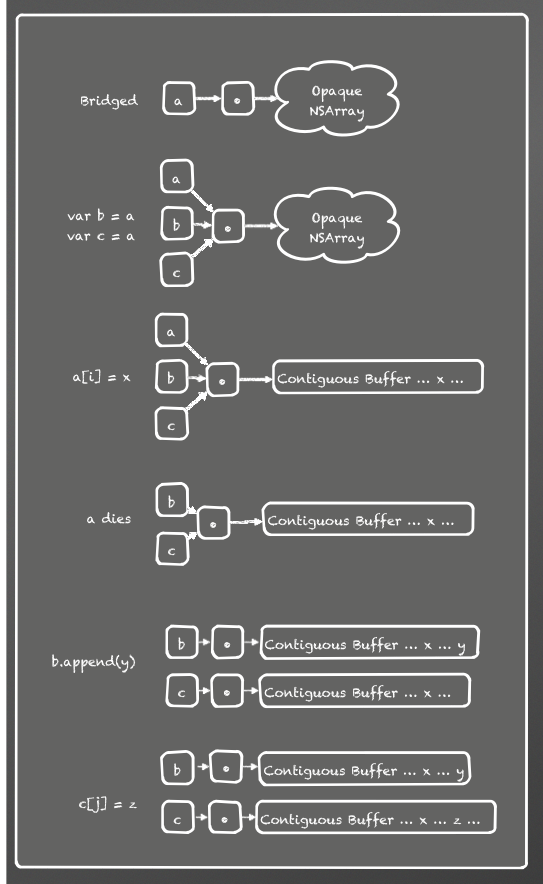
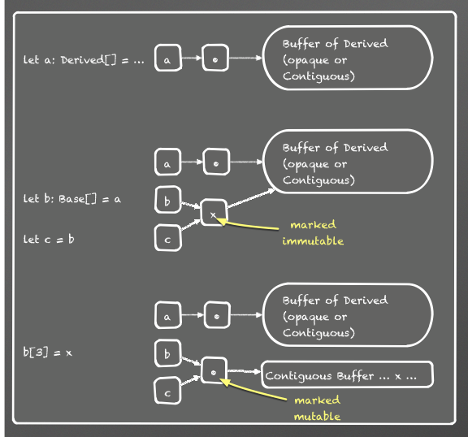

:orphan:

The Swift Array Design
======================

:Author: Dave Abrahams
:Date: 2014-04-10

.. raw:: html

   

Goals
-----

1. Performance equivalent to C arrays for subscript get/set of
   non-class element types is the most important performance goal.

2. It should be possible to receive an ``NSArray`` from Cocoa,
   represent it as an ``Array<AnyObject>``, and pass it right back to
   Cocoa as an ``NSArray`` in O(1) and with no memory allocations.
      
3. Arrays should be usable as stacks, so we want amortized O(1) append
   and O(1) popBack.  Together with goal #1, this implies a
   ``std::vector``\ -like layout, with a reserved tail memory capacity
   that can exceed the number of actual stored elements.

To achieve goals 1 and 2 together, we use static knowledge of the
element type: when it is statically known that the element type is not
a class, code and checks accounting for the possibility of wrapping an
``NSArray`` are eliminated.  An ``Array`` of Swift value types always
uses the most efficient possible representation, identical to that of
``ContiguousArray``.

Components
----------

Swift provides three generic array types, all of which have amortized
O(1) growth.  In this document, statements about **ArrayType** apply
to all three of the components.

* ``ContiguousArray<T>`` is the fastest and simplest of the three—use this
  when you need "C array" performance.  The elements of a
  ``ContiguousArray`` are always stored contiguously in memory.

  .. image:: ContiguousArray.png

* ``Array<T>`` is like ``ContiguousArray<T>``, but optimized for efficient
  conversions from Cocoa and back—when ``T`` can be a class type,
  ``Array<T>`` can be backed by the (potentially non-contiguous)
  storage of an arbitrary ``NSArray`` rather than by a Swift
  ``ContiguousArray``.  ``Array<T>`` also supports up- and down- casts
  between arrays of related class types.  When ``T`` is known to be a
  non-class type, the performance of ``Array<T>`` is identical to that
  of ``ContiguousArray<T>``.

  .. image:: Array.png

* ``Slice<T>`` is a subrange of some ``Array<T>`` or
  ``ContiguousArray<T>``; it's the result of using slice notation,
  e.g. ``a[7...21]`` on any Swift array ``a``.  A slice always has
  contiguous storage and "C array" performance.  Slicing an
  *ArrayType* is O(1) unless the source is an ``Array<T>`` backed by
  an ``NSArray`` that doesn't supply contiguous storage.

  ``Slice`` is recommended for transient computations but not for
  long-term storage.  Since it references a sub-range of some shared
  backing buffer, a ``Slice`` may artificially prolong the lifetime of
  elements outside the ``Slice`` itself.

  .. image:: Slice.png

Mutation Semantics
------------------

Originally, the plan was to give *ArrayType*\ s full value semantics
via copy-on-write (COW).  However, that COW requires a check for
unique ownership before every write, which is only compatible with our
primary performance goal if those checks can be hoisted out of loops.
Since we can almost certainly not get hoisting uniqueness checks for
1.0, subscript assignments on an array will be visible through all
copies of that array::

  var a = [1, 2, 3]
  let b = a
  a[1] = 42
  print(b[1]) // prints "42"

This implies that the elments of an array are notionally not part of
the array's value, and indeed subscript assignment is a non-mutating
operation:

.. parsed-literal::

  **let** a = [1, 2, 3]
  **a[1] = 42** // OK

Unfortunately, full consistent reference semantics would also be
problematic with this design, because during array growth, at some
point available capacity is filled, and the array's buffer needs be
reallocated.  The only way to keep changes to the array visible
through its copies once the buffer is reallocated would be to add a
level of indirection between the arrays and their shared buffer, which
would conflict with our primary performance goals, requiring a hoist
optimization that we are again unlikely to get for 1.0.

Therefore, potentially size-changing operations such as ``append`` do
*not* have reference semantics, as they always (effectively) copy the
array to ensure unique ownership before mutating it::

  var a = [1, 2, 3]
  let b = a
  a[1] = 42
  print(b[1]) // prints "42"

Shared Subscript Assignment and ``NSArray``
-------------------------------------------

For ``Array`` there is one more wrinkle: when its storage is backed by
an immutable ``NSArray``, shared semantics for subscript assignment
implies that we add a level of indirection anyway: the ``NSArray``
needs to be replaced by an array buffer containing the new value, and
that change needs to be visible through all copies of the array.
Remember that this indirection has no cost in cases like
``Array<Int>``, where it is statically known to be unneeded.

Bridging Rules and Terminology for all Types
--------------------------------------------

.. _bridged verbatim:

* Every class type or ``@objc`` existential (such as ``AnyObject``) is
  **bridged** to Objective-C and **bridged back** to Swift via the
  identity transformation, i.e. it is **bridged verbatim**.

* A type ``T`` that is not `bridged verbatim`_ can conform to
  ``BridgedToObjectiveC``, which specifies its conversions to and from
  ObjectiveC::

    protocol _BridgedToObjectiveC {
      typealias _ObjectiveCType: AnyObject
      func _bridgeToObjectiveC() -> _ObjectiveCType
      class func _forceBridgeFromObjectiveC(_: _ObjectiveCType) -> Self
    }

  .. Note:: classes and ``@objc`` existentials shall not conform to
     ``_BridgedToObjectiveC``, a restriction that's not currently
     enforceable at compile-time.

* Some generic types (*ArrayType*\ ``<T>`` in particular) bridge to
  Objective-C only if their element types bridge.  These types conform
  to ``_ConditionallyBridgedToObjectiveC``::

    protocol _ConditionallyBridgedToObjectiveC : _BridgedToObjectiveC {
      class func _isBridgedToObjectiveC() -> Bool
      class func _conditionallyBridgeFromObjectiveC(_: _ObjectiveCType) -> Self?
    }

  Bridging from, or *bridging back* to, a type ``T`` conforming to
  ``_ConditionallyBridgedToObjectiveC`` when
  ``T._isBridgedToObjectiveC()`` is ``false`` is a user programming
  error that may be diagnosed at
  runtime. ``_conditionallyBridgeFromObjectiveC`` can be used to attempt
  to bridge back, and return ``nil`` if the entire object cannot be
  bridged.

  .. Admonition:: Implementation Note

     There are various ways to move this detection to compile-time

* For a type ``T`` that is not `bridged verbatim`_,

  - if ``T`` conforms to ``BridgedToObjectiveC`` and either
  
    - ``T`` does not conform to ``_ConditionallyBridgedToObjectiveC``
    - or, ``T._isBridgedToObjectiveC()``

    then a value ``x`` of type ``T`` is **bridged** as
    ``T._ObjectiveCType`` via ``x._bridgeToObjectiveC()``, and an object
    ``y`` of ``T._ObjectiveCType`` is **bridged back** to ``T`` via
    ``T._forceBridgeFromObjectiveC(y)``

  - Otherwise, ``T`` **does not bridge** to Objective-C

``Array`` Type Conversions
--------------------------

From here on, this document deals only with ``Array`` itself, and not
``Slice`` or ``ContiguousArray``, which support a subset of ``Array``\
's conversions.  Future revisions will add descriptions of ``Slice``
and ``ContiguousArray`` conversions.

Kinds of Conversions
::::::::::::::::::::

In these definitions, ``Base`` is ``AnyObject`` or a trivial subtype
thereof, ``Derived`` is a trivial subtype of ``Base``, and ``X``
conforms to ``_BridgedToObjectiveC``:

.. _trivial bridging:

* **Trivial bridging** implicitly converts ``Base[]`` to
  ``NSArray`` in O(1). This is simply a matter of returning the
  Array's internal buffer, which is-a ``NSArray``.

.. _trivial bridging back:

* **Trivial bridging back** implicitly converts ``NSArray`` to
  ``AnyObject[]`` in O(1) plus the cost of calling ``copy()`` on
  the ``NSArray``. [#nocopy]_

* **Implicit conversions** between ``Array`` types

  - **Implicit upcasting** implicitly converts ``Derived[]`` to
    ``Base[]`` in O(1).  
  - **Implicit bridging** implicitly converts ``X[]`` to
    ``X._ObjectiveCType[]`` in O(N).

  .. Note:: Either type of implicit conversion may be combined with
     `trivial bridging`_ in an implicit conversion to ``NSArray``.

* **Checked conversions** convert ``T[]`` to ``U[]?`` in O(N)
  via ``a as U[]``.

  - **Checked downcasting** converts ``Base[]`` to ``Derived[]?``.
  - **Checked bridging back** converts ``T[]`` to ``X[]?`` where
    ``X._ObjectiveCType`` is ``T`` or a trivial subtype thereof.

* **Forced conversions** convert ``AnyObject[]`` or ``NSArray`` to
  ``T[]`` implicitly, in bridging thunks between Swift and Objective-C.

  For example, when a user writes a Swift method taking ``NSView[]``,
  it is exposed to Objective-C as a method taking ``NSArray``, which
  is force-converted to ``NSView[]`` when called from Objective-C.
     
  - **Forced downcasting** converts ``AnyObject[]`` to ``Derived[]`` in
    O(1)
  - **Forced bridging back** converts ``AnyObject[]`` to ``X[]`` in O(N).

  A forced conversion where any element fails to convert is considered
  a user programming error that may trap.  In the case of forced
  downcasts, the trap may be deferred_ to the point where an offending
  element is accessed.

.. Note:: Both checked and forced downcasts may be combined with `trivial
          bridging back`_ in conversions from ``NSArray``.

Maintaining Type-Safety
:::::::::::::::::::::::

Both upcasts and forced downcasts raise type-safety issues.

Upcasts
.......

When up-casting an ``Derived[]`` to ``Base[]``, a buffer of
``Derived`` object can simply be ``unsafeBitCast``\ 'ed to a buffer
of elements of type ``Base``—as long as the resulting buffer is never
mutated.  For example, we cannot allow a ``Base`` element to be
inserted in the buffer, because the buffer's destructor will destroy
the elements with the (incorrect) static presumption that they have
``Derived`` type.

Furthermore, we can't (logically) copy the buffer just prior to
mutation, since the ``Base[]`` may be copied prior to mutation,
and our shared subscript assignment semantics imply that all copies
must observe its subscript assignments.

Therefore, converting ``T[]`` to ``U[]`` is akin to
resizing: the new ``Array`` becomes logically independent.  To avoid
an immediate O(N) conversion cost, and preserve shared subscript
assignment semantics, we use a layer of indirection in the data
structure.  Further, when ``T`` is a subclass of ``U``, the
intermediate object is marked to prevent in-place mutation of the
buffer; it will be copied upon its first mutation:

.. _deferred:

Deferrred Checking for Forced Downcasts
.......................................

In forced downcasts, if any element fails to have dynamic type ``Derived``,
it is considered a programming error that may cause a trap.  Sometimes
we can do this check in O(1) because the source holds a known buffer
type.  Rather than incur O(N) checking for the other cases, the new
intermediate object is marked for deferred checking, and all element
accesses through that object are dynamically typechecked, with a trap
upon failure (except in ``-Ounchecked`` builds).

When the resulting array is later up-cast (other than to a type that
can be validated in O(1) by checking the type of the underlying
buffer), the result is also marked for deferred checking.

----

.. [#nocopy] This ``copy()`` may amount to a retain if the ``NSArray``
   is already known to be immutable.  We could eventually optimize out
   the copy if we can detect that the ``NSArray`` is uniquely
   referenced.  Our current unique-reference detection applies only to
   Swift objects, though.
