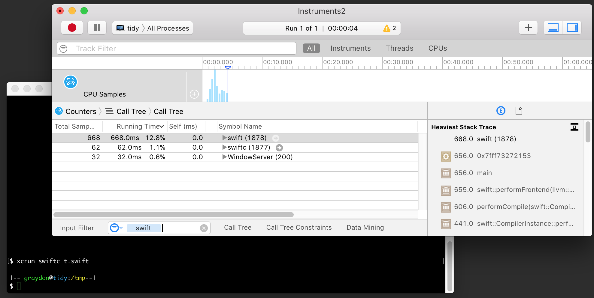
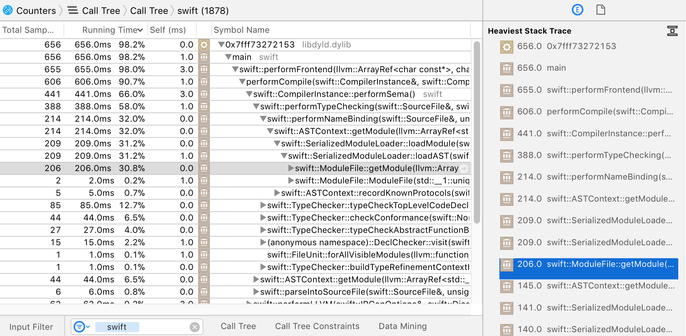
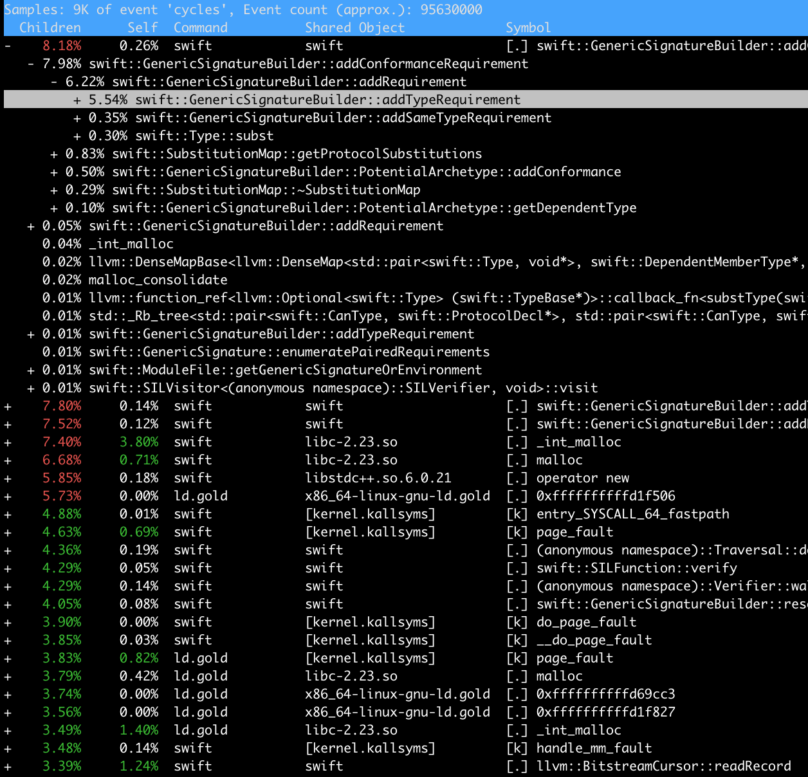

# Swift Compiler Performance

This document is a guide to understanding, diagnosing and reporting
compilation-performance problems in the swift compiler. That is: the speed
at which the compiler compiles code, not the speed at which that code runs.

While this guide is lengthy, it should all be relatively
straightforward. Performance analysis is largely a matter of patience,
thoroughness and perseverance, measuring carefully and consistently, and
gradually eliminating noise and focusing on a signal.

## Table of Contents
<!-- TOC -->

- [Swift Compiler Performance](#swift-compiler-performance)
    - [Table of Contents](#table-of-contents)
    - [Outline of processes and factors affecting compilation performance](#outline-of-processes-and-factors-affecting-compilation-performance)
        - [Compilation modes](#compilation-modes)
            - [Primary-file vs. WMO](#primary-file-vs-wmo)
            - [Amount of optimization](#amount-of-optimization)
        - [Workload variability, approximation and laziness](#workload-variability-approximation-and-laziness)
            - [Incremental compilation](#incremental-compilation)
            - [Lazy resolution](#lazy-resolution)
        - [Summing up: high level picture of compilation performance](#summing-up-high-level-picture-of-compilation-performance)
    - [Known problem areas](#known-problem-areas)
    - [How to diagnose compilation performance problems](#how-to-diagnose-compilation-performance-problems)
        - [Tools and options](#tools-and-options)
            - [Profilers](#profilers)
                - [Instruments.app](#instrumentsapp)
                - [Perf](#perf)
            - [Diagnostic options](#diagnostic-options)
            - [Post-processing tools for diagnostics](#post-processing-tools-for-diagnostics)
            - [Artifact-analysis tools](#artifact-analysis-tools)
            - [Minimizers](#minimizers)
                - [Git bisect](#git-bisect)
                - [Creduce](#creduce)
                - [General bisection](#general-bisection)
        - [Isolating a regression](#isolating-a-regression)
            - [Driver diagnosis](#driver-diagnosis)
        - [Finding areas in need of general improvement](#finding-areas-in-need-of-general-improvement)
            - [Compiler counters](#compiler-counters)
            - [Scale-test](#scale-test)
    - [How to report bugs most usefully](#how-to-report-bugs-most-usefully)
    - [How else to help out if you want to improve compile times](#how-else-to-help-out-if-you-want-to-improve-compile-times)

<!-- /TOC -->
## Outline of processes and factors affecting compilation performance

This section is intended to provide a high-level orientation around what the
compiler is doing when it's run -- beyond the obvious "compiling" -- and what
major factors influence how much time it spends.

When you compile or run a Swift program, either with Xcode or on the command
line, you typically invoke `swift` or `swiftc` (the latter is a symbolic link to
the former), which is a program that can behave in very different ways depending
on its arguments.

It may compile or execute code directly, but it will usually instead turn around
and run one or more copies of `swift` or `swiftc` as subprocesses. In typical
batch compilation, the first copy of `swiftc` runs as a so-called **driver**
process, and it then executes a number of so-called **frontend** subprocesses,
in a process tree. It's essential, when interpreting Swift compilation, to have
a clear picture of which processes are run and what they're doing:

  - **Driver**: the top-level `swiftc` process in a tree of
    subprocesses. Responsible for deciding which files need compiling or
    recompiling and running child processes &mdash; so-called **jobs** &mdash;
    to perform compilation and linking steps. For most of its execution, it is
    idle, waiting for subprocesses to complete.

  - **Frontend Jobs**: subprocesses launched by the driver, running `swift
    -frontend ...` and performing compilation, generating PCH files, merging
    modules, etc. These are the jobs that incur the bulk of the costs of
    compiling.

  - **Other Jobs**: subprocesses launched by the driver, running `ld`, `swift
    -modulewrap`, `swift-autolink-extract`, `dsymutil`, `dwarfdump` and similar
    tools involved in finishing off a batch of work done by the frontend
    jobs. Some of these will be the `swift` program too, but they're not "doing
    frontend jobs" and so will have completely different profiles.

The set of jobs that are run, and the way they spend their time, is itself
highly dependent on **compilation modes**. Information concerning those modes
that's relevant to compilation performance is recounted in the following
section; for more details on the driver, see [the driver docs](Driver.md), as
well as docs on [driver internals](DriverInternals.rst)
and [driver parseable output](DriverParseableOutput.rst).

After discussing compilation modes in the following section, we'll also touch on
large-scale variation in workload that can occur _without_ obvious hotspots, in
terms of laziness strategies and approximations.

### Compilation modes

There are many different options for controlling the driver and frontend jobs,
but the two dimensions that cause the most significant variation in behaviour
are often referred to as _modes_. These modes make the biggest difference, and
it's important when looking at compilation to be clear on which mode `swiftc` is
running in, and often to perform separate analysis for each mode. The
significant modes are:

  - **Primary-file** vs. **whole-module**: this varies depending on whether the
    driver is run with the flag `-wmo`, `-whole-module-optimization` or
    `-force-single-frontend-invocation` (all these options are synonymous).

    - **Batch** vs. **single-file** primary-file mode. This distinction refines
    the behaviour of primary-file mode, with the new batch mode added in the
    Swift 4.2 release cycle. Batching eliminates much of the overhead of
    primary-file mode, and will eventually become the default way of running
    primary-file mode, but until that time it is explicitly enabled by passing
    the `-enable-batch-mode` flag.

  - **Optimizing** vs. **non-optimizing**: this varies depending on whether the
    driver (and thus each frontend) is run with the flags `-O`, `-Osize`, or
    `-Ounchecked` (each of which turn on one or more sets of optimizations), or
    the default (no-optimization) which is synonymous with `-Onone` or
    `-Oplayground`.

When you build a program in Xcode or using `xcodebuild`, often there is a
_configuration_ parameter that will switch both of these modes
simultaneously. That is, typical code has two configurations:

  - **Debug** which combines primary-file mode with `-Onone`
  - **Release** which combines WMO mode with `-O`

But these parameters can be varied independently and the compiler will spend its
time very differently depending on their settings, so it's worth understanding
both dimensions in a bit more detail.

#### Primary-file (with and without batching) vs. WMO

This is the most significant variable in how the compiler behaves, so it's worth
getting perfectly clear:

  - In **primary-file mode**, the driver divides the work it has to do between
    multiple frontend processes, emitting partial results and merging those
    results when all the frontends finish. Each frontend job itself reads _all_
    the files in the module, and focuses on one or more _primary_ file(s) among
    the set it read, which it compiles, lazily analyzing other referenced
    definitions from the module as needed.
    This mode has two sub-modes:

    - In the **single-file** sub-mode, it runs _one frontend job per file_, with
      each job having a single primary.

    - In the **batch** sub-mode, it runs _one frontend job per CPU_, identifying an
      equal-sized "batch" of the module's files as primaries.

  - In **whole-module optimization (WMO) mode**, the driver runs one frontend
    job for the entire module, no matter what. That frontend reads all the files
    in the module _once_ and compiles them all at once.

For example: if your module has 100 files in it:

  - Running `swiftc *.swift` will compile in **single-file mode**, and will thus
    run 100 frontend subprocesses, each of which will parse all 100 inputs (for
    a total of 10,000 parses), and then each subprocess will (in parallel) 
    compile the definitions in its single primary file.

  - Running `swiftc -enable-batch-mode *.swift` will compile in **batch** mode,
    and on a system with 4 CPUs will run 4 frontend subprocesses, each of which
    will parse all 100 inputs (for a total of 400 parses), and then each subprocess
    will (in parallel) compile the definitions of 25 primary files (one quarter
    of the module in each process).

  - Running `swiftc -wmo *.swift` will compile in **whole-module** mode,
    and will thus run _one_ frontend subprocess, which then reads all 100 files
    _once_ (for a total of 100 parses) and compiles the definitions in all of them,
    in order (serially).

Why do multiple modes exist? Because they have different strengths and weaknesses;
neither is perfect:

  - Primary-file mode's advantages are that the driver can do **incremental
    compilation** by only running frontends for files that it thinks are out of
    date, as well as running multiple frontend jobs **in parallel**, making use
    of multiple cores. Its disadvantage is that each frontend job has to read
    _all the source files_ in the module before focusing on its primary-files of
    interest, which means that a _portion_ of the frontend job's work is being
    done _quadratically_ in the number of jobs. Usually this portion is relatively
    small and fast, but because it's quadratic, it can easily go wrong. The addition
    of **batch mode** was specifically to eliminate this quadratic increase in
    early work.

  - WMO mode's advantages are that it can do certain optimizations that only
    work when they are sure they're looking at the entire module, and it avoids
    the quadratic work in the early phases of primary-file mode. Its
    disadvantages are that it always rebuilds everything, and that it exploits
    parallelism worse (at least before LLVM IR code-generation, which is always
    multithreaded).

Whole-module mode does enable a set of optimizations that are not possible when
compiling in primary-file mode. In particular, in modules with a lot of private
dead code, whole-module mode can eliminate the dead code earlier and avoid
needless work compiling it, making for both smaller output and faster compilation.

It is therefore possible that, in certain cases (such as with limited available
parallelism / many modules built in parallel), building in whole-module mode
with optimization disabled can complete in less time than batched primary-file
mode. This scenario depends on many factors seldom gives a significant advantage,
and since using it trades-away support for incremental compilation entirely, it
is not a recommended configuration.

#### Amount of optimization

This document isn't the right place to give a detailed overview of the compiler
architecture, but it's important to keep in mind that the compiler deals with
Swift code in memory in 3 major representations, and can therefore be
conceptually divided into 3 major stages, the latter 2 of which behave
differently depending on optimization mode:

  - **ASTs** (Abstract Syntax Trees): this is the representation (defined in the
    `lib/AST` directory) closest to what's in a source file, produced from Swift
    source code, Swift modules and Clang modules (in `lib/Parse`,
    `lib/Serialization` and `lib/ClangImporter` respectively) and interpreted by
    resolution, typechecking and high-level semantics functions (in `lib/Sema`)
    early-on in compilation.

  - **SIL** (Swift Intermediate Language): this is a form that's private to the
    Swift compiler, lower-level and more-explicit than the AST representation,
    but still higher-level and more Swift-specific than a machine-oriented
    representation like LLVM. It's defined in `lib/SIL`, produced by code in
    `lib/SILGen` and _optionally optimized_ by code in `lib/SILOptimizer`.

  - **LLVM IR** (Low Level Virtual Machine Intermediate Representation): this is
    a form that's an abstract representation of the machine language being
    compiled for; it doesn't contain any Swift-specific knowledge, rather it's a
    form the Swift compiler _generates from SIL_ (in `lib/IRGen`) and then hands
    off as input to the [LLVM backend](http://llvm.org), a library upon which
    the Swift compiler depends. LLVM has its own _optional optimizations_ that
    apply to LLVM IR before it's lowered to machine code.

When running the Swift compiler in optimizing mode, many SIL and LLVM
optimizations are turned on, making those phases of compilation (in each
frontend job) take significantly more time and memory. When running in
non-optimizing mode, SIL and LLVM IR are still produced and consumed along the
way, but only as part of lowering, with comparatively few "simple" optimizations
applied.

Additionally, the IRGen and LLVM phases can operate (and usually are operated)
in parallel, using multiple threads in each frontend job, as controlled by the
`-num-threads` flag. This option only applies to the latter phases, however: the
AST and SIL-related phases never run multithreaded.

The amount of work done to the AST representation (in particular: importing,
resolving and typechecking ASTs) does not vary between different optimization
modes. However, it does vary _significantly_ between different projects and
among seemingly-minor changes to code, depending on the amount of laziness the
frontend is able to exploit.

### Workload variability, approximation and laziness

While some causes of slow compilation have definite hotspots (which we will get
to shortly), one final thing to keep in mind when doing performance analysis is
that the compiler tries to be _lazy_ in a variety of ways, and that laziness
does not always work: it is driven by certain approximations and assumptions
that often err on the side of doing more work than strictly necessary.

The outcome of a failure in laziness is not usually a visible hotspot in a
profile: rather, it's the appearance of doing "too much work altogether" across
a generally-flat profile. Two areas in particular where this occurs &mdash; and
where there are significant, ongoing improvements to be made &mdash; are in
incremental compilation and lazy resolution.

#### Incremental compilation

As mentioned in the section on primary-file mode, the driver has an _incremental
mode_ that can be used to attempt to avoid running frontend jobs entirely. When
successful, this is the most effective form of time-saving possible: nothing is
faster than a process that doesn't even run.

Unfortunately judgements about when a file "needs recompiling" are themselves
driven by an auxiliary data structure that summarizes the dependencies between
files, and this data structure is necessarily a conservative approximation. The
approximation is weaker than it should be, and as a result the driver often runs
more frontend jobs than it should.

#### Lazy resolution

Swift source files contain names that refer to definitions outside the enclosing
file, and frequently outside of the enclosing module. These "external"
definitions are resolved lazily from two very different locations (both called
"modules"):

  - C/ObjC modules, provided by the Clang importer
  - Serialized Swift modules

Despite their differences, both kinds of modules support laziness in the Swift
compiler in one crucial way: they are both kinds of _indexed_ binary file
formats that permit loading _single definitions_ out of by name, without having
to load the entire contents of the module.

When the Swift compiler manages to be lazy and limit the number of definitions
it tries to load from modules, it can be very fast; the file formats support
very cheap access. But often the logic in the Swift compiler is unnecessarily
conservative about exploiting this potential laziness, and so it loads more
definitions than it should.

### Summing up: high level picture of compilation performance

Swift compilation performance varies _significantly_ by at least the following
parameters:

  - WMO vs. primary-file (non-WMO) mode, including batching thereof
  - Optimizing vs. non-optimizing mode
  - Quantity of incremental work avoided (if in non-WMO)
  - Quantity of external definitions lazily loaded

When approaching Swift compilation performance, it's important to be aware of
these parameters and keep them in mind, as they tend to frame the problem you're
analyzing: changing one (or any of the factors influencing them, in a project)
will likely completely change the resulting profile.

## Known problem areas

These are areas where we know the compiler has room for improvement,
performance-wise, where it's worth searching for existing bugs on the topic,
finding an existing team member who knows the area, and trying to relate the
problem you're seeing to some of the existing strategies and plans for
improvement:

  - Incremental mode is over-approximate, runs too many subprocesses.
  - Too many referenced (non-primary-file) definitions are type-checked beyond
    the point they need to be, during the quadratic phase.
  - Expression type inference solves constraints inefficiently, and can
    sometimes behave super-linearly or even exponentially.
  - Periodically the analysis phase of a SIL optimization fails to cache
    overlapping subproblems, causing a super-linear slowdown.
  - Some SIL-to-IR lowerings (eg. large value types) can generate too much
    LLVM IR, increasing the time spent in LLVM.

(Subsystem experts: please add further areas of concern here.)

## How to diagnose compilation performance problems

Compiler performance analysis breaks down into two broad categories of work,
depending on what you're trying to do:

  - Isolating a regression
  - Finding areas that need general improvement

In all cases, it's important to be familiar with several tools and compiler
options we have at our disposal. If you know about all these tools, you can skip
the following section.

### Tools and options

You'll use several tools along the way. These come in 5 main categories:

  - Profilers
  - Diagnostic options built-in to the compiler (timers, counters)
  - Post-processing tools to further analyze diagnostic output
  - Tools to generally analyze the output artifacts of the compiler
  - Tools to minimize the regression range or testcases

#### Profilers

The basic tool of performance analysis is a profiler, and you _will need_ to
learn to use at least one profiler for the purposes of this work. The main two
profilers we use are `Instruments.app` on macOS, and `perf(1)` on Linux. Both
are freely available and extremely powerful; this document will barely scratch
the surface of what they can do.

##### Instruments.app

Instruments is a tool on macOS that ships as part of Xcode. It contains
graphical and batch interfaces to a very wide variety of profiling services;
see
[here](https://developer.apple.com/library/content/documentation/DeveloperTools/Conceptual/InstrumentsUserGuide/index.html) for
more documentation.

The main way we will use `Instruments.app` is in "Counter" mode, to record and
analyze a single run of swiftc. We will also use it in simple push-button
interactive mode, as a normal application. While it's possible to run
Instruments in batch mode on the command-line, the batch interface is less
reliable than running it as an interactive application, and frequently causes
lockups or fails to collect data.

Before starting, you should also be sure you are going to profile a version of
Swift _without_ DWARF debuginfo; while in theory debuginfo will give a
higher-resolution, more-detailed profile, in practice Instruments will often
stall out and become unresponsive trying to process the additional detail.

Similarly, be sure that as many applications as possible (especially those with
debuginfo themselves!) are closed, so that Instruments has little additional
material to symbolicate as possible. It collects a _whole system profile_ at
very high resolution, so you want to make its life easy by profiling on a quiet
machine doing little beyond the task you're interested in.

Once you're ready, follow these steps:

  - Open `Xcode.app`
  - Click `Xcode` => `Open Developer Tool` => `Instruments` (Once it's open, you
    might want to pin `Instruments.app` to the dock for ease of access)
  - Select the `Counters` profiling template
  - Open a terminal and get prepared to run your test-case
  - Switch back to `Instruments.app`
  - Press the red `record` button in the top-left of the instruments panel
  - Quickly switch to your terminal, run the test-case you wish to profile, and
    as soon as it's finished switch back to `Instruments.app` and press the stop
    button.

  That's it! You should have a profile gathered.

  Ideally you want to get to a situation that looks like this:



In the main panel you can see a time-sorted set of process and call-frame
samples, which you can filter to show only swift processes by typing `swift` in
the `Input Filter` box at the bottom of the window. Each line in the main panel
can be expanded by clicking the triangle at its left, showing the callees as
indented sub-frames.

If you hover over the line corresponding to a specific `swift` process, you'll
see a small arrow enclosed in a grey circle to the right of the line. Click on
it and instruments will shift focus of the main panel to just that process'
subtree (and recalculate time-percentages accordingly). Once you're focused on a
specific `swift` process, you can begin looking at its individual stack-frame
profile.

In the panel to the right of the main panel, you can see the heaviest stack
trace within the currently-selected line of the main panel. If you click on one
of the frames in that stack, the main panel will automatically expand every
level between the current frame and the frame you clicked on. For example,
clicking 11 frames down the hottest stack, on the frame called
`swift::ModuleFile::getModule`, will expand the main panel to show something
like this:



Click around a profile by expanding and contracting nodes in the stack tree, and
you'll pretty quickly get a feeling for where the program is spending its
time. Each line in the main display shows both the cumulative sample count and
running time of its subtree (including all of its children), as well as its own
frame-specific `Self` time.

In the example above, it's pretty clear that the compiler is spending 66% of
its time in `Sema`, and the heaviest stack inside there is the time spent
deserializing external definitions (which matches a known problem area,
mentioned earlier).

If you want to keep notes on what you're seeing while exploring a profile, you
can expand and collapse frames until you see a meaningful pattern, then select
the displayed set of stack frames and copy them as text (using `⌘-C` as usual)
and paste it into a text file; whitespace indentation will be inserted in the
copied text, to keep the stack structure readable.

If you have _two_ profiles and want to compare them, Instruments does have a
mode for direct diffing between profiles, but it doesn't work when the profiles
are gathered from different binaries, so for purposes of comparing different
swift compilers, you'll typically have to do manual comparison of the profiles.

##### Perf

Perf is a Linux profiler that runs on the command line. In many Linux
distributions it's included in a package called `linux-tools` that needs to be
separately installed. It's small, fast, robust, flexible, and can be easily
scripted; the main disadvantages are that it lacks any sort of GUI and only runs
on Linux, so you can't use it to diagnose problems in builds that need macOS or
iOS frameworks or run under `xcodebuild`.

Perf is documented
[on the kernel wiki](https://perf.wiki.kernel.org/index.php/Main_Page) as well
as on [Brendan Gregg's website](http://www.brendangregg.com/perf.html).

Using `perf` requires access to hardware performance counters, so you cannot use
it in most virtual machines (unless they virtualize access to performance
counters). Further, you will need root access to give yourself permission to use
the profiling interface of the kernel.

The simplest use of perf just involves running your command under `perf
stat`. This gives high level performance counters including an
instructions-executed count, which is a comparatively-stable approximation of
total execution cost, and is often enough to pick out a regression when
bisecting (see below):

```
$ perf stat swiftc t.swift

 Performance counter stats for 'swiftc t.swift':

       2140.543052      task-clock (msec)         #    0.966 CPUs utilized
                17      context-switches          #    0.008 K/sec
                 6      cpu-migrations            #    0.003 K/sec
            52,084      page-faults               #    0.024 M/sec
     5,373,530,212      cycles                    #    2.510 GHz
     9,709,304,679      instructions              #    1.81  insn per cycle
     1,812,011,233      branches                  #  846.519 M/sec
        22,026,587      branch-misses             #    1.22% of all branches

       2.216754787 seconds time elapsed

```

The fact that `perf` gives relatively stable and precise cost measurements means
that it can be made into a useful subroutine when doing other
performance-analysis tasks, such as bisecting (see section on `git bisect`) or
reducing (see section on `creduce`). A shell function like the following is very
useful:

```
count_instructions() {
    perf stat -x , --log-fd 3    \
      -e instructions -r 10 "$@" \
      3>&1 2>/dev/null 1>&2 | cut -d , -f 1
}
```

To gather a full profile with perf -- when not just using it as a batch counter
-- use the `perf record` and `perf report` commands; depending on configuration
you might need to play with the `--call-graph` and `-e` parameters to get a
clear picture:

```
$ perf record -e cycles -c 10000 --call-graph=lbr swiftc t.swift
[ perf record: Woken up 5 times to write data ]
[ perf record: Captured and wrote 1.676 MB perf.data (9731 samples) ]
```

Once recorded, data will be kept in a file called `perf.data`, which is the
default file acted-upon by `perf report`. Running it should give you something
like the following textual user interface, which operates similarly to
`Instruments.app`, only using cursor keys:



#### Diagnostic options

The Swift compiler has a variety of built-in diagnostic options. Some are
interpreted by the driver, others are interpreted by the frontend jobs that the
driver runs: these have to be passed on the driver command-line with
`-Xfrontend` to get passed through to the frontends. In a multi-frontend,
primary-file-mode compilation, any such `-Xfrontend` option will be passed to
_all_ frontend job, which means the diagnostic output from _all_ frontend jobs
will be sent to standard output in sequence. This makes diagnosing problems with
these options somewhat challenging; they work better if you can reduce the
problem to a single frontend process before using these options.

Further, some of the diagnostic options depend on instrumentation that's only
present in assert compilers; if you pass them to release compilers, you will get
limited or no output. It's often useful to have both release and assert
compilers on hand while you're working.

  - `-driver-time-compilation`: interpreted by the driver; emits a high-level
    timing of the frontend and other jobs that the driver executes. It can guide
    early investigation to see which file in a primary-file-mode compilation is
    taking the majority of time, or is taking more or less time than when
    comparing compilations. Its output looks like this:

    ```
    ===-------------------------------------------------------------------------===
                                Driver Compilation Time
    ===-------------------------------------------------------------------------===
      Total Execution Time: 0.0001 seconds (0.0490 wall clock)

       ---User Time---   --System Time--   --User+System--   ---Wall Time---  --- Name ---
       0.0000 ( 82.0%)   0.0001 ( 59.5%)   0.0001 ( 69.0%)   0.0284 ( 58.0%)  {compile: t-177627.o <= t.swift}
       0.0000 ( 18.0%)   0.0000 ( 40.5%)   0.0000 ( 31.0%)   0.0206 ( 42.0%)  {link: t <= t-177627.o}
       0.0001 (100.0%)   0.0001 (100.0%)   0.0001 (100.0%)   0.0490 (100.0%)  Total
    ```

  - `-Xfrontend -debug-time-compilation`: asks each frontend to print out timers
    for each phase of its execution. Its output (per-frontend) looks like this:

    ```
    ===-------------------------------------------------------------------------===
                                 Swift compilation
    ===-------------------------------------------------------------------------===
    Total Execution Time: 0.0876 seconds (0.0877 wall clock)

     ---User Time---   --System Time--   --User+System--   ---Wall Time---  --- Name ---
     0.0241 ( 53.9%)   0.0394 ( 92.0%)   0.0635 ( 72.5%)   0.0635 ( 72.5%)  Name binding
     0.0170 ( 38.0%)   0.0025 (  5.8%)   0.0195 ( 22.3%)   0.0195 ( 22.2%)  Type checking / Semantic analysis
     0.0013 (  3.0%)   0.0004 (  0.8%)   0.0017 (  1.9%)   0.0017 (  1.9%)  LLVM output
     0.0010 (  2.3%)   0.0003 (  0.7%)   0.0013 (  1.5%)   0.0013 (  1.5%)  SILGen
     0.0006 (  1.4%)   0.0002 (  0.4%)   0.0008 (  0.9%)   0.0008 (  0.9%)  IRGen
     0.0004 (  0.8%)   0.0000 (  0.1%)   0.0004 (  0.5%)   0.0004 (  0.5%)  SIL optimization
     0.0002 (  0.5%)   0.0001 (  0.1%)   0.0003 (  0.3%)   0.0003 (  0.3%)  LLVM optimization
     0.0001 (  0.1%)   0.0000 (  0.1%)   0.0001 (  0.1%)   0.0001 (  0.1%)  Parsing
     0.0000 (  0.0%)   0.0000 (  0.0%)   0.0000 (  0.0%)   0.0000 (  0.0%)  SIL verification (pre-optimization)
     0.0000 (  0.0%)   0.0000 (  0.0%)   0.0000 (  0.0%)   0.0000 (  0.0%)  SIL verification (post-optimization)
     0.0000 (  0.0%)   0.0000 (  0.0%)   0.0000 (  0.0%)   0.0000 (  0.0%)  AST verification
     0.0448 (100.0%)   0.0428 (100.0%)   0.0876 (100.0%)   0.0877 (100.0%)  Total
    ```

  - `-Xfrontend -debug-time-function-bodies`: asks each frontend to print out
    the time spent typechecking _every function_ in the program, sorted by time
    taken. The output is therefore voluminous, but can help when reducing a
    testcase to the "one bad function" that causes it. The output looks like
    this:

    ```
    9.16ms  test.swift:15:6 func find<R>(_ range: R, value: R.Element) -> R where R : IteratorProtocol, R.Element : Eq
    0.28ms  test.swift:27:6 func findIf<R>(_ range: R, predicate: (R.Element) -> Bool) -> R where R : IteratorProtocol
    2.81ms  test.swift:40:6 func count<R>(_ range: R, value: R.Element) -> Int where R : IteratorProtocol, R.Element : Eq
    0.64ms  test.swift:51:6 func countIf<R>(_ range: R, predicate: (R.Element) -> Bool) -> Int where R : IteratorProtocol
    ...
    ```

  - `-Xfrontend -debug-time-expression-type-checking`: similar to
    `-debug-time-function-bodies`, but prints a separate timer for _every
    expression_ in the program, much more detail than just the functions. The
    output looks like this:

    ```
    0.20ms  test.swift:17:16
    1.82ms  test.swift:18:12
    6.35ms  test.swift:19:8
    0.11ms  test.swift:22:5
    0.02ms  test.swift:24:10
    0.02ms  test.swift:30:16
    ...
    ```

  - `-Xfrontend -print-stats`: activates statistic counters inside each
    frontend, printing them out when the frontend exits. By default, most
    statistics are enabled only in assert builds, so in a release build this
    option will do nothing. In an assert build, its output will look like this:

    ```
    ===-------------------------------------------------------------------------===
                            ... Statistics Collected ...
    ===-------------------------------------------------------------------------===

       4 BasicCalleeAnalysis              - computeMethodCallees
       6 Clang module importer            - # of imported clang entities
      11 Constraint solver largest system - # of connected components split
     176 Constraint solver largest system - # of disjunction terms explored
       9 Constraint solver largest system - # of disjunctions explored
      59 Constraint solver largest system - # of constraints simplified
       0 Constraint solver largest system - # of simplification iterations
     232 Constraint solver largest system - # of solution states explored
      42 Constraint solver largest system - # of type variable bindings attempted
      38 Constraint solver largest system - # of type variables bound
      79 Constraint solver largest system - # of constraints not simplified
      94 Constraint solver largest system - # of the largest solution attempt
       6 Constraint solver overall        - Number of solutions discarded
     361 Constraint solver overall        - # of solution attempts
     130 Constraint solver overall        - # of connected components split
    1898 Constraint solver overall        - # of disjunction terms explored
     119 Constraint solver overall        - # of disjunctions explored
     844 Constraint solver overall        - # of constraints simplified
    ...
    ```

  - `-Xfrontend -print-clang-stats`: prints counters associated with the clang
    AST reader, which is operated as a subsystem of the swift compiler when
    importing definitions from C/ObjC. Its output is added to the end of
    whatever output comes from `-print-stats`, and looks like this:

    ```
    *** AST File Statistics:
    1/194 source location entries read (0.515464%)
    5/182 types read (2.747253%)
    7/318 declarations read (2.201258%)
    6/251 identifiers read (2.390438%)
    0/22 macros read (0.000000%)
    0/70 statements read (0.000000%)
    0/22 macros read (0.000000%)
    1/22 lexical declcontexts read (4.545455%)
    0/16 visible declcontexts read (0.000000%)
    6 / 6 identifier table lookups succeeded (100.000000%)
    ...
    ```

  - `-Xfrontend -print-stats -Xfrontend -print-inst-counts`: an extended form of
    `-print-stats` that activates a separate statistic counter for every kind of
    SIL instruction generated during compilation. Its output looks like this:

    ```
    ...
    163 sil-instcount                    - Number of AllocStackInst
     90 sil-instcount                    - Number of ApplyInst
     92 sil-instcount                    - Number of BeginAccessInst
    212 sil-instcount                    - Number of BranchInst
     80 sil-instcount                    - Number of BuiltinInst
     37 sil-instcount                    - Number of CondBranchInst
      6 sil-instcount                    - Number of CondFailInst
    136 sil-instcount                    - Number of CopyAddrInst
    177 sil-instcount                    - Number of DeallocStackInst
     21 sil-instcount                    - Number of DebugValueAddrInst
      6 sil-instcount                    - Number of DebugValueInst
    128 sil-instcount                    - Number of DestroyAddrInst
    ...
    ```

##### Unified stats reporter

In an attempt to unify collection and reporting of the various
statistic-gathering options, recent versions of the compiler support a partly
redundant command `-stats-output-dir <directory>` that writes _all_ driver and
primary frontend counters and timers (though not per-function timers) to JSON
files in `<directory>`.

This option also provides _some_ high-level counters that are "always available"
regardless of whether you're using an assert or release build, though assert
builds still get _more_ counters (all of those available through
`-print-stats`). If you are using a new-enough compiler, `-stats-output-dir`
often simplifies analysis, since its output is machine-readable and aggregates
all the jobs in a multi-job compilation, and there's a post-processing script
`utils/process-stats-dir.py` to work with these files in aggregate.

For example, to compile a file with the unified stats reporter enabled, first
make a directory in which to output the stats, then compile with the
`-stats-output-dir` flag:

```
$ mkdir /tmp/stats
$ swiftc -c test.swift -stats-output-dir /tmp/stats
$ ls /tmp/stats
stats-1518219149045080-swift-frontend-test-test.swift-x86_64_apple_macosx10.13-o-Onone-531621672.json
$ cat /tmp/stats/*.json
{
  "AST.NumSourceBuffers": 1,
  "AST.NumSourceLines": 1,
  "AST.NumSourceLinesPerSecond": 3,
  "AST.NumLinkLibraries": 0,
  "AST.NumLoadedModules": 4,
  "AST.NumTotalClangImportedEntities": 0,
  ...
  "time.swift.Parsing.wall": 5.038023e-03,
  "time.swift.Parsing.user": 7.200000e-05,
  "time.swift.Parsing.sys": 4.794000e-03,
  "time.swift-frontend.test-test.swift-x86_64_apple_macosx10.13-o-Onone.wall": 3.239949e-01,
  "time.swift-frontend.test-test.swift-x86_64_apple_macosx10.13-o-Onone.user": 2.152100e-02,
  "time.swift-frontend.test-test.swift-x86_64_apple_macosx10.13-o-Onone.sys": 2.897520e-01
}
```

###### Tracing stats events

Furthermore, recent versions `-stats-output-dir` have a secondary, experimental
(and much more voluminous mode) called `-trace-stats-events`, that writes _trace
files_ in CSV to the stats output directory. These trace files show -- in quite
verbose detail, declaration and expression at a time -- the costs incurred by
various phases of the compiler, both in terms of absolute time and in terms of
any changers to statistics being tracked by the unified stats reporter.

For example, to compile a small file with `-trace-stats-events`, pass it as an
extra argument to a compilation already using `-stats-output-dir`:

```
$ mkdir /tmp/stats
$ swiftc -c test.swift -stats-output-dir /tmp/stats -trace-stats-events
$ ls /tmp/stats
stats-1518219460129565-swift-frontend-test-test.swift-x86_64_apple_macosx10.13-o-Onone-1576107381.json
trace-1518219460129597-swift-frontend-test-test.swift-x86_64_apple_macosx10.13-o-Onone-1471252712.csv
$ head /tmp/stats/trace-1518219460129597-swift-frontend-test-test.swift-x86_64_apple_macosx10.13-o-Onone-1471252712.csv
Time,Live,IsEntry,EventName,CounterName,CounterDelta,CounterValue,EntityName,EntityRange
40032,0,"entry","typecheck-decl","Sema.NumDeclsDeserialized",91,91,"foo","[test.swift:1:1 - line:1:32]"
40032,0,"entry","typecheck-decl","Sema.NumLazyGenericEnvironments",40,40,"foo","[test.swift:1:1 - line:1:32]"
40032,0,"entry","typecheck-decl","Sema.NumLazyIterableDeclContexts",40,40,"foo","[test.swift:1:1 - line:1:32]"
40032,0,"entry","typecheck-decl","Sema.NumTypesDeserialized",106,106,"foo","[test.swift:1:1 - line:1:32]"
40032,0,"entry","typecheck-decl","Sema.NumUnloadedLazyIterableDeclContexts",40,40,"foo","[test.swift:1:1 - line:1:32]"
40135,0,"entry","typecheck-decl","Sema.InterfaceTypeRequest",1,1,"","[test.swift:1:13 - line:1:29]"
...
```

The data volume in these trace files can be quite overwhelming, and the contents
a little hard to read without formatting; for extraction and analysis it can be
helpful to load them into a separate tool such as
an [SQLite database](https://www.sqlite.org) or a command line CSV processor
such as [`xsv`](https://github.com/BurntSushi/xsv).

```
$ cat /tmp/stats/trace-1518219460129597-swift-frontend-test-test.swift-x86_64_apple_macosx10.13-o-Onone-1471252712.csv \
   | xsv search --select CounterName DeclsDeserialized \
   | xsv sort --reverse --numeric --select CounterDelta \
   | xsv table
Time   Live  IsEntry  EventName       CounterName                CounterDelta  CounterValue  EntityName  EntityRange
43279  0     entry    emit-SIL        Sema.NumDeclsDeserialized  360           517           _           [test.swift:1:17 - line:1:17]
40032  0     entry    typecheck-decl  Sema.NumDeclsDeserialized  91            91            foo         [test.swift:1:1 - line:1:32]
41324  735   exit     typecheck-decl  Sema.NumDeclsDeserialized  40            156                       [test.swift:1:13 - line:1:29]
40432  0     entry    typecheck-decl  Sema.NumDeclsDeserialized  25            116           _           [test.swift:1:17 - line:1:17]
43712  206   exit     emit-SIL        Sema.NumDeclsDeserialized  18            535           _           [test.swift:1:17 - line:1:17]
41448  97    exit     typecheck-fn    Sema.NumDeclsDeserialized  1             157           _           [test.swift:1:17 - line:1:17]
```

#### Post-processing tools for diagnostics

If you dump diagnostic output using `-stats-output-dir <dir>`, the resulting
files in `<dir>` will be simple JSON files that can be processed with any
JSON-reading program or library, such
as [`jq`](https://stedolan.github.io/jq/). Alternatively, a bulk-analysis script
also exists in `utils/process-stats-dir.py`, which permits a variety of
aggregation and analysis tasks.

Here is an example of how to use `-stats-output-dir` together with
`utils/process-stats-dir.py` to analyze the difference in compilation
performance between two compilers, say `${OLD}/swiftc` and `${NEW}/swiftc`:

```
$ mkdir stats-old stats-new
$ ${OLD}/swiftc -stats-output-dir stats-old test.swift
$ ${OLD}/swiftc -stats-output-dir stats-new test.swift
$ utils/process-stats-dir.py --compare-stats-dirs stats-old stats-new
old     new     delta_pct       name
1402939 1430732 1.98    AST.NumASTBytesAllocated
7       0       -100.0  AST.NumUsedConformances
232     231     -0.43   Constraint solver largest system.LargestNumStatesExplored
42      41      -2.38   Constraint solver largest system.LargestNumTypeVariableBindings
38      37      -2.63   Constraint solver largest system.LargestNumTypeVariablesBound
79      78      -1.27   Constraint solver largest system.LargestNumUnsimplifiedConstraints
2593    2592    -0.04   Constraint solver overall.OverallNumStatesExplored
589     588     -0.17   Constraint solver overall.OverallNumTypeVariableBindings
482     481     -0.21   Constraint solver overall.OverallNumTypeVariablesBound
972     971     -0.1    Constraint solver overall.OverallNumUnsimplifiedConstraints
2593    2592    -0.04   ConstraintSystem.incrementScopeCounter
2948    2947    -0.03   Generic signature builder.NumArchetypeAnchorCacheHits
14767   15924   7.84    Generic signature builder.NumConformanceConstraints
9701    10858   11.93   Generic signature builder.NumConformances
5013    4241    -15.4   Generic signature builder.NumPotentialArchetypes
5776    4084    -29.29  Generic signature builder.NumSameTypeConstraints
...
```

When comparing two stats directories that contain the combined results of
multiple projects, it can be helpful to select a single project with
`--select-module` and/or group counters by module with `--group-by-module`.


#### Artifact-analysis tools

Many performance issues manifest in the object files or module files produced by
the Swift compiler -- say, by generating too much code -- so it can sometimes be
helpful to look at the files the compiler outputs directly. The following tools
are helpful in such cases:

  - `llvm-objdump`, `llvm-otool` and `llvm-size`, `llvm-nm` (which are
    LLVM-project implementations of the `objdump`, `otool`, `size` and `nm`
    tools) permit analysis of object files: their sizes, their headers, the
    set of symbols within them, and even their complete disassembled contents.

  - `c++filt` and `swift-demangle` are commands that read from stdin and
    write to stdout, transforming the text they read by _demangling names_
    in C++ and Swift, respectively. If you ever seen long, ugly symbol names
    in diagnostic output from a tool reading a binary artifact, it may read
    much better after being piped through one or another of these tools.

  - `llvm-bcanalyzer` can print (in rough form) the contents of LLVM bitcode
    streams, such as Swift module files and the PCH/PCM files clang stores its
    serialized ASTs in. The latter requires combing `llvm-objdump` and
    `llvm-bcanalyzer` in the following fashion: `llvm-objdump -raw-clang-ast
    file.pcm | llvm-bcanalyzer -dump`

  - `llvm-dwarfdump` and `llvm-dis` can be used to print textual representations
    of DWARF debug information and LLVM bitcode, respectively. These are usually
    a bit lower-level than necessary when doing performance analysis, but can be
    helpful in certain cases.

  - `utils/cmpcodesize/cmpcodesize.py` provides a detailed, organized set of
    size comparisons between the artifacts in a pair of object files emitted by
    the Swift compiler.

#### Minimizers

##### Git bisect

The `git` command has a sub-command called `bisect` that helps with -- and can
even completely automate -- the process of reducing a regression range from a
large period (weeks to months, hundreds of revisions) down to a single revision
that was the cause of a problem. As the name implies, bisect performs bisection
-- repeatedly dividing a range in half, then in quarters, and so forth -- so
usually within a matter of a dozen steps it can isolate a problem. It is
documented in full [here](https://git-scm.com/docs/git-bisect) as well as in the
`git-bisect` man page.

The `bisect` command can be run in manual mode or automatic mode. In manual
mode, you follow these steps:

  1. Start with a command like `git bisect start <bad> <good>` that sets up the
     initial regression range to between the revisions `<bad>` and `<good>`
     (replace those with revisions you know to be bad and good).

  2. Git will repeatedly check out the revision in the middle of the current
     regression range, asking you to evaluate it.

  3. Build the revision it checked out, evaluate it using whatever method you
     like, and then either run `git bisect good` or `git bisect bad` (literally
     those words: `bad` or `good`). If the revision it checked out can't be
     evaluated, run `git bisect skip` and it will shift to an adjacent revision,
     adjusting its search strategy accordingly.

  4. When it's reduced to a single culprit, git will print out the "first bad
     revision" log entry. At this point it's worth manually re-confirming that
     the identified revision is indeed bad, and the revision
     immediately-previous to it is indeed good. Periodically some confounding
     issue will confuse the bisection search, and you'll be directed to the
     wrong candidate.

In automatic mode, one simply runs the command `git bisect run test.sh` on some
shell script you've written `test.sh`, and `git-bisect` performs the entire
bisection search automatically. The shell script needs to exit with a return
value that tells `git bisect` whether the revision it's run on is good (`exit 0`),
bad (`exit 1`), or should be skipped (`exit 125`).

How the test-script determines the presence of a regression is up to you: a
typical approach is to measure against a baseline (eg. using
`utils/process-stats-dir.py --compare-to-csv-baseline`, if your regression range
covers compilers that all support `-stats-output-dir`). Alternatively, just
measure raw time or instruction counts. An example script that uses the
`perf`-based `count_instructions` shell function (see the section on `perf`) to
judge whether a revision contains a bug looks something like this:

```
#!/bin/sh
THRESHOLD=500000000
CURR=$(git describe)
utils/update-checkout --scheme master --reset-to-remote --clone --clean
git checkout ${CURR}
utils/update-checkout --scheme master --match-timestamp
git checkout ${CURR}
if utils/build-script -r
then
    V=$(count_instructions ../build/Ninja-ReleaseAssert/swift-linux-x86_64/bin/swiftc -c test.swift)
    if [ ${V} -gt ${THRESHOLD} ]
    then
        # Bad
        exit 1
    else
        # Good
        exit 0
    fi
else
    # Skip
    exit 125
fi
```
Note that in the example, the `utils/update-checkout` script is called twice,
once to reset the adjacent repositories to their head state, and once with the
`--match-timestamp` argument to match the adjacent repositories to the latest
point in their history before the timestamp of the primary Swift repository
being bisected. This mechanism is necessary if the regression range includes
incompatible changes to `clang`, `llvm` or similar adjacent repositories.


##### Creduce

The `creduce` tool takes an input program and a script, and repeatedly cuts
pieces out of the input program and re-runs the script on the program to see if
the script still considers the residual input "interesting". It is
documented [here](https://embed.cs.utah.edu/creduce/) and is available through
Homebrew on macOS, or in most Linux package ecosystems.

You can use `creduce` to automate the otherwise-tedious task of taking a failing
or slow input and reducing it to "just the bad part" that triggers the problem
you're after.

For performance analysis, using `creduce` requires that the script can reliably
tell when it's "still seeing a regression" and when it's not. This means having
a reliable timer or cost-measurement tool; the simplest and most reliable we
know of is `perf` so we'll assume you're using it here, via the
`count_instructions` shell function described in the section on `perf`; but
other measurement tools also work, for example using
`utils/process-stats-dir.py` to test changes in performance counters. To use
`creduce` you need to write a script something like the following:

```
#!/bin/sh
INPUT=test.swift
OLD=${HOME}/old-toolchain/usr/bin/swift
NEW=${HOME}/new-toolchain/usr/bin/swift
THRESHOLD=50000000
VOLD=$(count_instructions ${OLD} -frontend -c ${INPUT})
VNEW=$(count_instructions ${NEW} -frontend -c ${INPUT})
VDIFF=$((${VNEW} - ${VOLD}))
if [ ${VDIFF} -gt ${THRESHOLD} ]
then
  # Interesting
  exit 0
else
  # Not interesting
  exit 1
fi
```

Note that, as with `git-bisect`, any measurement tool will work in place of
`count_instructions`; if you are looking at a regression-range in which all the
compilers have `-stats-output-dir` support, for example, you may well prefer to
use `utils/process-stats-dir.py --compare-to-csv-baseline`, for example.


##### General bisection

When all else fails, coding up a manual bisection is often possible given a
numbered set of testcases. The LLVM project ships with a very generic helper
script for this, `llvm/util/bisect`, that takes a numeric range and a general
subprocess and bisects the range until it finds the place the process changes
from success to failure.


### Isolating a regression

Follow these steps if you've observed (or think you're seeing) the compiler
getting slower between versions:

  1. Make sure the before-and-after compilers you're comparing are as close to
     identical as possible.

     - Ensure both compilers are built the same way: same configuration options,
       same host toolchains, same optimizations enabled.

     - Ensure both compilers are _release_ compilers _without assertions_ (Note:
       nightly snapshots from swift.org have assertions turned on.)  You may
       also want to build (or download) assertion-enabled compilers for
       finer-grained counter analysis (see below) but keep in mind that they run
       strictly slower and do significantly different work than release
       (non-assert) compilers, so are not representative of what users will be
       using.

  2. Measure the high-level timing of the compilation, using `time(1)` or
     `utils/rusage.py`. Run the compilation a few times to be sure you're not
     seeing noise.

  3. Determine the **compilation mode** in which the regression is
     occurring. Check to see if changing the compilation mode keeps the
     regression happening.

     - If the regression occurs regardless of optimization setting, you have
       reason to believe the cause is in `Sema` or a non-optimizing part of
       `SILGen`, `IRGen` or `LLVM`. Alternatively if it only occurs in
       optimizing builds, you have reason to believe the cause is in
       `SILOptimizer`, `IRGen` or `LLVM`.

     - If the regression occurs regardless of compilation mode, you have reason
       to believe the cause is localized to frontend jobs. Alternatively if it
       occurs only in primary-file mode, and goes away in whole-module mode, you
       have reason to believe the driver may also be implicated.

  4. Try to isolate your analysis to a specific frontend process in the compilation.

     - If the regression only occurs in whole-module build then you're already
       dealing with a single process (the sole frontend job).

     - If the regression _also_ (or _only_) happens in primary-file mode, you
       can compile with `-driver-time-compilation` to see which if any frontend
       job is slower.

     - If _all_ frontend jobs are slower, pick one at random to focus on for
       purposes of analysis.

     - If _no_ frontend jobs are slower but the overall compilation seems to be,
       _or_ if a different number of frontend jobs are running depending on
       which compiler is run, then the problem is likely in the driver. Skip to
       the section on driver diagnosis.

  5. Assuming you're looking at a frontend process: extract the command-line for
     the single process (of the form `swift -frontend ...`) by running the build
     in verbose mode, and put the command-line in a shell script so you can
     re-run it on its own, without the interference of the driver or other
     processes. Make a copy of the script that runs the old compiler and a
     different copy that runs the new compiler (or make the compiler version a
     parameter of the script). Reconfirm that _just those two isolated frontend
     processes_ still show the regression you're interested in isolating.

  6. Check high-level diagnostic output between the two compilers, either the
     newer unified stats reporter (`-stats-output-dir`) or the older flags
     (`-Xfrontend -debug-time-compilation` and friends). Comparing the two will
     often guide the search.

  7. Run both frontend processes under a profiler and compare the profiles in
     detail. At this point there ought to be _some_ sign of a difference, either
     in counters or profile; if everything looks identical, you either have a
     deeper mystery than this document will cover, or you've lost the signal by
     accidentally perturbing the environment / the input / the processes under
     study. If the problem is _blindingly obvious_ at this point, stop and fix
     the bug, otherwise proceed to narrowing the problem.

  8. Reduce the testcase. That is, figure out the smallest input file that
     causes the regression you're observing. If the problem you're looking at
     occurs in the frontend, you might be able to do this manually by running
     the input with `-Xfrontend -debug-time-function-bodies` and deleting all
     but the most expensive function, or reduce even further from a function to
     a single expression via `-Xfrontend -debug-time-expression-type-checking`;
     but keep in mind these options only track the time spent _typechecking_ a
     given function or expression; they do not help in reduction of testcases
     for problems that occur in other subsystems of the compiler. For general
     reduction, the normal approach is "bisection", also called
     "delta-debugging": repeatedly delete half the remaining contents of the
     file, and see if the regression remains. If so, repeat the process in the
     remaining half; if not, restore the half you deleted and switch your
     attention to it. This process -- along with several other reduction
     heuristics that are sensitive to the structure of the code -- can also be
     automated with the tool `creduce`. See the section on `creduce` for
     details.

  9. Bisect the regression range. That is, figure out the smallest range of
     changes to the compiler (typically a single revision in the git history)
     that caused the regression. If you have more network bandwidth than compute
     power available, you might want to begin this part by downloading snapshots
     of the compiler from swift.org. While only a handful of recent snapshots
     are linked on the swift.org webpage, all historical snapshots remain
     available to download by substituting the appropriate timestamp into the
     snapshot URL. For example, the master-branch, macOS snapshot from June 9
     2017 is available
     at
     [https://swift.org/builds/development/xcode/swift-DEVELOPMENT-SNAPSHOT-2017-06-09-a/swift-DEVELOPMENT-SNAPSHOT-2017-06-09-a-osx.pkg](https://swift.org/builds/development/xcode/swift-DEVELOPMENT-SNAPSHOT-2017-06-09-a/swift-DEVELOPMENT-SNAPSHOT-2017-06-09-a-osx.pkg),
     and the July 10 2017, swift-4.0-branch Linux snapshot is
     at
     [https://swift.org/builds/swift-4.0-branch/ubuntu1604/swift-4.0-DEVELOPMENT-SNAPSHOT-2017-07-10-a/swift-4.0-DEVELOPMENT-SNAPSHOT-2017-07-10-a-ubuntu16.04.tar.gz](https://swift.org/builds/swift-4.0-branch/ubuntu1604/swift-4.0-DEVELOPMENT-SNAPSHOT-2017-07-10-a/swift-4.0-DEVELOPMENT-SNAPSHOT-2017-07-10-a-ubuntu16.04.tar.gz).
     While such snapshots have asserts enabled -- so they do not entirely match
     the performance characteristics of release compilers -- it is often the
     case that a regression in a release compiler will still show up in an
     assert compiler, and downloading snapshots to narrow a regression range can
     often be much faster than building multiple compilers. Once you've narrowed
     a regression range to within a few days (or however far you can get with
     snapshots alone), you will likely also need to switch to bisection using
     `git bisect`, which can semi-automate or totally-automate the remaining
     search, depending on how much shell scripting you want to do and how
     precisely you're able to measure the difference. See the section on
     `git-bisect` for details.

  10. File or fix the bug! You have everything necessary at this point, and if
      you can't see how to fix the bug yourself, you should have enough
      information to hand it off to the person whose change caused the
      regression; they can usually make short work of fixing it (or at worst,
      consider whether to just revert the culprit revision). You should include
      in the bug report:

      - A reduced single-file testcase to feed to a single frontend job
      - A bisected culprit revision
      - Evidence (in the form of a profile and/or change in counters) of a
        definite performance problem caused by that revision, on that testcase.

#### Driver diagnosis

One special area where things rarely go wrong, but can be quite serious when
they do, is in the driver process orchestrating the frontend jobs. A sure sign
that something is amiss in the driver is when running the same compilation
scenario, from the same incremental state, but on different compilers, produces
a different set of frontend jobs (as seen by `-driver-time-compilation`).

To diagnose a driver problem, several additional diagnostic flags exist:
`-driver-print-actions`, `-driver-print-bindings`, `-driver-print-jobs`,
`-driver-show-incremental`, and `-driver-show-job-lifecycle`. By carefully
comparing these, one can sometimes determine the difference in
dependency-analysis and job-execution logic, between one compilation and
another.

It is usually also helpful to look at the `.swiftdeps` files generated by the
driver. These files contain the driver's summary-view of the dependencies
between entities defined and referenced in each source file; it is from these
files that the driver decides when a file "needs" to be rebuilt because it
depends on another file that needs to be rebuilt, and so on transitively. The
file format is [documented here](DependencyAnalysis.rst).

### Finding areas in need of general improvement

If you're not hunting a particular regression, but just trying to improve some
problem area in the compiler in general, you usually want to focus on _sorting_
costs rather than _isolating_. That is: you'll want to use the tools discussed
above (profilers, timers, counters, etc.) to pick off the _largest_ cost-centers
in a problem area, and work on those first.

Sorting only tells you where a cost center is, though, not whether that cost
center is _reasonable_. That is, it's often helpful to try to differentiate
cost-centers that "should" be expensive (because they're compiling a lot of
code) from cost-centers that "shouldn't" be expensive (but are, because they
have a bug or design flaw). One tool that's useful for differentiating these
cases is the `utils/scale-test` script.

Scale-test runs on counters, so it's worth taking a short digression into
the set of counters that exist in the Swift compiler and how they fit together.

#### Compiler counters

The Swift compiler has two separate (though related) subsystems for counting
the work it does.

  1. The LLVM `STATISTIC()` system included by `#include "llvm/ADT/Statistic.h"`
     and lightly wrapped by `#include "swift/Basic/Statistic.h"`. This system
     consists of macros and helper structures for atomic, static counters that
     self-register in a global list. This subsystem is shared with Clang and
     LLVM in general, and so decisions about whether to enable or disable it
     (or indeed, conditionally compile it out) are typically shared across all
     three projects. In practice, most of these definitions are compiled-out of
     a non-assert build, because the level of atomic counting and memory-fencing
     is considered inappropriate and potentially too expensive to count inner
     loops in production builds. When present, these counters are reported
     by `-Xfrontend -print-stats`

  2. The Swift-specific `UnifiedStatsReporter` system also included by
     `#include "swift/Basic/Statistic.h"`. This (newer) system consists of a
     Swift-specific struct full of counters passed around between subsystems
     of interest. These counters are _always compiled-in_ to a Swift build,
     regardless of build setting. As such, should have _negligible cost_
     when not counting/reporting: as much as possible, access is arranged
     to either involve a non-atomic operation (in an inner loop) or a single
     high-level check before a batch of measurements (outside a loop). These
     counters are reported by `-stats-output-dir <dir>`

The `UnifiedStatsReporter` system has `Unified` in its name partly because it
_subsumes_ the other statistic and timer reporting systems in LLVM: it merges
its counters with any LLVM `STATISTIC()` counters that existed in the current
build, as well as any timers in the compiler, when reporting. Thus whenever
possible, you should rely on the output from this subsystem by passing
`-stats-output-dir <dir>` and parsing the resulting JSON files; it will always
be as good as the output from the `STATISTIC()` counters, if they're present.

#### Scale-test

This script works with parametrized templates of code (in the same `gyb` format
as other generated code in the compiler), repeatedly instantiating the template
with larger and larger parameter values, and measuring the relationship between
the input parameter value and the outputs of the compiler counters.

The `utils/scale-test` script works with the same counters inside the compiler
as the `-Xfrontend -print-stats` option mentioned above, so it should be used
with an assert compiler. It works in concert with the `utils/gyb` boilerplate
code-generation tool. The process is straightforward:

  1. Write a small `.gyb` file that contains a code pattern that can be varied
     by varying a numeric input parameter called `N`. For example, the
     following file (taken from the testsuite) varies the number of nested
     dictionaries:
     ```
     private let _: [Any?] = [[
     %for i in range(0, N):
       "A": [
         "B" : "C",
     %end
     %for i in range(0, N):
         ]
     %end
     ]]
     ```

  2. Run the file under the `utils/scale-test` script. You will at least need to
     pass a `--swiftc-binary` and `.gyb` template filename; by default, it will
     test on values of `N` ranging from `10` to `100` in steps of `10`, and fit
     scaling curves to _all_ counters that it measures, printing any that scale
     worse than `O(n^1.2)`. For example, the following will give an initial
     survey of the script above:
     ```
     $ utils/scale-test --swiftc-binary=/.../usr/bin/swiftc test.swift.gyb
     O(n^0.0) : BasicCalleeAnalysis.computeMethodCallees
     O(n^0.0) : Clang module importer.NumTotalImportedEntities
     O(n^0.0) : Constraint solver largest system.LargestNumDisjunctionTerms
     O(n^0.0) : Constraint solver largest system.LargestNumDisjunctions
     ...
     O(n^1.0) : regalloc.NumCopies
     O(n^1.0) : isel.NumFastIselSuccessIndependent
     O(n^1.0) : regalloc.NumLoads
     O(n^1.0) : Constraint solver overall.NumSolutionAttempts
     O(n^1.9) : Constraint solver overall.TotalNumTypeVariables
     O(n^2.0) : Constraint solver overall.OverallNumComponentsSplit
     O(n^2.0) : Constraint solver largest system.LargestNumComponentsSplit
     ...
     ```

  3. Focus in on a single problematic counter if you see any, and make a
     regression scale-test -- a file with a `// RUN: %scale-test` line --
     that runs in as little time as possible while still capturing the
     scaling pattern. Adjust the scaling ranges with `--begin`, `--end`,
     `--step` and the counters selected with `--select`. It can be helpful to
     pass `--values` to see the values being extracted. Scale-test uses a
     numerical nonlinear optimizer that needs at least 4 or 5 data points to fit
     a curve properly, and will generally do better with 6 or 7 points. By
     default, `utils/scale-test` will exit `1` (in error) if it fits a scaling
     curve worse than `O(n^1.2)`, but this threshold can be adjusted up or down
     to fit the scenario using `--polynomial-threshold` or
     `--exponential-threshold`.

  4. Add the test to the regression suite. If you're testing a case that you
     have a fix for, commit the case along with the fix as a positive case, that
     passes (i.e. shows the bug is fixed). If you're testing a case you do _not_
     yet have a fix for, add a case with `// RUN: %scale-test --invert-result`
     and leave it as essentially an XFAIL for others to look at: a test that
     shows how the current code _scales badly_.

  5. If you did _not_ find a problematic counter, it's still important to write
     and commit a testcase, since it will be able to catch _future_ regressions
     if the compiler ever starts scaling poorly in the area you've tested. In
     general, the more scale tests, the more likely performance regressions will
     be prevented.

  6. If you do not see a counter covering a function in the compiler you're
     interested in the scaling behaviour of, by all means add a new one!
     Statistics are easy to add to a file, it takes only a few simple steps:
     - Add a define like `#define DEBUG_TYPE "subsystem-name"` to the file
     - Add an include like `#include <swift/Basic/Statistic.h>` to the file
     - Add `SWIFT_FUNC_STAT;` to the first line of a function to measure
     - Optionally, add separate `STATISTIC(SomeStat, "description");`
       definitions and manually increment `SomeStat++;` where you like;
       `SWIFT_FUNC_STAT;` is just a short-form of declaring and incrementing a
       local `STATISTIC()` named by the function.

## How to report bugs most usefully

The three components that make a performance bug easiest to act on are:

  1. A reduced testcase that reliably reproduces the problem
  2. A revision range where it started going wrong
  3. Measurement of how it's going wrong, numerically

If you can't get to #2 or #3, at least try for #1. The smaller the testcase the
better: a single file or even a single function is ideal, if you can run a
reducer. Much of the work a compiler engineer has to do when diagnosing a bug is
just reproduction and reduction, which does not take much knowledge of the
internals of the compiler, just time and patience.

## How else to help out if you want to improve compile times

  - File bugs with reduced testcases and culprit revisions, if you see a
    regression.

  - If you can understand such a bug well enough to fix it, open a pull request
    with the fix! Straightforward fixes to performance regressions are likely to
    be merged straight away.

  - Add `STATISTIC()` or `SWIFT_FUNC_STAT`-type counters to the compiler, as
    described in the scale-tests section. Alternatively, if you want a
    counter that will be "always available" in production builds (and
    potentially tracked by Apple's performance-tracking CI system),
    add a counter to `UnifiedStatsReporter`.

  - Add scale-tests, to eliminate the possibility of the compiler performing
    quadratic-or-worse work where it's expected to be linear, or linear-or-worse
    work where it's expected to be constant.

  - Add Open Source projects to the
    [source-compatibility testsuite](https://swift.org/source-compatibility/).
    Apple's internal CI infrastructure is now tracking selected non-assert-build
    `UnifiedStatsReporter` counters on those projects, and the team is far
    more likely to catch a regression if it's shown by a project in the testsuite.

  - If you're comfortable making changes to the compiler itself, and don't have
    a specific testcase you're concerned with, consider working on some of the
    known problem areas listed above. Get in touch with the people regularly
    working on those areas and see if there's some set of tasks you can look
    at. Improvements add up!
