# Differentiable Programming Manifesto

*   Authors: [Richard Wei], [Dan Zheng], [Marc Rasi], [Bart Chrzaszcz]
*   Status: Partially implemented

## Table of contents

<!--
TOC generated using https://github.com/ekalinin/github-markdown-toc.
Backticks were added manually.
-->

*   [Introduction](#introduction)
*   [Motivation](#motivation)
    *   [Background](#background)
    *   [Intelligent applications](#intelligent-applications)
    *   [Type-safe machine learning](#type-safe-machine-learning)
    *   [Calculus is fun](#calculus-is-fun)
        *   [Animations](#animations)
        *   [Games](#games)
        *   [Simulations](#simulations)
        *   [Robotics](#robotics)
        *   [Rendering and ray tracing](#rendering-and-ray-tracing)
*   [History of differentiation algorithms](#history-of-differentiation-algorithms)
    *   [Numerical differentiation](#numerical-differentiation)
    *   [Symbolic differentiation](#symbolic-differentiation)
    *   [Automatic differentiation](#automatic-differentiation)
*   [Approaches to automatic differentiation](#approaches-to-automatic-differentiation)
    *   [Embedded domain-specific languages](#embedded-domain-specific-languages)
    *   [Source code transformation tools](#source-code-transformation-tools)
    *   [First-class language support](#first-class-language-support)
    *   [Why bake differentiation into Swift?](#why-bake-differentiation-into-swift)
        *   [Maximal coverage of Swift language features](#maximal-coverage-of-swift-language-features)
        *   [Extensibility](#extensibility)
        *   [Static warnings and errors](#static-warnings-and-errors)
        *   [The pursuit for user-defined code transformations](#the-pursuit-for-user-defined-code-transformations)
*   [Math introduction](#math-introduction)
    *   [What is a derivative?](#what-is-a-derivative)
    *   [Iterative optimization](#iterative-optimization)
    *   [Derivatives of functions with arbitrary inputs](#derivatives-of-functions-with-arbitrary-inputs)
*   [Proposed solution](#proposed-solution)
    *   [The `Differentiable` protocol](#the-differentiable-protocol)
    *   [The `@differentiable` declaration attribute](#the-differentiable-declaration-attribute)
    *   [`@differentiable` function types](#differentiable-function-types)
    *   [`@differentiating` and `@transposing` attributes](#differentiating-and-transposing-attributes)
    *   [Differential operators](#differential-operators)
*   [Detailed design](#detailed-design)
    *   [Differentiable data structures](#differentiable-data-structures)
        *   [The `Differentiable` protocol](#the-differentiable-protocol-1)
        *   [`Differentiable` conformances](#differentiable-conformances)
        *   [Compiler-synthesized conformances](#compiler-synthesized-conformances)
            *   [Synthesis conditions](#synthesis-conditions)
            *   [Default synthesis](#default-synthesis)
            *   [Shortcut synthesis](#shortcut-synthesis)
    *   [Differentiable function declarations](#differentiable-function-declarations)
        *   [The `@differentiable` declaration attribute](#the-differentiable-declaration-attribute-1)
        *   [Conformance and subclassing](#conformance-and-subclassing)
            *   [Protocol dispatch](#protocol-dispatch)
            *   [Class dispatch](#class-dispatch)
    *   [Make a function differentiable using `@differentiating` or
        `@transposing`](#make-a-function-differentiable-using-differentiating-or-transposing)
        *   [Linear maps](#linear-maps)
            *   [Examples](#examples)
        *   [Derivative functions](#derivative-functions)
            *   [Examples](#examples-1)
    *   [Differentiable function types](#differentiable-function-types-1)
        *   [Function subtyping and runtime representation](#function-subtyping-and-runtime-representation)
        *   [The `@differentiable` function type attribute](#the-differentiable-function-type-attribute)
        *   [Type conversion](#type-conversion)
            *   [Coercing function declarations into `@differentiable` function
                values](#coercing-function-declarations-into-differentiable-function-values)
            *   [Upcasting to non-`@differentiable` functions](#upcasting-to-non-differentiable-functions)
        *   [Implied generic constraints](#implied-generic-constraints)
        *   [Non-differentiable parameters](#non-differentiable-parameters)
    *   [Differentiable operators](#differentiable-operators)
        *   [Differential-producing differential operators](#differential-producing-differential-operators)
        *   [Pullback-producing differential operators](#pullback-producing-differential-operators)
        *   [Example usage](#example-usage)
        *   [List of differential operators](#list-of-differential-operators)
        *   [Static analysis](#static-analysis)
            *   [Cross-module opacity](#cross-module-opacity)
            *   [Non-differentiable type conversions](#non-differentiable-type-conversions)
            *   [Accidental data flow mistakes](#accidental-data-flow-mistakes)
*   [Examples of differentiable programming](#examples-of-differentiable-programming)
    *   [Linear regression](#linear-regression)
    *   [Deep learning](#deep-learning)
        *   [Feed-forward neural networks (FFNN)](#feed-forward-neural-networks-ffnn)
        *   [Convolutional neural networks (CNN)](#convolutional-neural-networks-cnn)
        *   [Recurrent neural networks (RNN)](#recurrent-neural-networks-rnn)
*   [Future directions](#future-directions)
    *   [Differentiation of higher-order functions](#differentiation-of-higher-order-functions)
    *   [Higher-order differentiation](#higher-order-differentiation)
    *   [Naming conventions for numerical computing](#naming-conventions-for-numerical-computing)
*   [Source compatibility](#source-compatibility)
    *   [Differentiable protocol](#differentiable-protocol)
    *   [Differential operators](#differential-operators-1)
*   [Alternatives considered](#alternatives-considered)
    *   [Not support differentiable programming](#not-support-differentiable-programming)
    *   [Use another language or framework for differentiable programming](#use-another-language-or-framework-for-differentiable-programming)
    *   [Other approaches to differentiable programming](#other-approaches-to-differentiable-programming)
*   [Acknowledgements](#acknowledgements)

## Introduction

This proposal introduces first-class differentiable programming to Swift.
First-class differentiable programming includes five core additions:

-   The `Differentiable` protocol.
-   `@differentiable` function types.
-   The `@differentiable` declaration attribute for defining differentiable
    functions.
-   The `@differentiating` and `@transposing` attributes for defining custom
    derivatives.
-   Differential operators (e.g. `derivative(of:)`) in the standard library.

Differentiable programming is a new paradigm for programming in which programs
can be differentiated throughout. At a glance, differentiable programming lets
you take the derivative of functions whose parameters and results conform to the
`Differentiable` protocol.

```swift
@differentiable
func f(_ x: Float) -> Float {
    x * x
}
let dfdx = derivative(of: f)
dfdx(3) // 6
```

The ability to get derivatives of programs enables a new world of numerical
computing applications, notably machine learning. With first-class support,
gradient-based learning algorithms can even be built using standard library
types such as `Float` and `SIMD64<Float>` and be differentiated using
protocol-oriented APIs such as `valueWithGradient(at:in:)`.

```swift
struct Perceptron: @memberwise Differentiable {
    var weight: SIMD2<Float> = .random(in: -1..<1)
    var bias: Float = 0

    @differentiable
    func callAsFunction(_ input: SIMD2<Float>) -> Float {
        (weight * input).sum() + bias
    }
}

var model = Perceptron()
let andGateData: [(x: SIMD2<Float>, y: Float)] = [
    (x: [0, 0], y: 0),
    (x: [0, 1], y: 0),
    (x: [1, 0], y: 0),
    (x: [1, 1], y: 1),
]
for _ in 0..<100 {
    let (loss, 𝛁loss) = valueWithGradient(at: model) { model -> Float in
        var loss: Float = 0
        for (x, y) in andGateData {
            let ŷ = model(x)
            let error = y - ŷ
            loss = loss + error * error / 2
        }
        return loss
    }
    print(loss)
    model.weight -= 𝛁loss.weight * 0.02
    model.bias -= 𝛁loss.bias * 0.02
}
```

Differentiable programming scales up to full machine learning models, built with
third-party libraries like [TensorFlow](https://github.com/tensorflow/swift).

```swift
import TensorFlow

let model = Sequential {
    var layer1 = Dense<Float>(inputSize: 784, outputSize: 100, activation: relu)
    var layer2 = Dense<Float>(inputSize: 100, outputSize: 30, activation: relu)
    var layer3 = Dense<Float>(inputSize: 30, outputSize: 3, activation: identity)
}

var classifier = Model()
let optimizer = SGD(for: classifier, learningRate: 0.02)
Context.local.learningPhase = .training
let x: Tensor<Float> = ...
let y: Tensor<Int32> = ...

for _ in 0..<1000 {
    let 𝛁model = gradient(at: classifier) { classifier -> Tensor<Float> in
        let ŷ = classifier(x)
        let loss = softmaxCrossEntropy(logits: ŷ, labels: y)
        print("Loss: \(loss)")
        return loss
    }
    optimizer.update(&classifier, along: 𝛁model)
}
```

While the differentiation APIs are flexible and fully dynamic, differentiation
is based on a program transformation that happens at compile-time. This enables
many static analyses that not only help produce more efficient programs, but
also detect common numerical programming mistakes such as non-differentiable
functions and zero derivatives.

```swift
let grad = gradient(at: 1.0) { x in
    3.squareRoot()
}
```

```console
test.swift:2:18: warning: result does not depend on differentiation arguments and will always have a zero derivative; do you want to add 'withoutDerivative(at:)' to make it explicit?
    3.squareRoot()
    ^
     withoutDerivative(at:)
```

With a first-class differentiable programming language, some of the most common
runtime errors in machine learning become directly debuggable without library
boundaries. Simply step through backpropagation using LLDB to debug derivatives.

<p align="center">
  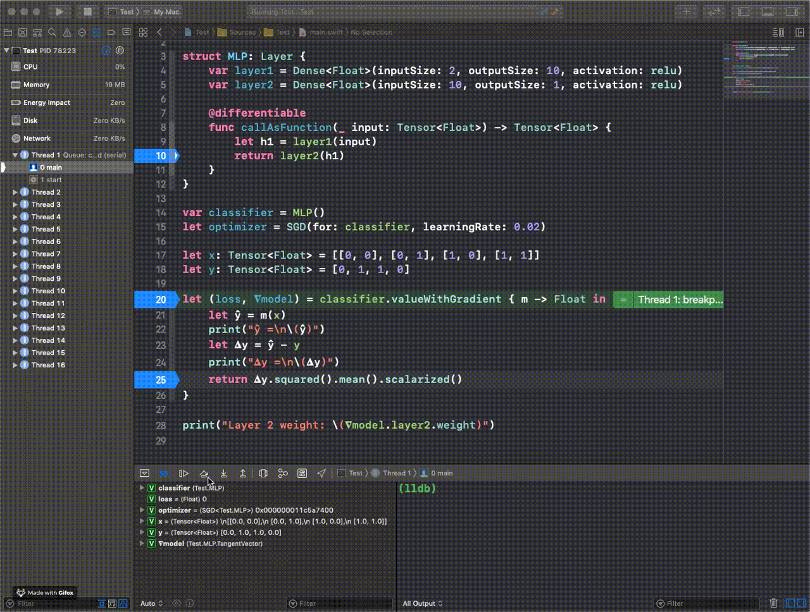
  <br>
  <sub>
  Backpropagation debugging demo using LLDB.
  </sub>
</p>

## Motivation

### Background

In mathematics, a derivative of a function of a real variable is another
function that computes the sensitivity to changes in the output of the original
function with respect to changes in the original function's arguments.
Differentiation is the process of computing derivatives. See the
["Math Introduction"](#math-introduction) section below for more details.

Derivatives are a fundamental tool in calculus and have applications in many
domains, notably deep learning. Numerical computing in Swift is an expressive,
high-performance language that is a great fit for numerical applications. Recent
proposals have paved the way for low-level numerical computing in Swift:
[AdditiveArithmetic][SE-0233], SIMD [[1][SE-0229]] [[2][SE-0251]], [generic math
functions][SE-0246]. However, high-level numerical computing applications,
including machine learning and artificial intelligence, require more work.

We believe that first-class differentiable programming is a big step towards
high-level numerical computing support and will make Swift a real contender in
the numerical computing and machine learning landscape. Differentiable
programming will enable intelligent applications, machine learning models,
scientific experiments, physical simulations, and more.

### Intelligent applications

Intelligent applications are smart: they use machine learning techniques to
enhance user experiences. Intelligent applications can make predictions, provide
suggestions, and learn user preferences: all of these can be powered by
differentiable programming.

The core of an intelligent application is a function with real-valued
parameters. Differentiation can be used to systematically optimize (i.e. find
"good" values for) these parameters via gradient descent. (Optimizing these
parameters via conventional algorithms is typically difficult or intractable.)

For example, consider a podcast player that tries to automatically adjust the
playback speed based on the podcast type and the podcast section.

```swift
enum PodcastCategory {
    case comedy
    case news
    ...
}

enum PodcastSection {
    case advertisement
    case introduction
    case body
    case conclusion
}

struct PodcastState {
    let category: PodcastCategory
    let section: PodcastSection
}

struct PodcastSpeedModel {
    var minSpeed, maxSpeed: Float
    var categoryMultipliers: [PodcastCategory: Float]
    var sectionMultipliers: [PodcastSection: Float]

    /// Returns a podcast speed multiplier prediction for the given podcast category
    /// and section.
    func prediction(for state: PodcastState) -> Float {
        let speed = categoryMultipliers[state.category] * sectionMultipliers[state.section]
        if speed < minSpeed { return minSpeed }
        if speed > maxSpeed { return maxSpeed }
        return speed
    }
}
```

This podcast speed model parameters that determine how quickly the podcast
should play under different circumstances: `minSpeed`, `maxSpeed`,
`categoryMultipliers`, and `sectionMultipliers`. A priori, it is not clear what
good parameter values are, and different users may prefer different parameter
values.

An intelligent application could determine personalized parameter values as
follows:

1.  Let the user set the speed manually, and record observations whenever the
    user changes the speed.

2.  After collecting enough observations, search for parameter values such that
    the model predicts speeds close to the user's preferred speed. If such
    values are found, offer to start automatically setting the speed.

"Gradient descent" is an algorithm that performs this search, and a language
that supports differentiable programming makes it easy to implement gradient
descent. Here is some pseudocode illustrating gradient descent.

First, we need an objective function for gradient descent to minimize.
[Mean absolute error](https://en.wikipedia.org/wiki/Mean_absolute_error) is used
here:

```swift
struct Observation {
    var podcastState: PodcastState
    var userSpeed: Float
}

func meanError(for model: PodcastSpeedModel, _ observations: [Observation]) -> Float {
    var error: Float = 0
    for observation in observations {
        error += abs(model.prediction(for: observation.state) - observation.userSpeed)
    }
    return error / Float(observations.count)
}
```

Next, we implement the gradient descent algorithm.

```swift
var model = PodcastModel()
let observations = storage.observations()
for _ in 0..<1000 {
    // The language differentiates `meanError` to get a "gradient", which is a value indicating
    // how to change `model` in order to decrease the value of `meanError`.
    let gradient = gradient(at: model) { meanError(for: $0, observations) }

    // Change `model` in the direction that decreased the value of `meanError`.
    model -= 0.01 * gradient
}
```

### Type-safe machine learning

Today, machine learning is predominantly done in dynamically-typed languages
like Python: these languages are concise and easy to use. However, some people
prefer safer programming: features like type checking and static diagnostics
help catch errors early and improve productivity.

Differentiable programming in Swift enables safe, powerful machine learning.
Custom differentiable data structures can be declared and checked at
compile-time. Thanks to protocol-oriented programming, differentiable types are
generalized by a protocol, enabling differential operators to be defined as
higher-order functions constrained on such a protocol. Mathematical optimization
algorithms such as neural network optimizers can also be defined generically
over such a protocol and work with all differentiable types.

### Calculus is fun

Calculus is fun, and differentiation in the Swift toolbox will let programmers
explore that fun. Here are some interesting applications:

#### Animations

[Easing functions](https://stackoverflow.com/a/8317722) specify the rate of
change of parameters for animations. Differentiation enables easy manipulation
of these functions.

#### Games

Physics equations can be modeled using differentiable functions in game engines.
Intelligent agents in games can be trained using techniques like machine
learning that are enabled by differentiation.

#### Simulations

Many simulation techniques for fluids and other physical processes are based on
approximate solutions to equations defined in terms of derivatives, like the
[Euler equations](https://en.wikipedia.org/wiki/Euler_equations_\(fluid_dynamics\))
and [Navier-Stokes](https://en.wikipedia.org/wiki/Navier–Stokes_equations).
Being able to differentiate functions is an important building block for
implementing algorithms to solve these equations.

#### Robotics

Control algorithms used in robotics and mechanical engineering rely on (often
higher-order) derivatives of functions that model the behavior of joints and
other physical systems. A language like Swift that can efficiently compute these
derivatives without incurring the unpredictable runtime overhead of garbage
collection may be well-placed to run aboard robots.

#### Rendering and ray tracing

Traditional rendering systems are black boxes that consume data structures with
scene geometry and produce images, but the physical processes they simulate are
made up of differentiable functions. Building a ray tracer out of differentiable
building blocks unlocks applications like inverse rendering (going from an image
to scene geometry). [[1]](https://github.com/BachiLi/redner)
[[2]](https://github.com/avik-pal/RayTracer.jl)

## History of differentiation algorithms

There are three main algorithms for computing derivatives: numerical
differentiation, symbolic differentiation, and automatic differentiation.

### Numerical differentiation

Numerical differentiation is a technique for estimating derivatives of
mathematical functions using values of the functions. The simplest method uses
the
[difference quotient formula](https://en.wikipedia.org/wiki/Difference_quotient),
introduced in elementary calculus courses:

<p align="center">
  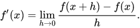
</p>

Numerical differentiation is easy to implement and generalizes to higher-order
derivatives. However, as an estimation approach, it is known to produce
inaccurate results, so it is rarely used when more accurate methods are
available.

### Symbolic differentiation

Symbolic differentiation is a technique for computing derivatives of math
expressions via symbolic manipulation, like differentiating an expression using
pen and paper in elementary calculus. This technique is used by computer algebra
systems like Mathematica, but it produces inefficient code when applied to
computer programs due to code bloat with common subexpressions.

### Automatic differentiation

Automatic differentiation (AD) is a technique for computing derivatives of
functions. Unlike symbolic differentiation, which operates on math expressions,
automatic differentiation operates on code.

Automatic differentiation leverages the chain rule of differentiation and the
ability to define temporary values in a program. There are two styles of
automatic differentiation in the traditional sense: forward-mode AD starts with
partial derivatives at inputs and ends by computing partial derivatives at
outputs, while reverse-mode automatic differentiation starts with partial
derivatives at outputs and ends by computing partial derivatives at inputs.

Mathematically, forward-mode AD corresponds to a fully-right association of the
chain rule of differentiation, and reverse-mode AD corresponds to a fully-left
association. Different associations of the chain rule produce the same result
but may differ in computational complexity†.

<p align="center">
  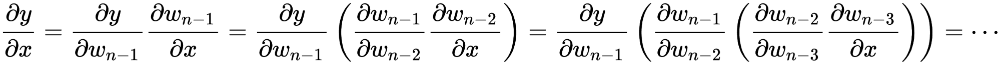
  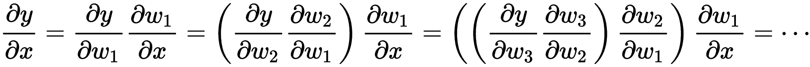
  <br>
  <sub>
  Top: fully-right association of chain rule, starting from partial
  derivative of input; "forward-mode".
  <br>
  Bottom: fully-left association of chain rule, starting from output;
  "reverse-mode".
  </sub>
</p>

Both forward-mode AD and reverse-mode AD are well-explored. Forward-mode AD can
be implemented simply by overloading math operations to compute both original
values and derivatives. Traditionally, reverse-mode AD has been perceived as
being more complicated: implementations typically involve non-local program
transformation and/or mutable tape data structures, though recent research aims
to demystify the subject [[1]](https://arxiv.org/abs/1804.00746)
[[2]](https://arxiv.org/abs/1803.10228).

†: Finding the optimal association of the chain rule of differentiation is
analogous to the
[matrix chain multiplication](https://en.wikipedia.org/wiki/Matrix_chain_multiplication)
problem and can be solved in `O(n^3)` time. More efficient algorithms also
exist.

## Approaches to automatic differentiation

In practice, automatic differentiation is the most common differentiation
algorithm because it is precise and efficient. This section summarizes
approaches to automatic differentiation.

### Embedded domain-specific languages

A domain-specific language (DSL) is a language designed to solve problems for a
specific domain. Some DSLs are *external*: these are standalone languages with
their own syntax and semantics, like HTML (a markup language) and SQL (a
database query language). Other DSLs are *embedded* within a more general "host"
language: these DSLs leverage host language constructs and features to define
interesting behavior. Advantages of embedded DSLs include flexibility and
portability: embedded DSLs can be imported as a library. Examples of embedded
DSLs include React (a UI language embedded in JavaScript) and LINQ (a query
language embedded in C#).

One approach to differentiable programming is to define an embedded DSL for
differentiation *as a library*. This can be done via operator overloading: the
DSL can define a "dual number" type (representing a pair of a real number and
its derivative) and overload differentiable math operations to compute both
original values and derivative values.

```swift
struct RealWithDerivative<T: FloatingPoint> {
    var value: T
    var derivative: T = 0
}
extension RealWithDerivative {
    static func + (lhs: Self, rhs: Self) -> Self {
        RealWithDerivative(
            value: lhs.value + rhs.value,
            derivative: lhs.derivative + rhs.derivative)
    }
    static func * (lhs: Self, rhs: Self) -> Self {
        RealWithDerivative(
            value: lhs.value * rhs.value,
            derivative: lhs.derivative * rhs.value + lhs.value * rhs.derivative)
    }
}

var x = RealWithDerivative(value: 3, derivative: 1)
// Original:   x^2 + x^3 = 3^2 + 3^3 = 36.
// Derivative: 2x + 3x^2 = 2*3 + 3(3)^2 = 33.
var result = x*x + x*x*x
print(result)
// RealWithDerivative<Double>(value: 36.0, derivative: 33.0)
```

Such a DSL could be extended to be more useful. For example, the `Real` type
could be generalized to multidimensional arrays and more differentiable
operations could be added.

However, embedded DSLs have some limitations:

-   DSL functionality is often restricted to specific types and APIs. DSLs often
    use specialized abstractions rather than general ones for simplicity and to
    enable optimizations. For example, many machine learning frameworks are DSLs
    that support differentiation only for a particular multidimensional array
    type and only using a particular algorithm (reverse-mode automatic
    differentiation). Extending a differentiation DSL beyond these limitations
    is difficult and may require extra boilerplate: see below.

-   They typically involve some boilerplate. As a host language, Swift currently
    supports limited metaprogramming for reducing boilerplate code. For example,
    libraries cannot define automatic conformance derivation for library
    protocols (though Swift provides it for `Equatable`, `Hashable`, and
    `Codable`), so users must write boilerplate conformances for their custom
    types.

-   They are limited by the metaprogramming capabilities of the host language.
    It is not currently possible to define non-trivial code transformations
    (e.g. reverse-mode automatic differentiation) in a Swift library on Swift
    code. (Note: SwiftSyntax enables Swift AST transformations but has the extra
    indirection of parsing Swift code from a file - it is not possible to
    evaluate transformed Swift code from the same file without a general "eval"
    mechanism.) To cope with this, some DSLs require explicit program "graph"
    building and/or global mutable data structures to mimic the effects of code
    transformation, which obfuscate the original transformation semantics.

-   They may not work well with all host language constructs. Embedded DSLs only
    support a subset of the host language's features. In particular, some
    differentiation DSLs do not support native mutation (e.g. assigning to a
    `var`) or native control flow (e.g. `if` constructs) due to technical
    limitations, even though supporting them would be ideal.
    Restricting/diagnosing unsupported host language features (e.g. preventing
    DSL users from using `var` in Swift) is difficult or not possible.

-   Producing good diagnostics may be difficult or impossible. DSLs have limited
    access to source location information. When indirections like code
    transformations are involved, showing the appropriate source locations in
    diagnostic messages may be difficult. Without the aid of compiler utilities,
    statically detecting and diagnosing dataflow-based errors is not possible.

### Source code transformation tools

Source code transformation tools are another approach to differentiable
programming. Tool users write code, select various differentiation configuration
options (the name of the function-to-differentiate, the independent and
dependent variable, etc), and provide them to the tool. The tool analyzes the
input code and generates output code that computes derivatives according to the
options.

Historically, this is one of the oldest approaches for automatic
differentiation. Tools like
[Tapenade](https://www-sop.inria.fr/tropics/tapenade.html) and
[ADIC](https://www.mcs.anl.gov/research/projects/adic)/[ADIFOR](https://www.mcs.anl.gov/research/projects/adifor)
compute derivatives of Fortran and C code.

An advantage of source code transformation tools is that they are essentially
*static compilers*: they can perform static analyses on input code to generate
optimized derivative-computing output code. For example, Tapenade performs
["activity analysis"](https://www-sop.inria.fr/tropics/papers/supportCoursDA.pdf)
to determine variables that do not need a derivative and "TBR (to-be-recorded)
analysis" to remove unnecessary intermediate variables during differentiation.

However, these tools are not ideal for usability: users must interact with an
external GUI to specify inputs and they receive a textual program as output.
This external workflow is an extra indirection that takes users out of their
natural programming environment. Exposing the tool-provided differentiation
features within a language would be more ergonomic.

<p align="center">
  
  <br>
  <sub>
  Image of Tapenade web interface.
  <br>
  User specifies input program and configuration options.
  <br>
  Tapenade generates derivative-computing output program.
  </sub>
</p>

### First-class language support

Another class of differentiable programming approaches is by integrating the
differentiation semantics and code transformations into a programming language
to some degree. While there are no mainstream programming languages that support
differentiable programming, research systems like
[Stalin∇](http://www-bcl.cs.may.ie/~barak/papers/toplas-reverse.pdf) add
first-class differential operators (e.g. `grad`) into the language and the
reverse-mode automatic differentiation transformation into the compiler.

First-class language support for differentiation can reap the benefits of source
code transformation techniques (e.g. language coverage, performant derivative
code) without requiring programmers to use an external tool. Well-designed,
powerful differentiation primitives enable users to define their own custom
differentiation APIs that would otherwise not be possible in differentiation
libraries.

### Why bake differentiation into Swift?

First-class language support for differentiation will enable convenient,
extensible, and performant differentiable programming in Swift.

#### Maximal coverage of Swift language features

First-class support for differentiation in Swift enables differentiation to work
nicely with a maximal number of Swift language features, including mutation and
control flow. Users of differentiable programming do not need to write in a
restricted subset of Swift: just write normal code and use differentiation.

#### Extensibility

First-class language support enables an extensible differentiable programming
system.

Custom types can be extended to be differentiable with minimal boilerplate.
Custom derivative functions can be retroactively registered for existing
functions. Users can define custom differentiation APIs using the powerful
primitive operators defined in the standard library and supported by the type
system.

#### Static warnings and errors

Some functions perform non-differentiable operations (on the path from
parameters to result) and thus cannot be differentiated. Functions that do not
use their parameters to compute the result are technically differentiable, but
the derivative is trivially always zero.

With language support for differentiation, the compiler can identify these cases
statically via data flow analysis and produce a non-differentiability error or
warning. These diagnostics improve productivity and help users catch errors
ahead of time. Library-based differentiation approaches cannot generally provide
these diagnostics.

For details on static warnings and errors, see the "Static analysis" section in
the detailed design below.

#### The pursuit for user-defined code transformations

The key code transformation enabling differentiable programming is "derivative
code generation". Derivative code generation implements automatic
differentiation: given an "original function" to differentiate, a derivative
function is generated by replacing function applications in the original
function with corresponding derivative function applications. The algorithm is
described in detail in the
[Swift Differentiable Programming Implementation Overview document](http://bit.ly/swift-autodiff-internals).

Some languages provide the ability to define custom code transformations:

-   [Macros](https://en.wikipedia.org/wiki/Macro_\(computer_science\)) enable
    syntax-based code transformations at compile-time. Hygienic macros (macro
    systems that avoid accidental variable capture) are available in a variety
    of languages, including Lisp, Julia, Rust, and Scala, to name a few. As an
    example: generated type-safe schema wrappers can implemented using
    [hygienic macros in Scala](https://meta.plasm.us/posts/2013/07/11/fake-type-providers-part-2).

-   Compiler plugin systems enable programmers to write plugins that extend the
    behavior of a compiler. Compiler plugins are more popular in bootstrapped
    languages, like
    [Haskell](https://ghc.gitlab.haskell.org/ghc/doc/users_guide/extending_ghc.html#compiler-plugins),
    [Rust](https://doc.rust-lang.org/1.1.0/book/compiler-plugins.html) and
    [Scala](https://docs.scala-lang.org/overviews/plugins/index.html), where the
    plugin can be written in the language itself. As an example: a
    continuation-passing-style code transformation can be implemented as a
    [compiler plugin in Scala](https://github.com/scala/scala-continuations).

One might make the case that derivative code generation for differentiation is
better implemented as a custom code transformation. While that may be true in
theory, Swift does not yet support custom code transformations in practice. This
proposal presents differentiable programming as a system of *high-level language
features and semantics*; derivative code generation is an implementation detail.
If a system for custom code transformations is added to Swift one day, it may be
possible to reimplement derivative code generation using that system without
changing the high-level differentiable programming features proposed here.

## Math introduction

### What is a derivative?

The derivative of a function `f` measures how quickly the function's output
changes when you make small changes to the function's input. The value of this
measurement depends on the input `x` that you start with, and we call the value
of the measurement starting at that input "the derivative of `f` at `x`.

For a single variable real function (a function with a single real input and a
single real output), the derivative of `f` at `x` can be summarized as a single
real number `f'(x)` such that `f(x + ε) ~= f(x) + f'(x) * ε`. In other words,
changing the input by a tiny amount `epsilon` changes the output by `f'(x) * ε`.

<p align="center">
  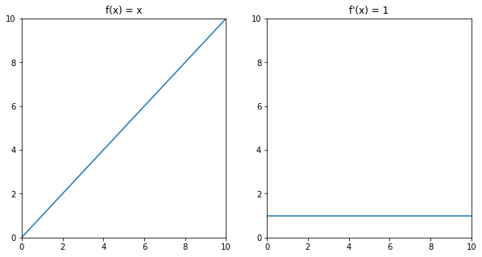
  <br>
  <sub>
  <code>f(x) = x</code> changes by exactly <code>ε</code> whenever you change
  its input by <code>ε</code>, so its derivative is 1 everywhere.
  </sub>
</p>

<p align="center">
  
  <br>
  <sub>
  Near <code>x = 0</code>, <code>f(x) = x^2</code> changes very little when you
  change its input, so its derivative at <code>x = 0</code> is <code>0</code>
  (see orange line).
  <br>
  Near <code>x = 1</code>, <code>f(x) = x^2</code> changes by approximately
  <code>2*ε</code> when you change its input by <code>ε</code>, so its
  derivative at <code>x = 1</code> is <code>2</code> (see green line).
  <br>
  In general, the derivative of <code>f(x) = x^2</code> at <code>x</code> is
  <code>2*x</code>.
  </sub>
</p>

### Iterative optimization

Iterative optimization algorithms use derivatives to optimize functions (i.e.
find the inputs that minimize or maximize the output of the function). For
example, the simple "gradient descent" algorithm starts with an arbitrary input
`x` and uses the derivative of the function at `x` to determine whether it needs
to increase or decrease `x` to decrease the output of the function. Then it
mutates `x` slightly along the appropriate direction and repeats until the
output stops decreasing.

<p align="center">
  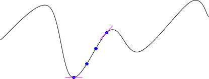
</p>

### Derivatives of functions with arbitrary inputs

Real world programs deal with data more complicated than single real variables.
Fortunately, there are mathematical theories that extend derivatives to
functions with nearly arbitrary inputs and outputs.

Recall our original description of derivative: "The derivative of a function `f`
measures how quickly the function's output changes when you make small changes
to the function's input." This makes sense for arbitrary input and output types,
as long as we can describe small changes in them.

It is easy to describe small changes in nested structures of real numbers: they
are just small changes in all the components' real numbers. For example,
consider:

```swift
struct Point {
    var x, y: Float
}

struct PointPair {
    var p1, p2: Point
}
```

A small change in `Point` might be "add `0.01` to `x` and add `0.02` to y". A
small change in `PointPair` might be "add `0.01` to `p1.x` and add `0.01` to
`p2.x`".

We can define new types that capture the values of these small changes. We call
these types "tangent vectors", a term from math. For example:

```swift
extension Point {
    struct TangentVector {
        // `dx` and `dy` are small changes in `x` and `y`, respectively.
        var dx, dy: Float
    }
}

extension PointPair {
    struct TangentVector {
        // `dp1` and `dp2` are small changes in `p1` and `p2`, respectively.
        var dp1, dp2: Point.TangentVector
    }
}
```

In terms of these tangent vectors, the small changes that we described in words
above would be:

```swift
Point.TangentVector(dx: 0.01, dy: 0.02)

PointPair.TangentVector(
    p1: Point.TangentVector(dx: 0.01, dy: 0),
    p2: Point.TangentVector(dx: 0.01, dy: 0))
```

In terms of tangent vectors, the derivative of a function `f: (A) -> B` is a
function `df: (A, A.TangentVector) -> B.TangentVector`. In other words, `df`
takes a starting value of type `A` and a small change `A.TangentVector` and
tells you what the resulting small change in `B` is.

The gradient descent iterative optimization algorithm can run on any function
`f: (A) -> Float` as long as `A` is a type for which we can define a tangent
vector. It iteratively walks around different values of `A`, searching for a
value that minimizes the output of `f`.

## Proposed solution

To push Swift's capabilities to the next level in numerics and machine learning,
we introduce differentiable programming as a new language feature, which
includes standard library APIs and small additive changes to the type system.

### The `Differentiable` protocol

`Differentiable` is a standard library protocol that generalizes all data
structures that can be a parameter or result of a differentiable function. The
compiler derives protocol requirement implementations when a `@memberwise`
conformance is declared.

```swift
extension Float: Differentiable {
    typealias TangentVector = Self
}
struct Perceptron: @memberwise Differentiable {
    var weight: SIMD64<Float>
    var bias: Float
}
```

### The `@differentiable` declaration attribute

The `@differentiable` declaration attribute is an attribute that marks
function-like declarations (function declarations, initializers, properties, and
subscripts) as being differentiable.

```swift
@differentiable
func cubed(_ x: Float) -> Float {
    x * x * x
}
extension Perceptron {
    @differentiable
    func callAsFunction(_ input: SIMD64<Float>) -> Float {
        (weight * input).sum() + bias
    }
}
```

### `@differentiable` function types

A subtype of normal function types with a different runtime representation,
which stores metadata that allows their values to be differentiated anywhere.

```swift
func addOne(_ x: Float) -> Float { x + 1 }
let _: @differentiable (Float) -> Float = addOne
let _: @differentiable(linear) (Float) -> Float = addOne
```

### `@differentiating` and `@transposing` attributes

`@differentiating` and `@transposing` attributes are used for declaring custom
derivative functions for some other function declaration.

```swift
import Glibc

@differentiating(expf)
func _(_ x: Float) -> (value: Float,
                       differential: @differentiable(linear) (Float) -> Float) {
    let y = expf(x)
    return (value: y, differential: { v in v * y })
}
```

### Differential operators

Standard library differentiation APIs that take `@differentiable` functions and
return derivative functions or compute derivative values.

```swift
// In the standard library:
//
//     func derivative<T: FloatingPoint, R>(
//         of body: @escaping @differentiable (T) -> R
//     ) -> (T) -> R where T.TangentVector: FloatingPoint

@differentiable
func f(_ x: Float) -> Float {
    x * x
}
let dfdx = derivative(of: f)
dfdx(3) // 6
```

## Detailed design

### Differentiable data structures

Speaking in terms of elementary calculus, only functions are "differentiable":
only functions have derivatives and can be differentiated. In programming
languages, types are isomorphic to mathematical spaces, and functions are
isomorphic to mathematical functions over those spaces. Differentiability
depends heavily on the continuity and smoothness of points in a space (or values
of a type). For example, the `Int` type represents the space of integers, which
are discrete values, so functions over integers cannot be differentiated. In
general, when a type is said to be differentiable, it means that one can do
calculus with its values. As such, real numbers, real vector spaces, and complex
vector spaces are differentiable, but characters, strings, and integers are not.

For full flexibility and extensibility, a protocol is introduced in the Swift
standard library to generalize all data structures that can be a parameter or a
result of a differentiable function.

#### The `Differentiable` protocol

The `Differentiable` protocol defines operations and structures required for a
type to be differentiated.


```swift
public protocol Differentiable {
    /// A type that can be used to represent derivatives with respect to a
    /// value whose type is `Self`. Mathematically, this is equivalent to the
    /// tangent bundle of the differentiable manifold represented by the
    /// differentiable type.
    associatedtype TangentVector: Differentiable & AdditiveArithmetic
        where TangentVector == TangentVector.TangentVector

    /// Moves `self` along the given direction. In Riemannian geometry, this is
    /// equivalent to exponential map, which moves `self` on the geodesic
    /// surface along the given tangent vector.
    mutating func move(along direction: TangentVector)
    
    /// A closure that produces a zero tangent vector and does not capture `self`.
    ///
    /// In some cases, the zero tangent vector of `self` is equal to
    /// `TangentVector.zero`. In other cases, the zero tangent vector depends on
    /// information in `self`, such as shape for an n-dimensional array type.
    /// For differentiable programming, it is more memory-efficient to define a
    /// custom `zeroTangentVectorInitializer` property which returns a closure
    /// that captures and uses only the necessary information to create a zero
    /// tangent vector. For example:
    ///
    /// ```swift
    /// struct Vector {
    ///     var scalars: [Float]
    ///     var count: Int { scalars.count }
    ///     init(repeating repeatedElement: Float, count: Int) { ... }
    /// }
    /// 
    /// extension Vector: Differentiable {
    ///     typealias TangentVector = Vector
    ///
    ///     @noDerivative
    ///     var zeroTangentVectorInitializer: () -> TangentVector {
    ///         let count = self.count
    ///         return { TangentVector(repeating: 0, count: count) }
    ///     }
    /// }
    /// ```
    ///
    @noDerivative
    var zeroTangentVectorInitializer: () -> TangentVector { get }
}

extension Differentiable {
    /// A tangent vector such that `move(along: zeroTangentVector)` will not modify
    /// `self`.
    @noDerivative
    var zeroTangentVector: TangentVector { zeroTangentVectorInitializer() }
}
```

Specifically, `Differentiable` generalizes types to satisfy the following
requirements from real-world use cases: Functions over these types can be
differentiable. Besides types, a function's differentiability also depends on
the function's body. Values of these types can be updated based on derivative
values. For full flexibility, differentiable types should not be required to be
a vector space. For example, a differentiable neural network layer can store a
`Bool` flag in addition to differentiable parameters.

Intuitively, a `Differentiable`-conforming type allows one to do calculus with
its values. In elementary calculus, a derivative of a real-valued function at a
point is the slope of the tangent line at this point. The tangent line is the
best [linear approximation](https://en.wikipedia.org/wiki/Linear_approximation)
of the differentiated function near that input value. The same definition
applies to vector-valued functions when they are split into their coordinate
functions. The derivative of a vector-valued function at a certain point is
called a [tangent vector](https://en.wikipedia.org/wiki/Tangent_vector). Beyond
real numbers and vector spaces, there is a widely accepted mathematical
framework,
[differential geometry](https://en.wikipedia.org/wiki/Differential_geometry),
which generalizes calculus beyond Euclidean space. By bringing ideas from this
mathematical framework into the Swift standard library and the Swift compiler,
differentiable programming becomes more flexible and expressive than ever.

<p align="center">
  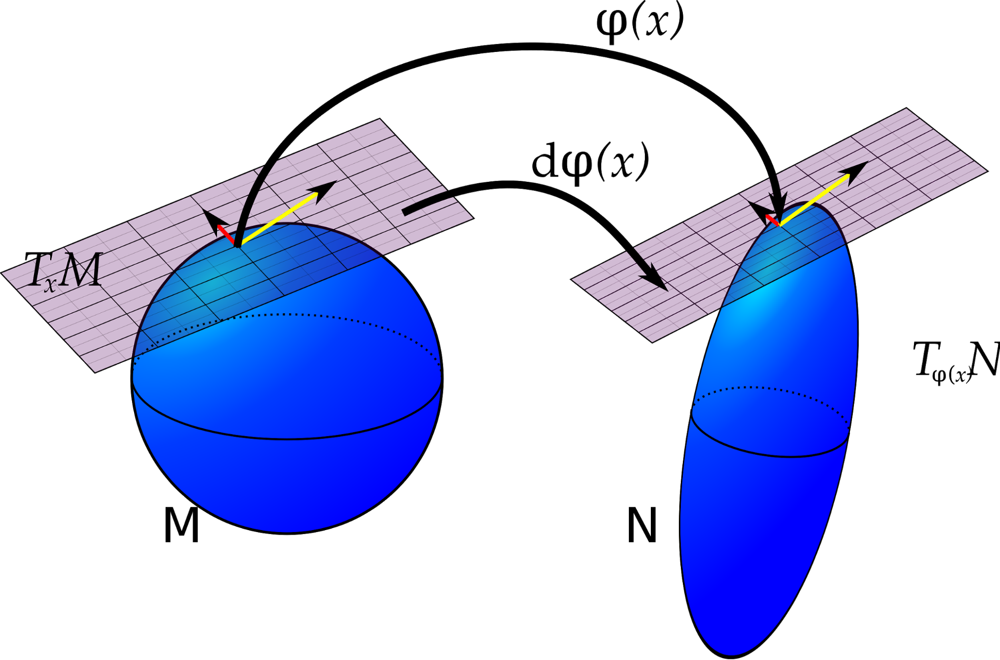
  <br>
  <sub>
  Image showing two differentiable manifolds: a sphere and a spheroid, from
  https://en.wikipedia.org/wiki/Pushforward_(differential).
  <br>
  If a map, φ, carries every point on manifold M to manifold N, then the
  pushforward of φ carries vectors in the tangent space at every point in M to
  a tangent space at every point in N.
  </sub>
</p>

Mathematically speaking, types that conform to `Differentiable` are considered
[smooth Riemannian manifolds](https://en.wikipedia.org/wiki/Riemannian_manifold).
When differentiating a function over these manifolds, a derivative value is a
vector in the [tangent bundle](https://en.wikipedia.org/wiki/Tangent_bundle) of
this manifold and has type `TangentVector`. The associated type `TangentVector`
is required to conform to `AdditiveArithmetic` because
[additive group](https://en.wikipedia.org/wiki/Additive_group) properties
[`zero`](https://developer.apple.com/documentation/swift/additivearithmetic/3126829-zero)
and
[`+(_:_:)`](https://developer.apple.com/documentation/swift/additivearithmetic/3126821)
are necessary for initializing and accumulating derivative values.

The `move(along:)` method is equivalent to the mathematical notion of
[exponential map](https://en.wikipedia.org/wiki/Exponential_map_\(Riemannian_geometry\)),
which takes a tangent vector (e.g. a derivative), and moves the value along the
direction specified by the tangent vector on the geodesic surface of the
manifold. In vector spaces where the tangent vector is of the same vector space
as the original differentiable space, `move(along:)` is equivalent to vector
addition. Mathematical optimization algorithms such as gradient descent will
make use of this method.

```swift
public extension Differentiable where Self == TangentVector {
    mutating func move(along direction: TangentVector) {
        self += direction
    }

    @noDerivative
    var zeroTangentVectorInitializer: () -> TangentVector {
        { .zero }
    }
}
```

The `zeroTangentVector` property returns a tangent vector such that calling
`move(along:)` on the vector will not modify `self`. A zero tangent vector is
often used in the initialization of mathematical optimization, where tangent
vectors are initially zero and modified iteratively. This property may be
different from `TangentVector.zero` because some tangent vectors depend on
instance properties of `self`, e.g. the `count` property in `Array`.

#### `Differentiable` conformances

Conforming a type to `Differentiable` tells Swift that changes in values of this
type can be differentiated, and makes functions over this type be compatible
with all differentiation APIs in the standard library. Floating point numeric
types and vector types, including
[`Float`](https://developer.apple.com/documentation/swift/float),
[`Double`](https://developer.apple.com/documentation/swift/double),
[`Float80`](https://developer.apple.com/documentation/swift/float80), and
[SIMD vector types](https://developer.apple.com/documentation/swift/swift_standard_library/numbers_and_basic_values/simd_vector_types),
are extended to conform to `Differentiable`, and their `TangentVector`s equal
themselves.

Besides numeric types, collections of numeric types are also powerful data
structures in differentiable programming. For example, the
[`Array`](https://developer.apple.com/documentation/swift/array) type in the
standard library
[conforms to `Differentiable`](https://github.com/apple/swift/blob/c224468653366119690aeb34f290843f3e5f2fd6/stdlib/public/core/Array.swift#L2052)
conditionally when the `Element` type conforms to `Differentiable`. This makes
it possible to differentiate functions over arrays, and makes it easy to express
dynamic differentiable algorithms. Similarly, other common container types in
the standard library such as
[`Optional`](https://developer.apple.com/documentation/swift/optional),
[`Dictionary`](https://developer.apple.com/documentation/swift/dictionary), and
[`Result`](https://developer.apple.com/documentation/swift/result) can also be
made differentiable via a conditional protocol conformance.

```swift
// struct Array<Element>
extension Array: Differentiable where Element: Differentiable {
    // Note: `Array.TangentVector` cannot be `Array` because `Array.+` is used for
    // concatenation and therefore cannot satisfy the `AdditiveArithmetic`
    // conformance constraint.
    public struct TangentVector: Differentiable, AdditiveArithmetic {
        public typealias TangentVector = Self
        @differentiable
        public var elements: [Element.TangentVector]
        @differentiable
        public init(_ elements: [Element.TangentVector]) { self.elements = elements }
        ...
    }

    public mutating func move(along direction: TangentVector) {
        for i in indices {
            self[i].move(along: Element.TangentVector(direction.elements[i]))
        }
    }

    @noDerivative
    public var zeroTangentVectorInitializer: () -> TangentVector {
        { [count = self.count] in
            TangentVector(Array(repeating: .zero, count: count))
        }
    }
}

// struct Dictionary<Key: Hashable, Value>
extension Dictionary: Differentiable where Value: Differentiable {
    public struct TangentVector: Differentiable, AdditiveArithmetic {
        public typealias TangentVector = Self
        @differentiable
        public var elements: [Key: Value.TangentVector]
        @differentiable
        public init(_ elements: [Key: Value.TangentVector]) {
            self.elements = elements
        }
        ...
    }

    public mutating func move(along direction: TangentVector) {
        for i in indices {
            self[i].move(along: Value.TangentVector(direction.elements[i]))
        }
    }

    @noDerivative
    public var zeroTangentVectorInitializer: () -> TangentVector {
        { [keys = self.keys] in
            let pairs = zip(keys, sequence(first: .zero, next: {$0}))
            return TangentVector(Dictionary(uniqueKeysWithValues: pairs))
        }
    }
}

// enum Optional<Wrapped>
extension Optional: Differentiable where Wrapped: Differentiable {
    public struct TangentVector: Differentiable, AdditiveArithmetic {
        public typealias TangentVector = Self
        @differentiable
        public var value: Wrapped.TangentVector?
        @differentiable
        public init(_ value: Wrapped.TangentVector?) { self.value = value }
        ...
    }

    public mutating func move(along direction: TangentVector) {
        if let value = direction.value {
            self?.move(along: value)
        }
    }

    @noDerivative
    public var zeroTangentVectorInitializer: () -> TangentVector {
        { TangentVector(.zero) }
    }
}
```

#### Compiler-synthesized conformances

In numerics and machine learning, high-level data structures such as neural
network layers and models are formed from smaller components stored as
properties in structure types and class types. In order to use these types for
differentiation, one must extend these types to conform to the `Differentiable`
protocol. Luckily, this need not be done manually in most cases—the compiler
automatically synthesizes conformances when a memberwise `Differentiable`
conformance is declared.

##### Synthesis conditions

The compiler automatically synthesizes implementations of `Differentiable`
protocol requirements for struct and class types. Here are the conditions for
synthesis: The type must declare a conformance to `Differentiable` with a
`@memberwise` attribute before the protocol name, either on the type declaration
or on an extension in the same file. All stored properties of the conforming
type must either be a `var` that conforms to `Differentiable` or be marked with
the `@noDerivative` attribute. If a non-`Differentiable` or a `let` stored
property is not marked with `@noDerivative`, then it is treated as if it has
`@noDerivative` and the compiler emits a warning (with a fix-it in IDEs) asking
the user to make the attribute explicit.

##### Default synthesis

By default, the compiler synthesizes a nested `TangentVector` structure type
that contains the `TangentVector`s of all stored properties that are not marked
with `@noDerivative`. In other words, `@noDerivative` makes a stored property
not be included in a type's tangent vectors.

The synthesized `TangentVector` has the same effective access level as the
original type declaration. Properties in the synthesized `TangentVector` have
the same effective access level as their corresponding original properties.

A `move(along:)` method is synthesized with a body that calls `move(along:)` for
each pair of the original property and its corresponding property in
`TangentVector`. Similarly, `zeroTangentVector` is synthesized to return a
tangent vector that consists of each stored property's `zeroTangentVector`.
Here's an example:

```swift
struct Foo<T: Differentiable, U: Differentiable>: @memberwise Differentiable {
    // `x` and `y` are the "differentiation properties".
    var x: T
    var y: U
    @noDerivative var customFlag: Bool
    @noDerivative let helperVariable: T

    // The compiler synthesizes:
    //     struct TangentVector: Differentiable, AdditiveArithmetic {
    //         var x: T.TangentVector
    //         var y: U.TangentVector
    //     }
    //     mutating func move(along direction: TangentVector) {
    //         x.move(along: direction.x)
    //         y.move(along: direction.y)
    //     }
    //     @noDerivative
    //     var zeroTangentVectorInitializer: () -> TangentVector {
    //         { [xTanInit = x.zeroTangentVectorInitializer,
    //            yTanInit = y.zeroTangentVectorInitializer] in
    //             TangentVector(x: xTanInit(), y: yTanInit())
    //         }
    //     }
}
```

##### Shortcut synthesis

In certain cases, it is not ideal to keep `Self` and `TangentVector` as separate
types. A most obvious example of this is when all of the following conditions
are met: `Self` is declared to conform to `AdditiveArithmetic`. All stored
properties are declared to conform to `AdditiveArithmetic`. There are no
`@noDerivative` stored properties.

In these cases, the compiler will make `TangentVector` be a type alias for Self.
Method `move(along:)` and property `zeroTangentVector` will not be synthesized
because a default implementation already exists.

```swift
struct Point<T: Real>: @memberwise Differentiable, @memberwise AdditiveArithmetic {
    // `x` and `y` are the "differentiation properties".
    var x, y: T

    // The compiler synthesizes:
    //     typealias TangentVector = Self
}
```

### Differentiable function declarations

At the heart of a differentiable programming language is the ability to express
differentiable functions, from abstract manifold operations all the way down to
floating point addition. Because differentiable programming is a flexible and
extensible language feature in Swift, the compiler is agnostic of actual
mathematical operations—it does not have special knowledge of standard library
operators such as
[Float.+(_:_:)](https://developer.apple.com/documentation/swift/float/2894068),
nor does it distinguish between primitive operations and normal functions. A
function can be differentiated with respect to certain Differentiable-conforming
parameters if it satisfies one of the following requirements:

-   Base case 1: It is linear with respect to those parameters.

-   Base case 2: A derivative function for it with respect to those parameters
    exists in code.

-   Recursive case: All function calls, initializer calls, subscript accesses,
    property accesses, variable assignments along the path from those parameters
    to the result can be differentiated.

#### The `@differentiable` declaration attribute

The `@differentiable` declaration attribute can be used to mark function
declarations, initializers, properties, and subscripts as being differentiable.
When one of these entities is marked with `@differentiable`, the compiler
attempts to differentiate it with respect to all parameters (including any
implicit `self` parameter) that conform to the `Differentiable` protocol. One
can specify explicit parameters via a `wrt:` clause, e.g. `@differentiable(wrt:
x)` and `@differentiable(wrt: (self, x))`. In generic algorithms, one can also
provide a `where`-clause to specify generic constraints for parameters or the
result to make the function differentiable only when the generic constraints are
satisfied, e.g. `@differentiable(wrt: x where Scalar: FloatingPoint)`.

```swift
@differentiable // differentiable with respect to 'x'
func silly(_ x: Float, _ n: Int) -> Float {
    print("Running 'silly' on \(x) and \(n)!")
    return sin(cos(x))
}
```

Computed property getters behave like methods in that they accept exactly one
argument, `self`. If a computed property is marked with `@differentiable`, the
compiler attempts to differentiate its getter with respect to `self`.
`@differentiable` can also be applied to an explicit getter declaration.

```swift
extension Float {
    @differentiable
    var reciprocal: Float {
        1 / self
    }
}
```

Among these language constructs, stored properties are the least method-like in
that they are stored values and cannot have a user-defined getter. However,
access to stored properties can be considered as a projection of `self`.
Therefore, stored properties can be marked `@differentiable` and be
differentiated as a function as well. However, an explicit `@differentiable` is
only necessary for public properties in public structs or classes to support
library evolution, and are implicitly synthesized by the compiler when the
parent type's `Differentiable` conformance is synthesized by the compiler (not
user-defined).

```swift
public struct Vector: @memberwise Differentiable {
    @differentiable // Okay, though the compiler has synthesized it.
    public var x, y: Float
}
```

#### Conformance and subclassing

Protocol requirements and class members can be made differentiable with a
`@differentiable` attribute. Semantically, this means that this member is
guaranteed to be differentiable, and that any conformance implementation or
inheritance must maintain the differentiability.

##### Protocol dispatch

The `@differentiable` attribute can be used on protocol requirements. A
`@differentiable` protocol requirement requires that all conforming types
implement this protocol requirement with a differentiable body with respect to
the specified parameters.

```swift
protocol Layer: Differentiable {
    associatedtype Input: Differentiable
    associatedtype Output: Differentiable
    @differentiable // w.r.t. `input` and `self`
    func callAsFunction(_: Input) -> Output
}
struct Perceptron: @memberwise Differentiable, Layer {
    var weight: SIMD4<Float>
    var bias: Float
    @differentiable // w.r.t. `input` and `self`
    func callAsFunction(_ input: SIMD4<Float>) -> Float {
        (weight * input).sum() + b
    }
}
```

In a protocol hierarchy, one can override a differentiable protocol requirement
with a `@differentiable` attribute that declares differentiability with respect
to more parameters.

```swift
protocol Module: Differentiable {
    associatedtype Input
    associatedtype Output: Differentiable
    @differentiable(wrt: self)
    func callAsFunction(_: Input) -> Output
}

protocol Layer: Module where Input: Differentiable {
    @differentiable(wrt: (self, input))
    func callAsFunction(_: Input) -> Output
}
```

In the example above, types that are declared to conform to `Layer` (the
protocol with a refined `callAsFunction(_:)` method) can omit the
`@differentiable(wrt: self)` attribute on the method implementation and use
`@differentiable(wrt: (self, input))` (or just `@differentiable`) only.

`Differentiable` protocol requirements are not allowed to use a `where`-clause
in the `@differentiable` attribute. This is to simplify the programming model
where protocol requirement overrides are more powerful.

##### Class dispatch

A differentiable non-final class method, property or subscript can be overridden
by a subclass implementation. The overriding implementation must be
`@differentiable` if the original overridden declaration is marked with
`@differentiable`. When a method/subscript call or a property access that is
dynamically dispatched is being differentiated, the derivative of the subclass
implementation will be used.

```swift
class Superclass {
    @differentiable
    func foo(_ x: SIMD8<Float>) -> Float {
        x.sum()
    }
}

class Subclass: Superclass {
    @differentiable
    override func foo(_ x: SIMD8<Float>) -> Float {
        (x * x).sum()
    }
}
```

### Make a function differentiable using `@differentiating` or `@transposing`

Any function that has `Differentiable`-conforming parameters and result can be
made differentiable by extending the function to have either an associated
derivative function or a linear transpose. The `@differentiating` attribute is
used for marking a function as producing a custom derivative for another
function, hence making the other function differentiable. The `@transposing`
attribute is used for marking a function as transposing another function, hence
making the other function linear.

A protocol requirement or class method/property/subscript can be made
differentiable via a derivative function or transpose function defined in an
extension. A dispatched call to such a member can be differentiated even if the
concrete implementation is not differentiable.

#### Linear maps

[Linear maps](https://en.wikipedia.org/wiki/Linear_map) are a fundamental
concept in differentiation. Differentiating a function between two
differentiable manifolds at a certain point produces a linear map between the
[tangent space](https://en.wikipedia.org/wiki/Tangent_space) at that point in
the input manifold and the tangent space at the corresponding point at the
output manifold. This linear map is called a
[differential (or pushforward)](https://en.wikipedia.org/wiki/Pushforward_\(differential\)),
which applies the chain rule to compute directional derivatives. Gradients, on
the other hand, are computed by a linear map called
[pullback](https://en.wikipedia.org/wiki/Pullback_\(differential_geometry\)),
which is the transpose of a differential, where transposition can be thought of
as transposing the matrix representing the linear map. It is important that
functions that are used for chaining derivatives are implemented as linear maps
provided with a transpose (e.g. scalar multiplication, matrix transposition, and
matrix multiplication), because gradients can only be computed when the
differential can be transposed.

To make a function a linear map, use a `@transposing` attribute on the transpose
function. If the function is only linear with respect to certain parameters, use
a wrt: clause to indicate parameter positions, e.g. `@transposing(..., wrt:
(self, 0))`.

The numeric addition operator
[`AdditiveArithmetic.+(_:_:)`](https://developer.apple.com/documentation/swift/additivearithmetic/3126821)
is linear, and the multiplication operator
[`Numeric.*(_:_:)`](https://developer.apple.com/documentation/swift/numeric/2883821)
is [bilinear](https://en.wikipedia.org/wiki/Bilinear_map) (i.e. linear with
respect to each parameter). Here's how they are made differentiable in the
standard library.

_Note: Since both transpose functions and derivative functions are difficult to
name and need not be referenced directly, we make these functions unnamed (with
base name being an underscore). This is not yet valid in the official Swift
language, but the developers of the differentiable programming feature will
prototype and pitch this change through Swift Evolution._

```swift
extension FloatingPoint where Self: Differentiable & AdditiveArithmetic {
    @transposing(+)
    static func _(_ v: Self) -> (Self, Self) { (v, v) }

    @transposing(*, wrt: 0)
    @transposing(*, wrt: 1)
    static func _(lhs: Self, rhs: Self) -> Self { lhs * rhs }
}
```

As shown, transpose functions may be defined in a type extension or a protocol
extension that has more generic constraints than the original `+(_:_:)` and
`*(_:_:)` declarations. This makes the original functions linear only when these
extra generic constraints are satisfied. Moreover, transpose functions for
`*(_:_:)` are defined per-parameter due to the nature of bilinearity (`x + y` is
a flat plane while `x * y` is not), but fortunately its transpose functions with
respect to each parameter are just `*(_:_:)` itself.

In vector calculus, transpose functions become less trivial. For example, here
is a hypothetical `Tensor` type, which has two transpose functions defined for
`Tensor.transposed()`, the tensor transposition method, and `matmul(_:_:)`, the
matrix multiplication function.

```swift
extension Tensor where Scalar: FloatingPoint & Differentiable {
    @transposing(transposed, wrt: self)
    func _() -> Tensor {
        self.transposed()
    }
}

@transposing(matmul(_:_:), wrt: 0)
func _<T: FloatingPoint & Differentiable>(y: Tensor<T>, v: Tensor<T>) -> Tensor<T> {
    matmul(v, y.transposed())
}

@transposing(matmul(_:_:), wrt: 1)
func _<T: FloatingPoint & Differentiable>(x: Tensor<T>, v: Tensor<T>) -> Tensor<T> {
    matmul(x.transposed(), v)
}
```

##### Examples

Many floating-point operations are linear. Addition and subtraction are linear.
Multiplication is bilinear (linear with respect to each argument).

```swift
extension FloatingPoint {
    @inlinable
    @transposing(+)
    func _(_ v: Self) -> (Self, Self) {
        (v, v)
    }

    @inlinable
    @transposing(-)
    func _(_ v: Self) -> (Self, Self) {
        (v, -v)
    }

    @inlinable
    @transposing(*, wrt: 0)
    @transposing(*, wrt: 1)
    func _(_ x: Self, _ v: Self) -> Self {
        return x * v
    }
}
```

Complex differentiation is representable in our system. Complex numbers behave
differently from real numbers and vectors
([forum discussion](https://forums.swift.org/t/vectornumeric-type-in-general-complex-numbers/24875/3):
they have an additional `conjugate` operation which flips the sign of the
imaginary component.

Since complex numbers are not yet defined in the standard library, we extended
the complex number type defined in the
[NumericAnnex](https://github.com/xwu/NumericAnnex) library to be
differentiable.
[The full implementation is here](https://github.com/tensorflow/swift-apis/blob/master/Sources/third_party/Experimental/Complex.swift).
The implementation adopts the
[Autograd convention](https://github.com/HIPS/autograd/blob/master/docs/tutorial.md#complex-numbers)
for derivatives of functions with complex arguments or results, so that we can
define derivatives for non-holomorphic primitives.

```swift
struct Complex<Base: FloatingPoint>: Numeric {
    var real: Base
    var imaginary: Base

    @differentiable(linear where Base: Differentiable, Base == Base.TangentVector)
    init(real: Base = 0, imaginary: Base = 0) {
        self.real = real
        self.imaginary = imaginary
    }

    ...
}

extension Complex: @memberwise Differentiable where Base: Differentiable, Base == Base.TangentVector {}

extension Complex {
    @differentiable(where Base: Differentiable, Base == Base.TangentVector)
    func complexConjugate() -> Complex {
        Complex(real: real, imaginary: -imaginary)
    }
}
```

SIMD vectors are also differentiable: mathematically, they represent a vector
space. Most SIMD operations are defined as `SIMD` protocol requirements, so
derivatives of these operations can be defined generally in a protocol extension
on `SIMD`.

```swift
extension SIMD where Self: Differentiable, TangentVector: SIMD, Scalar: BinaryFloatingPoint, Self == Self.TangentVector {
    @transposing(*, wrt: 0)
    @transposing(*, wrt: 1)
    static func _(v: Self, x: Self) -> Self {
        v * x
    }
}
```

Additionally, concrete types conforming to `SIMD` are extended to conditionally
conform to `Differentiable` and `AdditiveArithmetic`. For `SIMD` conforming
types, the `TangentVector` associated type is equal to `Self`.

```swift
extension SIMD${n}: AdditiveArithmetic where Scalar: BinaryFloatingPoint {}

extension SIMD${n}: Differentiable
where Scalar: Differentiable & BinaryFloatingPoint,
      Scalar.TangentVector : BinaryFloatingPoint {
    public typealias TangentVector = SIMD${n}
}

// `subscript` is defined on `SIMD`-conforming types, so the transpose is as well.
extension SIMDScalar where Self: Differentiable & BinaryFloatingPoint {
    @transposing(subscript)
    func _(index: Int) -> SIMD${n}<Self> {
        var result = SIMD${n}<Self>.zero
        result[index] = self
        return result
    }
}
```

The full implementation is in
[`SIMDVector.swift`](https://github.com/apple/swift/blob/tensorflow/stdlib/public/core/SIMDVector.swift)
and
[`SIMDVectorTypes.swift.gyb`](https://github.com/apple/swift/blob/tensorflow/stdlib/public/core/SIMDVectorTypes.swift.gyb)
on the `tensorflow` branch.

#### Derivative functions

In the following example, the 32-bit floating point exponential function
[`expf(_:)`](https://en.cppreference.com/w/c/numeric/math/exp) is imported from
the C standard library. The derivative function marked with `@differentiating`
makes `expf(_:)` a differentiable function.

```swift
import Glibc

@differentiating(expf)
func _(_ x: Float) -> (value: Float,
                       differential: @differentiable(linear) (Float) -> Float) {
    let y = expf(x)
    return (value: y, differential: { v in v * y })
}
```

A derivative function has the same parameters as the original function, but
returns a linear
[differential](https://en.wikipedia.org/wiki/Pushforward_\(differential\))
function in addition to the original value. Computing both the original value
and the differential is the most efficient way for the differential closure to
capture anything it needs from the original computation, and is important for
flexibility and performance.

##### Examples

The `ElementaryFunctions` protocol introduced in
[SE-0246](https://github.com/apple/swift-evolution/blob/master/proposals/0246-mathable.md)
defines generic elementary functions, which are non-linear. By defining
derivatives using the `@differentiating` attribute for these protocol
requirements in an extension, all conforming types now have differentiable
elementary functions.

```swift
public protocol ElementaryFunctions {
    static func sqrt(_ x: Self) -> Self
    static func cos(_ x: Self) -> Self
    static func asinh(_ x: Self) -> Self
    static func exp(_ x: Self) -> Self
    static func exp10(_ x: Self) -> Self
    static func log(_ x: Self) -> Self
    static func pow(_ x: Self, _ y: Self) -> Self
    ...
}

public extension ElementaryFunctions where Self: Differentiable, Self == Self.TangentVector {
    @inlinable
    @differentiating(sqrt)
    func _(_ x: Self) -> (value: Self, differential: @differential(linear) (Self) -> Self) {
        (sqrt(x), { dx in (1 / 2) * (1 / sqrt(x)) * dx })
    }

    @inlinable
    @differentiating(cos)
    func _(_ x: Self) -> (value: Self, differential: @differential(linear) (Self) -> Self) {
        (cos(x), { dx in -sin(x) * dx })
    }

    @inlinable
    @differentiating(asinh)
    func _(_ x: Self) -> (value: Self, differential: @differential(linear) (Self) -> Self) {
        (asinh(x), { dx in 1 / (1 + x * x) * dx })
    }

    @inlinable
    @differentiating(exp)
    func _(_ x: Self) -> (value: Self, differential: @differential(linear) (Self) -> Self) {
        let ret = exp(x)
        return (ret, { dx in ret * dx })
    }

    @inlinable
    @differentiating(exp10)
    func _(_ x: Self) -> (value: Self, differential: @differential(linear) (Self) -> Self) {
        let ret = exp10(x)
        return (ret, { dx in exp(10) * ret * dx })
    }

    @inlinable
    @differentiating(log)
    func _(_ x: Self) -> (value: Self, differential: @differential(linear) (Self) -> Self) { dx in
        (log(x), { 1 / x * dx })
    }

    @inlinable
    @differentiating(pow)
    func _(_ x: Self, _ y: Self) -> (value: Self, differential: @differential(linear) (Self, Self) -> Self) {
        (pow(x, y), { (dx, dy) in
            let l = y * pow(x, y-1) * dx
            let r = pow(x, y) * log(x) * dy
            return l + r
        })
    }

    ...
}
```

### Differentiable function types

Differentiability is a fundamental mathematical concept that applies not only to
declarations of functions, initializers, subscripts, and properties, but also to
function types. In Swift, functions are first-class values of function types
that can be passed around, applied, or converted. Because an important part of
differentiable programming is to be able to define
[differential operators](https://en.wikipedia.org/wiki/Differential_operator)
and custom algorithms on differentiable functions, Swift's type system has been
extended to be able to express differentiable functions as first-class values.

A differentiable function type is a special function type that has a different
runtime representation than a normal function type, and is a subtype of a
non-differentiable function type with the same parameter types and result type.

#### Function subtyping and runtime representation

Subtyping of function types already exists in Swift and is primarily used for
representing different foreign calling conventions for language
interoperability. Function types and function pointer types in C, e.g.
`int(*)(int)`, are imported to Swift as function types with a `@convention(c)`
attribute, e.g. `@convention(c) (Int) -> Int`, with all parameter types and
return types converted to the corresponding Swift ones.

These function types are also subtypes of a function type with the same
parameter types and result types but without the `@convention(c)` attribute. For
example, you can implicitly convert a `@convention(c)` function value to a Swift
function value and use it directly as an argument to higher-order functions such
as
[`map(_:)`](https://developer.apple.com/documentation/swift/array/3017522-map).

```swift
// In a C file:
int addOne(int x) { return x + 1; }
int (*addOneFunctionPointer)(int) = addOne;
// Swift equivalent:
//   let addOneFunctionPointer: (Int) -> Int = addOne

// In a Swift file that imports the C file:
// Global variable `addOneFunctionPointer` imported as `@convention(c) (Int) -> Int`.
[1, 2, 3].map(addOneFunctionPointer) // [2, 3, 4]
```

One of the main differences between a Swift function value and a C function
value is their runtime representation. A C function cannot capture values from
the context where it is defined, so the runtime representation of a C function
value is just a pointer to the function in memory. A Swift function, however,
can capture values from the context, and thus contains a pointer to the
heap-allocated (or sometimes stack-allocated) context storing captured values.

<p align="center">
  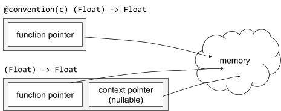
</p>

In differentiable programming, differentiable function types contain more
information than its non-differentiable counterparts. A differentiable function
contains the original function pointer so that it can be efficiently converted
to or called like the original function type. It also contains a derivative
function that will be called when this function is being differentiated. All of
these functions share the same context. A linear map, which is differentiable by
definition and whose differential at any point is itself, does not need to store
derivative functions but just a linear transpose function instead.

<p align="center">
  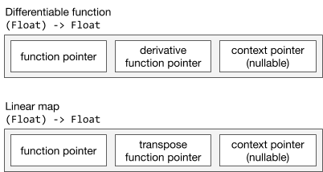
</p>

#### The `@differentiable` function type attribute

A `@differentiable` attribute on a function type specifies the function's
differentiability, just like `@differentiable` on function declarations. The
attribute is able to represent linear map function types as well, i.e.
`@differentiable(linear)`. All linear maps are infinitely differentiable,
therefore `@differentiable(linear)` is a subtype of `@differentiable`.

The `@differentiable` attribute requires the function type it is attached to
have differentiable parameters and results. Each parameter and result must
conform to the `Differentiable` protocol (or `Differentiable &
AdditiveArithmetic` when the attribute is `@differentiable(linear)`) unless it
is marked with `@noDerivative`.

<p align="center">
  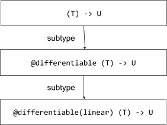
</p>

#### Type conversion

The subtyping relation among `@differentiable(linear)`, `@differentiable`, and
non-`@differentiable` function types allow functions of different types to be
conditionally convertible to each other. Such conversions do not always succeed:
Conversion from a function declaration (`func`) to a `@differentiable` function
value succeeds if and only if the function can be differentiated. Conversion
from a `@differentiable` function value to a non-`@differentiable` function
value always succeeds. Conversion from a non-`@differentiable` function value to
a `@differentiable` function value always fails, because the function's body is
opaque to the compiler.

##### Coercing function declarations into `@differentiable` function values

A function declaration can be implicitly coerced into a `@differentiable`
function value, when there is a contextual `@differentiable` function type. Such
conversions succeed either if the function declaration has been marked with a
`@differentiable` declaration attribute, or if the function declaration is
defined in the same module and the function can be differentiated as if it were
marked with `@differentiable`. When neither of these conditions are met, the
function cannot be differentiated, and thus cannot be converted to a
`@differentiable` function value, in which case the compiler will produce an
error.

```swift
func addOne(_ x: Float) -> Float { x + 1 }
let _: @differentiable (Float) -> Float = addOne // Okay!
let _: @differentiable(linear) (Float) -> Float = addOne // Okay!

let _: @differentiable(linear) (Float) -> Float = coshf(_:)
// Error: `coshf(_:)` is from a different module and has not been marked with
// `@differentiable`.

func mySin(_ x: Float) -> Float { sin(x) * 2 }
let _: @differentiable (Float) -> Float = mySin // Okay!
let _: @differentiable(linear) (Float) -> Float = mySin
// Error: When differentiating `mySin(_:)` as a linear map, `sin` is not linear.

func addOneViaInt(_ x: Float) -> Float { Float(Int(x) + 1) }
let _: @differentiable (Float) -> Float = addOneViaInt
// Error: When differentiating `addOneViaInt(_:)`, `Int(x)` is not differentiable.
```

##### Upcasting to non-`@differentiable` functions

As shown in the
[function subtyping and runtime representation](#function-subtyping-and-runtime-representation)
subsection, a `@differentiable` function value's runtime representation contains
the original function along with extra information that allows the function to
be differentiated (or transposed, if it is `@differentiable(linear)`). A
@differentiable or `@differentiable(linear)` function value can be called like a
non-`@differentiable` function. A `@differentiable(linear)` function value can
be implicitly converted to a `@differentiable` one, which can be implicitly
converted to a non-`@differentiable` one.

```swift
func addOne(_ x: Float) -> Float { x + 1 }
let f0: @differentiable(linear) (Float) -> Float = addOne
let f1: @differentiable (Float) -> Float = f0
let f2: (Float) -> Float = f1
```

A `@differentiable` function can also be converted to a function which is
identical except that more of its parameters are marked with `@noDerivative`.

```swift
func addOne(_ x: Float) -> Float { x + 1 }
let f0: @differentiable (Float, Float, Float) -> Float = addOne
let f1: @differentiable (@noDerivative Float, Float, Float) -> Float = f0
let f2: @differentiable (@noDerivative Float, Float, @noDerivative Float) -> Float = f1
```

#### Implied generic constraints

In the declaration of a generic higher-order function, when a function type is
marked with `@differentiable` as a parameter or a result and uses generic
parameters from the parent function declaration, type inference will add
implicit generic constraints that make the `@differentiable` function type's
parameter types and result type conform to `Differentiable`.

```swift
// With all explicit generic constraints:
func foo<T: Differentiable, U: Differentiable, V: Differentiable>(
    _ f: @differentiable (T, U) -> V
) {
    ...
}

// With implied constraints:
//     where T: Differentiable, U: Differentiable, V: Differentiable
func foo<T, U, V>(_ f: @differentiable (T, U) -> V) {
    ...
}
```

Similarly, when such parameters or results are marked with
`@differentiable(linear)`, implicit generic constraints will add additional
constraints that make the `@differentiable(linear)` function type's parameter
types and result type conform to `Differentiable`.

```swift
// With all explicit generic constraints:
func foo<T: Differentiable & AdditiveArithmetic,
         U: Differentiable & AdditiveArithmetic,
         V: Differentiable & AdditiveArithmetic>(
    _ f: @differentiable(linear) (T, U) -> V
) {
    ...
}

// With implied constraints:
//     where T: Differentiable & AdditiveArithmetic,
//           U: Differentiable & AdditiveArithmetic,
//           V: Differentiable & AdditiveArithmetic
func foo<T, U, V>(_ f: @differentiable(linear) (T, U) -> V) {
    ...
}
```

By extending the type system with the ability to represent differentiable
functions as first-class values, users are able to define arbitrary algorithms
and data structures that deal with differentiable function values, including:

Arbitrary higher-order functions that require arguments to be differentiable
functions. Differential operators, e.g. `derivative(of:)`, described in the
[differential operators and differentiation APIs](differential-operators-and-differentiation-apis)
section. Differentiable higher-order functions for collections, e.g.
[`Array.differentiableReduce(_:_:)`](https://gist.github.com/rxwei/2739515f77a62d26add66947cb179911).
Data structures that store `@differentiable` functions as a property. Neural
network layers that store activation functions, e.g.
[`Dense`](https://github.com/tensorflow/swift-apis/blob/1b3f7c9231cac7d92b6ad79c2d6fd703e51f520a/Sources/TensorFlow/Layers/Core.swift#L149).
Neural network trainer objects that store loss functions, e.g.
[`Learner` in the fast.ai Swift notebooks](https://github.com/fastai/fastai_docs/blob/d3953390dde2349f3618977c717b2f5a8e84e04b/dev_swift/FastaiNotebook_04_callbacks/Sources/FastaiNotebook_04_callbacks/04_callbacks.swift#L97).

#### Non-differentiable parameters

Like function declarations with a `@differentiable` attribute, differentiable
function values can also be differentiable with respect to a subset of
parameters. This is expressed as part of type information, in `@differentiable`
and `@differentiable(linear)` function types, using a `@noDerivative` attribute at
each parameter that is not being differentiated with respect to.

By default, all parameters are being differentiated with respect to. When a
`@noDerivative` attribute is specified for a parameter in a `@differentiable`
function type, values of this function type are not differentiable (or linear)
with respect to the parameter.

```swift
let f0: @differentiable (Float, Float) -> Float = { $0 * $1 }
let f1: @differentiable(linear) (Float, Float) -> Float = { $0 + $1 }
let f2: @differentiable(linear) (Float, @noDerivative Float) -> Float = { $0 * $1 }
let f3: @differentiable (@noDerivative Int, Float, @noDerivative Int) -> Float = {
  $0 ? Float($1) + $2 : 0
}
```

Differentiability of parameters in a function type is important for type
conversions and is part of the subtyping rule: Any `@differentiable` or
`@differentiable(linear)` function type is a subtype of the same function type
with more `@noDerivative` parameters than there originally are.

```swift
let f0: @differentiable (Float, Float) -> Float = { $0 * $1 }
_ = f0 as @differentiable (Float, @noDerivative Float) -> Float
_ = f0 as @differentiable (@noDerivative Float, Float) -> Float
_ = f0 as @differentiable (@noDerivative Float, @noDerivative Float) -> Float
```

### Differentiable operators

The core differentiation APIs are the differential operators. Differential
operators are higher-order functions that take `@differentiable` functions as
inputs and return derivative functions or evaluate derivative values.

#### Differential-producing differential operators

Among these differential operators, two base APIs,
`valueWithDifferential(at:in:)` and `transpose(of:)`, are used for implementing
*all other differential operators and differentiation APIs*.

```swift
/// Returns `body(x)` and the differential of `body` at `x`.
func valueWithDifferential<T, R>(
    at x: T, in body: @differentiable (T) -> R
) -> (value: R,
      differential: @differentiable(linear) (T.TangentVector) -> R.TangentVector) {
    // Compiler built-in.
    Builtin.autodiffApply_jvp_arity1(body, x)
}


/// Returns the transpose of the linear map `body`.
func transpose<T, R>(
    of body: @escaping @differentiable(linear) (T) -> R
) -> @differentiable(linear) (R) -> T {
    // Compiler built-in.
    { x in Builtin.autodiffApply_transpose(body, x) }
}
```

The most common differential operators are the ones that compute directional
derivatives. These differential operators are defined to take a differentiable
function whose parameter is a real number.

```swift
func valueWithDerivative<T: FloatingPoint, R>(
    at x: T, in body: @differentiable (T) -> R
) -> (value: R, derivative: R.TangentVector) where T.TangentVector: FloatingPoint {
    let (value, df) = valueWithDifferential(at: x, in: body)
    return (value, df(T.TangentVector(1)))
}

func derivative<T: FloatingPoint, R>(
    at x: T, in body: @differentiable (T) -> R
) -> R.TangentVector where T.TangentVector: FloatingPoint {
    valueWithDerivative(at: x, in: body).derivative
}

func derivative<T: FloatingPoint, R>(
    of body: @escaping @differentiable (T) -> R
) -> (T) -> R.TangentVector where T.TangentVector: FloatingPoint {
    return { x in derivative(at: x, in: body) }
}
```

#### Pullback-producing differential operators

Unlike directional derivatives, gradients are computed by pullbacks. Based on
the differential-producing differential operator
`valueWithDifferential(at:in:)`, `valueWithPullback(at:in:)` is defined as
returning the original value and the transpose of the differential, and
`valueWithGradient(at:in:)` is defined as evaluating the pullback at `1` when
the function being differentiated returns a real number.

```swift
func valueWithPullback<T, R>(
    at x: T, in body: @differentiable (T) -> R
) -> (value: R,
      pullback: @differentiable(linear) (R.TangentVector) -> T.TangentVector) {
    let (value, df) = valueWithDifferential(at: x, in: body)
    return (value, transpose(of: df))
}

func valueWithGradient<T, R: FloatingPoint>(
    at x: T, in body: @differentiable (T) -> R
) -> (value: R, gradient: T.TangentVector) where R.TangentVector: FloatingPoint {
    let (value, pullback) = valueWithPullback(at: x, in: body)
    return (value, pullback(R.TangentVector(1)))
}

func gradient<T, R: FloatingPoint>(
    at x: T, in body: @differentiable (T) -> R
) -> (value: R, gradient: T.TangentVector) where R.TangentVector: FloatingPoint {
    return valueWithGradient(at: x, in: body).gradient
}

func gradient<T, R: FloatingPoint>(
    of body: @escaping @differentiable (T) -> R
) -> (T) -> T.TangentVector where R.TangentVector: FloatingPoint {
    return { x in gradient(at: x, in: body) }
}
```

#### Example usage

All of these APIs are designed to work nicely with Swift's trailing closure
syntax. Here is an example of training a simple deep learning model:

```swift
for _ in 0..<1000 {
    // Differentiate the loss with respect to the model `classifier` itself,
    // producing a tangent vector `𝛁model` that represents partial derivatives
    // with respect to all differentiable properties (trainable model parameters)
    // in the model
    let 𝛁model = gradient(at: classifier) { classifier -> Tensor<Float> in
        let ŷ = classifier(x)
        let loss = softmaxCrossEntropy(logits: ŷ, labels: y)
        print("Loss: \(loss)")
        return loss
    }
    optimizer.update(&classifier, along: 𝛁model)
}
```

#### List of differential operators

Differential operators                                                                                                                                                                                                                                                                                                         | Description
------------------------------------------------------------------------------------------------------------------------------------------------------------------------------------------------------------------------------------------------------------------------------------------------------------------------------ | -----------
[`transpose(of:)`](https://github.com/apple/swift/blob/9c95e27601e9623f5b53c9cc531d185e267a83d6/stdlib/public/core/AutoDiff.swift#L374)                                                                                                                                                                                        | Returns transpose of linear map.
[`valueWithDifferential(at:in:)`](https://github.com/apple/swift/blob/9c95e27601e9623f5b53c9cc531d185e267a83d6/stdlib/public/core/AutoDiff.swift#L383) <br> [`valueWithDifferential(at:_:in:)`](https://github.com/apple/swift/blob/9c95e27601e9623f5b53c9cc531d185e267a83d6/stdlib/public/core/AutoDiff.swift#L390) (arity 2) | Returns original result and differential function.
[`valueWithPullback(at:in:)`](https://github.com/apple/swift/blob/c1211a3f78992c89a3ab4d638c378c6f45ab8fe8/stdlib/public/core/AutoDiff.swift#L276) <br> [`valueWithPullback(at:_:in:)`](https://github.com/apple/swift/blob/c1211a3f78992c89a3ab4d638c378c6f45ab8fe8/stdlib/public/core/AutoDiff.swift#L283)                   | Returns original result and pullback function.
[`differential(at:in:)`](https://github.com/apple/swift/blob/9c95e27601e9623f5b53c9cc531d185e267a83d6/stdlib/public/core/AutoDiff.swift#L435) <br> [`differential(at:_:in:)`](https://github.com/apple/swift/blob/9c95e27601e9623f5b53c9cc531d185e267a83d6/stdlib/public/core/AutoDiff.swift#L442) (arity 2)                   | Returns differential function.
[`pullback(at:in:)`](https://github.com/apple/swift/blob/c1211a3f78992c89a3ab4d638c378c6f45ab8fe8/stdlib/public/core/AutoDiff.swift#L302) <br> [`pullback(at:_:in:)`](https://github.com/apple/swift/blob/c1211a3f78992c89a3ab4d638c378c6f45ab8fe8/stdlib/public/core/AutoDiff.swift#L309)                                     | Returns pullback function.
[`derivative(at:in:)`](https://github.com/apple/swift/blob/9c95e27601e9623f5b53c9cc531d185e267a83d6/stdlib/public/core/AutoDiff.swift#L483) <br> [`derivative(at:_:in:)`](https://github.com/apple/swift/blob/9c95e27601e9623f5b53c9cc531d185e267a83d6/stdlib/public/core/AutoDiff.swift#L491) (arity 2)                       | Returns partial derivatives with respect to arguments ("forward-mode").
[`gradient(at:in:)`](https://github.com/apple/swift/blob/c1211a3f78992c89a3ab4d638c378c6f45ab8fe8/stdlib/public/core/AutoDiff.swift#L384) <br> [`gradient(at:_:in:)`](https://github.com/apple/swift/blob/c1211a3f78992c89a3ab4d638c378c6f45ab8fe8/stdlib/public/core/AutoDiff.swift#L392)                                     | Returns partial derivatives with respect to arguments ("reverse-mode").
[`valueWithDerivative(at:in:)`](https://github.com/apple/swift/blob/9c95e27601e9623f5b53c9cc531d185e267a83d6/stdlib/public/core/AutoDiff.swift#L538) <br> [`valueWithDerivative(at:_:in:)`](https://github.com/apple/swift/blob/9c95e27601e9623f5b53c9cc531d185e267a83d6/stdlib/public/core/AutoDiff.swift#L547) (arity 2)     | Returns original result and partial derivatives with respect to arguments ("forward-mode").
[`valueWithGradient(at:in:)`](https://github.com/apple/swift/blob/c1211a3f78992c89a3ab4d638c378c6f45ab8fe8/stdlib/public/core/AutoDiff.swift#L327) <br> [`valueWithGradient(at:_:in:)`](https://github.com/apple/swift/blob/c1211a3f78992c89a3ab4d638c378c6f45ab8fe8/stdlib/public/core/AutoDiff.swift#L335)                   | Returns original result and partial derivatives with respect to arguments ("reverse-mode").
[`derivative(of:)`](https://github.com/apple/swift/blob/9c95e27601e9623f5b53c9cc531d185e267a83d6/stdlib/public/core/AutoDiff.swift#L601) <br> [`derivative(of:)`](https://github.com/apple/swift/blob/9c95e27601e9623f5b53c9cc531d185e267a83d6/stdlib/public/core/AutoDiff.swift#L609) (arity 2)                               | Returns derivative function, taking original arguments and returning and partial derivatives with respect to arguments ("forward-mode").
[`gradient(of:)`](https://github.com/apple/swift/blob/c1211a3f78992c89a3ab4d638c378c6f45ab8fe8/stdlib/public/core/AutoDiff.swift#L410) <br> [`gradient(of:)`](https://github.com/apple/swift/blob/c1211a3f78992c89a3ab4d638c378c6f45ab8fe8/stdlib/public/core/AutoDiff.swift#L418)                                             | Returns gradient function, taking original arguments and returning and partial derivatives with respect to arguments ("reverse-mode").
[`valueWithDerivative(of:)`](https://github.com/apple/swift/blob/9c95e27601e9623f5b53c9cc531d185e267a83d6/stdlib/public/core/AutoDiff.swift#L656) <br> [`valueWithDerivative(of:)`](https://github.com/apple/swift/blob/9c95e27601e9623f5b53c9cc531d185e267a83d6/stdlib/public/core/AutoDiff.swift#L664) (arity 2)             | Returns function taking original arguments and returning original result and partial derivatives with respect to arguments ("forward-mode").
[`valueWithGradient(of:)`](https://github.com/apple/swift/blob/c1211a3f78992c89a3ab4d638c378c6f45ab8fe8/stdlib/public/core/AutoDiff.swift#L356) <br> [`valueWithGradient(of:)`](https://github.com/apple/swift/blob/c1211a3f78992c89a3ab4d638c378c6f45ab8fe8/stdlib/public/core/AutoDiff.swift#L364)                           | Returns function taking original arguments and returning original result and partial derivatives with respect to arguments ("reverse-mode").

#### Static analysis

Differentiable programming in Swift aims to provide the best static compiler
diagnostics to help users catch mistakes. Beyond error diagnostics, the compiler
and the standard library are equipped with static analyses and marker APIs that
help the user write differentiable code with explicit annotations about
non-obvious non-differentiable cases.

##### Cross-module opacity

Swift libraries are distributed as
[modules](https://docs.swift.org/swift-book/LanguageGuide/AccessControl.html),
which provide an API interface and an opaque binary format for client code to
use. By importing a library, we can compute derivatives of functions that have
been marked with `@differentiable` or that have been provided with a linear
transpose function or a derivative function, but not of functions that have not
been marked this way without defining a custom derivative for it. For example,
if we try to differentiate
[`sinf(_:)`](https://en.cppreference.com/w/c/numeric/math/sin) with the
`derivative(at:in:)` API, the compiler will produce error messages at
compile-time instead of producing zero derivatives.

```swift
let y = derivative(at: 1.0) { x in
    sinf(x)
}
```

```console
test.swift:4:5: error: expression is not differentiable
    sinf(x)
    ^
test.swift:4:5: note: cannot differentiate functions that have not been marked '@differentiable' and that are defined in other modules
    sinf(x)
    ^
```

##### Non-differentiable type conversions

Calling functions that convert values to non-differentiable types and convert
them back makes the function no longer differentiable. The compiler is able to
detect these cases and provide error messages.

```swift
let d = derivative(at: 1.0) { x in
    Double(Int(x)) + 2
```

```console
test.swift:1:27: error: function is not differentiable
let y = derivative(at: 1.0) { x in
                            ^~~~~~
test.swift:2:12: note: cannot differentiate through a non-differentiable result; do you want to add 'withoutDerivative(at:)'?
    Double(Int(x)) + 2
           ^
```

##### Accidental data flow mistakes

Even when there are no obvious non-differentiable operations on the path from
parameters to the result (like non-differentiable type conversions), it is still
possible to mistype a variable and cause numerical computation to be incorrect.
As such, the compiler is able to leverage dependency analysis to determine
whether the derivative is always zero and warns the user.

```swift
let grad = gradient(at: 1.0) { x in
    3.squareRoot()
}
```

```console
test.swift:4:18: warning: result does not depend on differentiation arguments and will always have a zero derivative; do you want to add '.withoutDerivative()' to make it explicit?
    3.squareRoot()
    ^
    withoutDerivative(at:)
```

## Examples of differentiable programming

### Linear regression

[Linear Regression](https://en.wikipedia.org/wiki/Linear_regression) attempts to
fit a line that best fits a set of data points. There are two different ways of
finding a solution: the iterative and closed form methods. In the iterative
method, we use gradient descent to slowly find better and better values for the
slope and y-intercept. For a basic set of data points consisting of `(x, y)`
value pairs, the model would look like the following:

```swift
struct Perceptron: @memberwise Differentiable {
    var weights: SIMD64<Float>
    var bias: Float

    @differentiable
    func callAsFunction(_ input: SIMD64<Float>) -> Float {
        weights.dot(input) + bias
    }
}
```

To train the model on a data set, it would look like the following:

```swift
let iterationCount = 160
let learningRate: Float = 0.00003

var model = Perceptron(weights: .zero, bias: 0)

for i in 0..<iterationCount {
    var (loss, 𝛁loss) = valueWithGradient(at: model) { model -> Float in
        var totalLoss: Float = 0
        for (x, y) in data {
            let pred = model(x)
            let diff = y - pred
            totalLoss = totalLoss + diff * diff / Float(data.count)
        }
        return totalLoss
    }
    𝛁loss.weight *= -learningRate
    𝛁loss.bias *= -learningRate
    model.move(along: 𝛁loss)
    if i.isMultiple(of: 10) {
        print("Iteration: \(iteration) Avg Loss: \(loss / Float(data.count))")
    }
}
```

### Deep learning

[Swift for TensorFlow](https://github.com/tensorflow/swift) is a numerics and
machine learning library that uses the proposed differentiable programming
feature. Swift for TensorFlow has been used to implement many machine learning
models, from simple image classification models like
[ResNet](https://arxiv.org/abs/1512.03385) to advanced models using Monte Carlo
tree search to power a [Go](https://en.wikipedia.org/wiki/Go_\(game\)) game
engine.

#### Feed-forward neural networks (FFNN)

A neural networks is a "parameterized function approximator": it takes some
input, produces some output, and is parameterized by weights. Neural networks
are composed of *layers*, which are smaller "building block" parameterized
functions. A loss function (or cost function) measures the difference between
the output of a neural network versus the expected output. Neural networks can
improve via training: networks are applied to "training data" (input/output
pairs) and parameters are updated with their derivatives with respect to the
loss function.

A feed-forward neural network is a simple neural network in which the output of
each layer is fed as the input to the next layer. A multi-layer perceptron is an
example of a feed-forward neural network: it is composed of multiple dense
layers, each of which performs `output = activation(matmul(weight, input) +
bias)`.

```swift
import TensorFlow

struct MultiLayerPerception: Layer, @memberwise Differentiable {
    var dense1 = Dense<Float>(inputSize: 784, outputSize: 100, activation: relu)
    var dense2 = Dense<Float>(inputSize: 100, outputSize: 30, activation: relu)
    var dense3 = Dense<Float>(inputSize: 30, outputSize: 10, activation: softmax)

    @differentiable
    func callAsFunction(_ input: Tensor<Float>) -> Tensor<Float> {
        dense3(dense2(dense1(input)))
    }
}
```

#### Convolutional neural networks (CNN)

A convolution neural network is a feed-forward neural network that performs a
[cross-correlation operation](https://en.wikipedia.org/wiki/Cross-correlation),
which is a "sliding dot product" over the input. The cross-correlation operation
encodes spatial locality and translation invariance, making CNNs suited for
applications like image recognition.

Here is a simple script that implements
[LeNet-5](http://yann.lecun.com/exdb/lenet/), a convolutional neural network for
classifying handwritten digits.

```swift
import TensorFlow

// Original Paper:
// "Gradient-Based Learning Applied to Document Recognition"
// Yann LeCun, Léon Bottou, Yoshua Bengio, and Patrick Haffner
// http://yann.lecun.com/exdb/publis/pdf/lecun-01a.pdf
//
// Note: this implementation connects all the feature maps in the second convolutional layer.
// Additionally, ReLU is used instead of sigmoid activations.
struct LeNet: Layer, @memberwise Differentiable {
    var conv1 = Conv2D<Float>(filterShape: (5, 5, 1, 6), padding: .same, activation: relu)
    var pool1 = AvgPool2D<Float>(poolSize: (2, 2), strides: (2, 2))
    var conv2 = Conv2D<Float>(filterShape: (5, 5, 6, 16), activation: relu)
    var pool2 = AvgPool2D<Float>(poolSize: (2, 2), strides: (2, 2))
    var flatten = Flatten<Float>()
    var fc1 = Dense<Float>(inputSize: 400, outputSize: 120, activation: relu)
    var fc2 = Dense<Float>(inputSize: 120, outputSize: 84, activation: relu)
    var fc3 = Dense<Float>(inputSize: 84, outputSize: 10, activation: softmax)

    @differentiable
    func callAsFunction(_ input: Tensor<Float>) -> Tensor<Float> {
        let convolved = pool2(conv2(pool1(conv1(input))))
        return fc3(fc2(fc1(flatten(convolved))))
    }
}
```

#### Recurrent neural networks (RNN)

A recurrent neural network is a feed-forward neural network wrapped in a loop
over a sequence of inputs. The feed-forward neural network within the loop is
usually referred to as the "cell" of the RNN. An RNN cell, like other neural
network layers, has a `callAsFunction(_:)` method that is differentiable with
respect to `self` and `input`, where `input` is an element of the sequence that
is the input to the RNN.

```swift
/// A recurrent neural network cell.
protocol RNNCell: Layer
where Input == RNNCellInput<TimeStepInput, State>,
      Output == RNNCellOutput<TimeStepOutput, State> {
    /// The input at a time step.
    associatedtype TimeStepInput: Differentiable
    /// The output at a time step.
    associatedtype TimeStepOutput: Differentiable
    /// The state that may be preserved across time steps.
    associatedtype State: Differentiable
    /// The zero state.
    var zeroState: State { get }
}
```

Below is the cell of a
[long short-term memory (LSTM)](https://en.wikipedia.org/wiki/Long_short-term_memory)
network, which is used widely in natural language processing and speech
processing.

```swift
/// An LSTM cell.
struct LSTMCell<Scalar: TensorFlowFloatingPoint>: RNNCell, @memberwise Differentiable {
    var fusedWeight: Tensor<Scalar>
    var fusedBias: Tensor<Scalar>

    @noDerivative var stateShape: TensorShape { [1, fusedWeight.shape[1] / 4] }

    var zeroState: State {
        State(cell: Tensor(zeros: stateShape), hidden: Tensor(zeros: stateShape))
    }

    typealias TimeStepInput = Tensor<Scalar>
    typealias TimeStepOutput = State
    typealias Input = RNNCellInput<TimeStepInput, State>
    typealias Output = RNNCellOutput<TimeStepOutput, State>

    struct State: @memberwise Differentiable {
        var cell: Tensor<Scalar>
        var hidden: Tensor<Scalar>
    }

    @differentiable
    func callAsFunction(_ input: Input) -> Output {
        let gateInput = input.input.concatenated(with: input.state.hidden, alongAxis: 1)
        let fused = matmul(gateInput, fusedWeight) + fusedBias
        let (batchSize, hiddenSize) = (fused.shape[0], fused.shape[1] / 4)
        let fusedParts = fused.split(count: 4, alongAxis: 1)
        let (inputGate, updateGate, forgetGate, outputGate) = (
            sigmoid(fusedParts[0]),
            tanh(fusedParts[1]),
            sigmoid(fusedParts[2]),
            sigmoid(fusedParts[3])
        )
        let newCellState = input.state.cell * forgetGate + inputGate * updateGate
        let newHiddenState = tanh(newCellState) * outputGate
        let newState = State(cell: newCellState, hidden: newHiddenState)
        return Output(output: newState, state: newState)
    }
}
```

Since an RNN is a loop wrapped around the cell, it can be implemented as a
generic struct with a `Cell` generic parameter that conforms to `RNNCell`.

```swift
struct RNN<Cell: RNNCell>: Layer {
    typealias Input = [Cell.TimeStepInput]
    typealias Output = [Cell.TimeStepOutput]

    var cell: Cell

    init(_ cell: @autoclosure () -> Cell) {
        self.cell = cell()
    }

    @differentiable(wrt: (self, input))
    func callAsFunction(_ input: [Cell.TimeStepInput]) -> [Cell.TimeStepOutput] {
        var currentHiddenState = zeroState
        var timeStepOutputs: [Cell.TimeStepOutput] = []
        for timeStep in input {
            let output = cell(input: timeStep, state: currentHiddenState)
            currentHiddenState = output.state
            timeStepOutputs.append(output.output)
        }
        return timeStepOutputs
    }
}
```

Using generics, one can compose `RNN` with different RNN cell types. Different
RNN types can be defined in a library simply by creating a type alias.

```swift
typealias SimpleRNN<Scalar: TensorFlowFloatingPoint> = RNN<SimpleRNNCell<Scalar>>
typealias LSTM<Scalar: TensorFlowFloatingPoint> = RNN<LSTMCell<Scalar>>
```

## Future directions

### Differentiation of higher-order functions

Mathematically, the differentiability of `@differentiable (T, U) -> V` is
similar to that of `@differentiable (T) -> @differentiable (U) -> V` in that
differentiating either one will provide derivatives with respect to parameters
`T` and `U`.

To form a `@differentiable (T) -> @differentiable (U) -> V`, the most natural
thing to do is currying, which one might implement as:

```swift
func curry<T, U, V>(
    _ f: @differentiable (T, U) -> V
) -> @differentiable (T) -> @differentiable (U) -> V {
    { x in { y in f(x, y) } }
}
```

However, the compiler does not support currying today due to known
type-theoretical constraints and implementation complexity regarding
differentiating a closure with respect to the values it captures. Fortunately,
we have a formally proven solution in the works, but we would like to defer this
to a future proposal since it is purely additive to the existing semantics.

### Higher-order differentiation

Distinct from differentiation of higher-order functions, higher-order
differentiation refers to taking the derivative of a derivative of a function.
As a natural next step after the first-order differentiation capability proposed
here, higher-order differentiation can be designed and implemented in various
different ways with trade-offs in performance, usability, and complexity.

Intuitively, higher-order differentiation will enable calling a differential
operator on the result of a differential operator, e.g.

```swift
let f = derivative(of: derivative(of: derivative(of: { x in pow(x, 3.0) })))
```

This will require the differential operator `derivative(of:)` to return a
`@differentiable` function, hence semantically changing `@differentiable` to
mean infinite differentiability.

```swift
func derivative<T: FloatingPoint, U: Differentiable>(
    _ f: @differentiable (T) -> U
) -> @differentiable (T) -> U where T: FloatingPoint, T == T.TangentVector {
    { x in differential(at: x, in: f) }
}
```

Since `derivative(of:)` is implemented in term of `derivative(at:in:)`, which is
implemented in terms of `valueWithDifferential(at:in:)`, both
`derivative(at:in:)` and `valueWithDifferential(at:in:)` would need to be marked
with `@differentiatiable` with respect to its `x` argument.

```swift
@differentiable(wrt: x)
func derivative<T: FloatingPoint, U: Differentiable>(
    at x: T, in body: @differentiable (T) -> U) -> U
) -> U.TangentVector where T: FloatingPoint, T == T.TangentVector {
    valueWithDifferential(at: x, in: body).differential(T(1))
}

@differentiable(wrt: x)
func valueWithDifferential<T: FloatingPoint, U: Differentiable>(
    at x: T, in body: @differentiable (T) -> U) -> U
) -> (value: U, differential: @differentiable(linear) (T.TangentVector) -> U.TangentVector)
```

To differentiate `valueWithDifferential`, we need to be able to differentiate
its return value, a tuple of the original value and the differential, with
respect to its `x` argument. Since the return type contains a function,
[differentiation of higher-order functions](#differentiation-of-higher-order-functions)
is required for differentiating this differential operator.

A kneejerk solution is to differentiate derivative functions generated by the
differentiation transform at compile-time, but this leads to problems. For
example, how do we repeatedly differentiate a function whose body is
unavailable? Should a `@differentiable` function contain derivative functions
for dynamically many orders? Would it require serializing SIL code as part of a
`@differentiable` function and running the differentiation transform at runtime?
Alternatively, is there a single closed-form formula that the compiler can
generate once in the differentiation transform, without performing any runtime
compilation or using large function representations? These questions are
difficult to answer, due to the complexity in both mathematical formulae (e.g.
[Faà di Bruno's formula](https://en.wikipedia.org/wiki/Faà_di_Bruno%27s_formula))
and static compilation. Currently, we are exploring different theoretical and
practical approaches to find a beautiful design that would help us deliver the
best differentiable programming language.

### Naming conventions for numerical computing

The
[API Design Guidelines](https://swift.org/documentation/api-design-guidelines)
encourages naming that is both easy-to-learn for beginners and unsurprising for
experts.

Numerical computing is full of math terminology and notation; finding good names
for math concepts is not always easy. Consider the formulas for gated recurrent
neural networks:

<p align="center">
  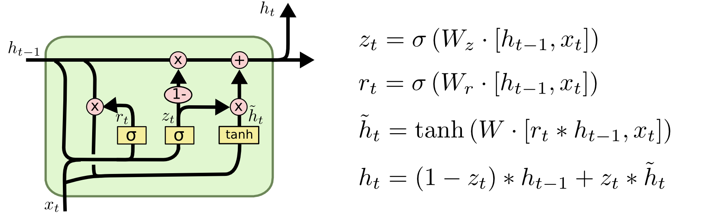
</p>

Each of these mathematical variables needs a name in code. Consider the
following names for the `W_ih` variable:

-   `var W_ih`: the abbreviated name. May be difficult to learn for beginners.
-   `var inputHiddenWeight`: the descriptive name. May be unfamiliar for
    experts, who are accustomed to the math notation.

Which name is the best? It is hard to say, as no naming precedent exists.
Standardizing naming conventions for math terminology will be important as
numerical computing becomes more prominent in Swift.

## Source compatibility

This feature does not change any existing APIs. New implicit function
conversions are added to the type system, which slightly increases type checking
complexity. We have not observed source compatibility breakages so far. Effect
on ABI stability This feature has additions to the ABI. Specifically, the
`@differentiable` function representation will be added and must be kept stable.
Effect on API resilience This feature adds the
[`Differentiable` protocol](#differentiable-protocol) and
[differential operators](#differential-operators) to the standard library as
public APIs. They introduce additions to the standard library.

### `Differentiable` protocol

The `Differentiable` protocol contains all necessary requirements for a type to
be differentiated. Without breaking API, it will be possible to add extensions
to the `Differentiable` protocol and add new requirements with default
implementations.

### Differential operators

Differential operators (e.g. `derivative(of:)` and `gradient(of:)`) are added to
the standard library as lightweight top-level higher-order functions. These APIs
can be renamed or moved under some namespace without breaking ABI.

## Alternatives considered

### Not support differentiable programming

We believe first-class differentiable programming is a big step towards making
Swift a real contender in the numerical computing and machine learning
landscape. Differentiable programming will enable intelligent applications,
machine learning models, scientific experiments, physical simulations, and more.

### Use another language or framework for differentiable programming

Dynamic languages, like Python and Julia, have established library support for
differentiable programming. While it is possible to interoperate with these
libraries via Swift, we feel that first-class differentiable programming in
Swift is leaps ahead in expressivity, usability, and safety.

### Other approaches to differentiable programming

See
["Approaches to automatic differentiation"](#approaches-to-automatic-differentiation)
above for an overview and comparison of automatic differentiation approaches.
First-class language support for differentiation will enable convenient,
extensible, and performant differentiable programming in Swift - more so than
library-based approaches.

## Acknowledgements

Many people have influenced the design and the implementation of the
differentiable programming feature. The authors would like to thank these people
(sorted alphabetically by last name) for their contributions in any form
(inspirations, ideas, discussions, code, or bikeshedding): Gogul Balakrishnan,
James Bradbury, Steve Canon, Casey Chu, Conal Elliott, Roy Frostig, Doug Gregor,
Dominik Grewe, Dmitri Gribenko, Joe Groff, Sylvain Gugger, Tim Harley, Matthew
Johnson, Chris Lattner, Dougal Maclaurin, John McCall, Bart van Merriënboer,
Slava Pestov, Anthony Platanios, Gordon Plotkin, Alexey Radul, Brennan Saeta,
Parker Schuh, and Dimitrios Vytiniotis.

<!-- Links -->

[Richard Wei]: https://github.com/rxwei
[Dan Zheng]: https://github.com/dan-zheng
[Marc Rasi]: https://github.com/marcrasi
[Bart Chrzaszcz]: https://github.com/bartchr808
[SE-0229]: https://github.com/apple/swift-evolution/blob/master/proposals/0229-simd.md
[SE-0233]: https://github.com/apple/swift-evolution/blob/master/proposals/0233-additive-arithmetic-protocol.md
[SE-0246]: https://github.com/apple/swift-evolution/blob/master/proposals/0246-mathable.md
[SE-0251]: https://github.com/apple/swift-evolution/blob/master/proposals/0251-simd-additions.md
