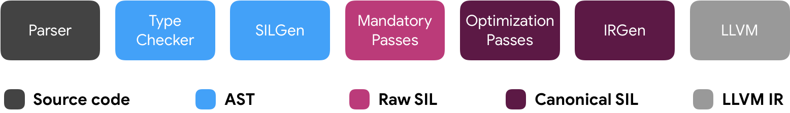
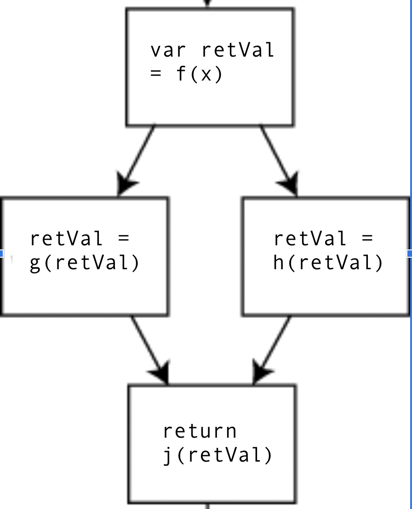

# Swift Differentiable Programming Implementation Overview

- Authors: [Dan Zheng](https://github.com/dan-zheng), [Bart Chrzaszcz](https://github.com/bartchr808)
- Status: Draft, work in progress.

## Table of contents

- [Introduction](#introduction)
- [Overview](#overview)
- [Terminology](#terminology)
    - [JVP and VJP functions](#jvp-and-vjp-functions)
    - [Typing rules](#typing-rules)
    - [Registration](#registration)
- [Background](#background)
    - [The Swift compilation pipeline](#the-swift-compilation-pipeline)
    - [Differentiation in the compilation pipeline](#differentiation-in-the-compilation-pipeline)
- [Two triggers of differentiation](#two-triggers-of-differentiation)
    - [The `@differentiable` declaration attribute](#the-differentiable-declaration-attribute)
    - [Differentiable function type conversion](#differentiable-function-type-conversion)
- [The differentiation transform](#the-differentiation-transform)
    - [Activity analysis](#activity-analysis)
    - [Canonicalization](#canonicalization)
- [Derivative code generation](#derivative-code-generation-automatic-differentiation)
    - [JVP and differential generation](#jvp-and-differential-generation)
    - [VJP and pullback generation](#vjp-and-pullback-generation)
    - [Derivative code generation details](#derivative-code-generation-details)
    - [Special cases](#special-cases)
- [Future directions and infrastructural changes](#future-directions-and-infrastructural-changes)
- [Acknowledgements](#acknowledgements)

## Introduction

This document explains how differentiation is implemented in the Swift compiler, stage by stage. Namely, it answers the following questions:

```swift
// From the standard library:
// func gradient<T, R>(at x: T, of f: @differentiable (T) -> R) -> T.TangentVector
// where R: FloatingPoint, R.TangentVector == R

// 1. What does the `@differentiable` attribute do?
// Answer: the attribute marks `cubed` as a differentiable function declaration.
// The compiler will verify that `cubed` is indeed differentiable.
@differentiable
func cubed(_ x: Float) -> Float {
    return x * x * x
}

// 2. How does this call to `gradient` work?
// Answer: the closure expression is implicitly converted to a differentiable
// function-typed value and passed to `gradient`. In SIL, the differentiation
// transform generates derivative functions for the closure expression. The
// `gradient` higher-order function extracts and applies a derivative function to
// evaluate a gradient value.
gradient(at: 4, of: { x in x * x * x }) // 48.0
```

> NOTE:
> - Please see the [Swift Differentiable Programming Manifesto](DifferentiableProgramming.md) for background and a holistic overview of differentiable programming in Swift.
> - This document describes the current implementation of differentiation in Swift. Some details may differ from [Swift Differentiable Programming Manifesto](DifferentiableProgramming.md), which describes the final design for differentiation in Swift. As the implementation of differentiation changes, this document will be updated accordingly.

## Overview

Swift supports first-class, language-integrated differentiable programming. This includes the following components:
- [The `Differentiable` protocol](DifferentiableProgramming.md#the-differentiable-protocol): a protocol that generalizes all data structures that can be a parameter or result of a differentiable function.
- [The `@differentiable` declaration attribute](DifferentiableProgramming.md#the-differentiable-declaration-attribute): used to mark function-like declarations (function declarations, initializers, properties, and subscripts) as being differentiable.
- [Differentiable function types](DifferentiableProgramming.md#differentiable-function-types): subtypes of normal function types, with a different runtime representation and calling convention. Differentiable function types have differentiable parameters and results.
- [Differential operators](DifferentiableProgramming.md#differential-operators): core differentiation APIs. Differential operators are higher-order functions that take `@differentiable` functions as inputs and return derivative functions or evaluate derivative values.
- [The differentiation transform](#the-differentiation-transform): a compiler transformation on the Swift Intermediate Language (SIL) that implements automatic differentiation and generates derivative functions. The differentiation transform is explained in this document.

## Terminology

### JVP and VJP functions

A JVP (Jacobian-vector product) function is a [forward-mode](DifferentiableProgramming.md#automatic-differentiation) derivative function. A VJP (vector-Jacobian product) function is a [reverse-mode](DifferentiableProgramming.md#automatic-differentiation) derivative function.

### Typing rules

Consider a function with type `(T0, ...) -> U`, where `T0, ..., U` all conform to the `Differentiable` protocol.

The JVP function type is:

```swift
//  (T0, ...)      ->  (U,    (T0.TangentVector, ...) -> (U.TangentVector))
//   ^                  ^      ^~~~~~~~~~~~~~~~~~~~~      ^~~~~~~~~~~~~~~
//  original args   result      derivative wrt args    derivative wrt result
```

The JVP function returns a tuple with two elements:
- The original result of type `U`.
- A linear approximation function called the “differential”, which takes derivatives with respect to arguments and returns the derivative with respect to the result.

The VJP function type is:

```swift
//  (T0, ...)      ->  (U,    (U.TangentVector)   -> (T0.TangentVector, ...))
//   ^                  ^      ^~~~~~~~~~~~~~~        ^~~~~~~~~~~~~~~~~~~~~
//  original args   result     derivative wrt result    derivative wrt args
```

The VJP function returns a tuple with two elements:
- The original result of type `U`.
- A backpropagation function called the “pullback”, which takes the derivatives with respect to the result and returns the derivative with respect to arguments.

> TODO: Explain typing rules for functions with `inout` parameters.

### Registration

JVP and VJP functions can be registered using the `@derivative` attribute. JVP functions should return a tuple with labels `(value: ..., differential: ...)`. VJP functions should return a tuple with labels `(value: ..., pullback: ...)`.

For usage examples of the `@derivative` attribute, refer to the [`@derivative` attribute section](https://github.com/rxwei/swift-evolution/blob/autodiff/proposals/0000-differentiable-programming.md#derivative-attribute) in the proposal.

Note that derivative functions are defined as "JVP/VJP functions taking original arguments", rather than just the "returned differential/pullback" functions. This is because differential/pullback functions may need to refer to intermediate values computed by the original function - this is possible when they are returned closures that capture values.

> TODO: Write a canonical explanation of JVP and VJP functions and a `@derivative` attribute usage guide.

## Background

### The Swift compilation pipeline

The Swift compiler translates Swift source code into executable machine code. Below is an illustration of the compilation pipeline:



Here is a description of the main phases in compilation:[†](https://www.swift.org/swift-compiler/)
- **Parsing**: The parser takes Swift source code and generates an abstract syntax tree (AST) without type information. Warnings and errors are produced for grammatical problems in source code.
- **Type checking**: The type checker takes the parsed AST and transforms it into a fully type-checked form, performing type inference. Warnings and errors are produced for semantic problems in source code.
- **SIL generation**: The Swift Intermediate Language (SIL) is a high-level intermediate language for Swift suitable for analysis and optimization. The SIL generation phase lowers the type-checked AST into ["raw" SIL](SIL.rst#silgen).
- **SIL mandatory passes**: The SIL mandatory passes perform analyses (diagnosing user errors) and lowering (down to canonical SIL).
- **SIL optimizations passes**: The SIL optimization passes perform additional high-level optimizations to SIL.
- **LLVM IR generation**: IR generation lowers SIL to LLVM IR. LLVM performs further optimizations and generates machine code.

### Differentiation in the compilation pipeline

Here is how differentiation fits into each of the stages of compilation:
- **Parsing**
    - `@differentiable` attributes are parsed.
    - `@differentiable` function types are parsed.
- **Type checking**
    - `@differentiable` attributes are type-checked and verified.
    - `@differentiable` function types are type-checked: this includes conversions to and from normal function types. Conversion from a normal function to a differentiable function is represented as an explicit `DifferentiableFunctionExpr` expression.
- **SIL generation**
    - `@differentiable` AST declaration attributes are lowered to [SIL differentiability witnesses](SIL.rst#differentiability-witnesses).
    - `DifferentiableFunctionExpr` function conversion expressions are lowered to the `differentiable_function` SIL instruction.
- **SIL mandatory passes**
    - The differentiation transform is a SIL mandatory pass that implements [automatic differentiation](https://en.wikipedia.org/wiki/Automatic_differentiation).
    - **Invariant**: after the differentiation transform, all SIL differentiability witnesses are canonicalized (i.e. derivative functions are filled in).
    - **Invariant**: after the differentiation transform, all `differentiable_function` SIL instructions are canonicalized (i.e. derivative function values are filled in).
- **LLVM IR generation**
    - `@differentiable` function types are lowered to LLVM IR types.
    - `differentiable_function` and `differentiable_function_extract` SIL instructions are lowered to LLVM IR.
    - SIL differentiability witnesses are lowered to global variables in LLVM IR.

> TODO: Explain differential operators and their implementation (builtins).

## Two triggers of differentiation

The differentiation system in Swift needs to handle two main things: `@differentiable` declaration attributes and differentiable function type conversion.

Both of these trigger "differentiation" by the compiler:
- The compiler verifies that every declaration with the `@differentiable` attribute is indeed differentiable (according to the parameter indices and generic requirements of the attributes). All lowered SIL differentiability witnesses should be "filled in" with corresponding derivative functions.
- The compiler ensures that every conversion from a normal function to a differentiable function is valid.

This document will explain the internals of the differentiation system via illustrative examples of the two triggers.

## The `@differentiable` declaration attribute

### Syntax

The `@differentiable` declaration attribute marks "function-like" declarations ([function declarations](https://docs.swift.org/swift-book/LanguageGuide/Functions.html#ID159), [initializers](https://docs.swift.org/swift-book/LanguageGuide/Initialization.html), [properties](https://docs.swift.org/swift-book/LanguageGuide/Properties.html#ID608), and [subscripts](https://docs.swift.org/swift-book/LanguageGuide/Subscripts.html)) as differentiable.

> TODO: Add `@differentiable` declaration attribute examples.

The `@differentiable` declaration attribute has a few components:
- Parameter indices clause (optional): `wrt: x, y`.
    - This explicitly states that the declaration is to be differentiated with respect to specific parameters.
    - If the parameter indices clause is omitted, then the parameters for differentiation are inferred to be all parameters that conform to `Differentiable`.
- Generic where clause (optional): `where T: Differentiable`.
    - This states that the declaration is differentiable only when certain additional generic requirements are met.

### Type checking

`@differentiable` declaration attributes are type-checked:
- All `wrt` parameters of the declaring function must conform to `Differentiable` and must be specified in ascending order. If `wrt` parameters are inferred, there must be at least one `wrt` parameter.
- The result of the declaring function must conform to `Differentiable`.
- If JVP/VJP function names are specified, they must resolve to function declarations with the expected JVP/VJP function types (computed from the original function type, parameter indices, and generic where clause).

### SIL generation

`@differentiable` declaration attributes are lowered to SIL differentiability witnesses. SIL differentiability witnesses have similar components to `@differentiable` attributes, including parameter indices, result indices (a SIL implementation detail), JVP/VJP SIL function names, and an optional generic where clause.

### Differentiation transform

The differentiation transform canonicalizes SIL differentiability witnesses: all SIL differentiability witnesses are filled in with JVP/VJP functions.

```swift
// Before: empty differentiability witness, lowered from a `@differentiable`
// declaration attribute.

// differentiability witness for foo(_:)
sil_differentiability_witness hidden [parameters 0] [results 0] @$s12diff_witness3fooyS2fF : $@convention(thin) (Float) -> Float {
}

// After: canonicalized differentiability witness. The differentiation transform
// fills in JVP/VJP functions.

sil_differentiability_witness hidden [parameters 0] [results 0] @$s3fooAAyS2fF : $@convention(thin) (Float) -> Float {
  jvp: @AD__$s3fooAAyS2fF__jvp_src_0_wrt_0 : $@convention(thin) (Float) -> (Float, @owned @callee_guaranteed (Float) -> Float)
  vjp: @AD__$s3fooAAyS2fF__vjp_src_0_wrt_0 : $@convention(thin) (Float) -> (Float, @owned @callee_guaranteed (Float) -> Float)
}
```

## Differentiable function type conversion

### Syntax

Swift supports ergonomic implicit function conversions:

```swift
// Takes a differentiable function argument.
func f(_ x: @differentiable (Float) -> Float) { }

// Calling `f` with a function declaration reference triggers an implicit
// `@differentiable` function type conversion.
func identity(_ x: Float) -> Float { x }
f(identity)

// Calling `f` with a closure literal also triggers an implicit
// `@differentiable` function type conversion.
f({ x in x })
```

Explicit conversion is also possible:

```swift
let function: (Float) -> Float = { x in x }
// Explicit conversion.
let diffFunction: @differentiable (Float) -> Float = function
```

### Type checking

Differentiable function types are a subtype of normal function types. See [here](DifferentiableProgramming.md#function-subtyping-and-runtime-representation) for more information about type checking rules.

Differentiable function conversion is represented in the AST as an explicit [DifferentiableFunctionExpr](https://github.com/swiftlang/swift/blob/8b7ab1143e260d7bb1db3b98e24f7fe28dc7f0f0/include/swift/AST/Expr.h#L2923) expression. Example output from `swiftc -dump-ast` for the explicit conversion example above:

```
(differentiable_function implicit
                type='@differentiable (Float) -> Float'
                location=example.swift:3:54
                range=[example.swift:3:54 - line:3:54]
(declref_expr type='(Float) -> Float'
                location=example.swift:3:54
                range=[example.swift:3:54 - line:3:54]
                decl=example.(file).function@example.swift:1:5
                function_ref=unapplied))
```

### SIL generation

The `DifferentiableFunctionExpr` function conversion expression is lowered to the `differentiable_function` SIL instruction. A raw `differentiable_function` instruction takes an original function operand and produces a differentiable function. Canonical `differentiable_function` instructions are also bundled with derivative functions:

### Differentiation transform

The differentiation transform canonicalizes `differentiable_function` instructions: all `differentiable_function` instructions are filled in with JVP/VJP function values.

```swift
// Before:
%fn_ref = function_ref @fn : $@convention(thin) (Float) -> Float
%diff_fn = differentiable_function [wrt 0] %fn_ref

// After differentiation transform:
%fn_ref = function_ref @fn : $@convention(thin) (Float) -> Float
%fn_jvp_ref = function_ref @fn_jvp : $@convention(thin) (Float) -> (Float, (Float) -> Float)
%fn_vjp_ref = function_ref @fn_vjp : $@convention(thin) (Float) -> (Float, (Float) -> Float)
%diff_fn = differentiable_function [wrt 0] %fn_ref with {%fn_jvp_ref, %fn_vjp_ref}
// `@fn_jvp` and `@fn_vjp` may be generated.
```

## The differentiation transform

The differentiation transform is a SIL mandatory pass that implements automatic differentiation. This is the "magic" in the differentiation system that automatically generates derivative functions. This involves a few steps:
- [**Activity analysis**](#activity-analysis): static analysis that answers what values need a derivative.
- **Differentiability checking**: errors are produced for non-differentiable operations and warnings are produced for accidental data flow mistakes.
- **Automatic differentiation**: generate derivative functions.

### Activity analysis[†](https://www-sop.inria.fr/tropics/papers/supportCoursDA.pdf)

Activity analysis is a static SIL data flow analysis that determines exactly what values need a derivative. Let’s walk through the following example:

```swift
@differentiable
func f(_ x: Float) -> Float {
    let result = sin(x) * cos(3)
    print(result)
    return result
}
```

Activity analysis classifies values in a function into these categories:
- **Varied values**: values that depend on the input.
- **Useful values**: values that contribute to the output.
- **Active values**: values are both varied and useful. These are the values that need a derivative.

Here is the result of activity analysis for this example:

```swift
// Varied values are surrounded by asterisks.
// These values depend on the input (`x`).
@differentiable
func f(_ **x**: Float) -> Float {
    let **sinx** = sin(**x**)
    let cos3 = cos(3)
    let **result** = **sinx** * cos3
    print(**result**)
    return **result**
}

// Useful values are surrounded by asterisks.
// These values contribute to the output (`result`).
@differentiable
func f(_ **x**: Float) -> Float {
    let **sinx** = sin(**x**)
    let **cos3** = cos(**3**)
    let **result** = **sinx** * **cos3**
    print(**result**)
    return **result**
}

// Active values are surrounded by asterisks.
// These values are varied and useful, and thus need a derivative.
@differentiable
func f(_ **x**: Float) -> Float {
    let **sinx** = sin(**x**)
    let cos3 = cos(3)
    let **result** = **sinx** * cos3
    let void = print(result)
    return **result**
}
```

Active values tell us what function calls to differentiate. For example, since `cos3` and `void` (the result of `print`) are not active, it is not necessary to differentiate the function calls `cos(3)` (which would be unnecessary work) or `print(result)` (which is not a differentiable operation).

Active values also tell us which function parameters to differentiate with respect to. For example, since `cos3` is not active, it is not necessary to differentiate `Float.*` with respect to the second parameter `cos3`.

### Canonicalization

The differentiation transform is triggered by:
1. SIL differentiability witnesses that are missing derivative functions.
2. SIL `differentiable_function` instructions that are missing derivative function operands.

```swift
// 1. SIL differentiability witnesses attributes.
//
// `@differentiable` declaration attribute does not register `jvp:` or `vjp:`
// derivative functions.
//
//   @differentiable(wrt: x) // no 'jvp:' or 'vjp:' functions specified
//   func cubed(_ x: Float) -> Float
//
// It is lowered to a SIL differentiability witness that similarly is missing
// derivative functions:
//
//   // missing 'jvp' and 'vjp' functions
//   sil_differentiability_witness hidden [parameters 0] [results 0]
//       @$s12diff_witness3fooyS2fF : $@convention(thin) (Float) -> Float {
//   }
// 
// The differentiation transform generates derivative functions to fill in the
// attribute:
//
//   // `@cubed_jvp` and `@cubed_vjp` may be generated.
//   sil hidden
//   [differentiable source 0 wrt 0 jvp @cubed_jvp vjp @cubed_vjp] @cubed
@differentiable(wrt: x)
func cubed(_ x: Float) -> Float {
  return x * x * x
}

// 2. Differentiable function conversion.
//
// A function value (here, the closure `{ x in x * x * x }`) is converted to a
// differentiable function value. SILGen lowers the function conversion to a
// `differentiable_function` instruction:
//
//   %closure_ref = function_ref @closure : $@convention(thin) (Float) -> Float
//   %cubed = differentiable_function [wrt 0] %closure_ref
//
// The differentiation transform canonicalizes the `differentiable_function` instruction,
// filling in derivative function values:
//
//   %closure_ref = function_ref @closure : $@convention(thin) (Float) -> Float
//   // `@closure_jvp` and `@closure_vjp` may be generated.
//   %closure_jvp_ref = function_ref @closure_jvp
//       : $@convention(thin) (Float) -> (Float, (Float) -> Float)
//   %closure_vjp_ref = function_ref @closure_vjp
//       : $@convention(thin) (Float) -> (Float, (Float) -> Float)
//   %cubed = differentiable_function [wrt 0] %closure_ref
//       with {%closure_jvp_ref, %closure_vjp_ref}

gradient(at: Float(4), of: { x in x * x * x })

// Swift supports implicit function conversions, which happens above.
// Below is what the conversion looks like explicitly:
// let foo: (Float) -> Float = { x in x * x * x }
// let cubed: @differentiable (Float) -> Float = foo
// gradient(at: Float(4), of: cubed)
```

> TODO: Update the \[differentiable\] attribute directly above the Swift declaration of `cubed(_:)` with a SIL differentiability witness.

## Derivative code generation ([automatic differentiation](https://en.wikipedia.org/wiki/Automatic_differentiation))

For both triggers (1) and (2) above, the differentiation transform needs to generate derivative functions. This "derivative function generation" is the bulk of differentiation transform; it is [automatic differentiation](https://en.wikipedia.org/wiki/Automatic_differentiation) implemented as a SIL-to-SIL function transformation.

Derivative code generation takes the following steps:
- JVP generation and differential generation.
- VJP generation and pullback generation.

Eventually, after forward-mode differentiation and linear maps are implemented, we will switch to a final "JVP → differential → pullback generation" approach. See [Probabilistic & Differentiable Programming Summit '19 slides](https://drive.google.com/corp/drive/folders/1y1FeJenXhoz_8xPw0ftVPngJUO_MdmRX) for more information about that approach. For now, this document will describe the current derivative code generation approach.

In the sections below, let us dig into derivative code generation for the following function-to-differentiate (“original function”):

```swift
@differentiable
func f(_ x: Float) -> Float {
    return sin(x) * cos(x)
}

// Simplified SIL pseudocode.
sil @f : $(Float) -> Float {
bb0(%x):
  %y1 = apply @sin(%x)
  %y2 = apply @cos(%x)
  %y3 = apply @mul(%y1, %y2)
  return %y3
}
```

## JVP and differential generation

### Overview

Generated JVP functions are clones of the original function, with function applications replaced with JVP applications. Each JVP application returns the original result of the application in addition to a differential value (named "callee differential" to distinguish it from the "generated differential function").

The generated differential function takes the partial derivative with respect to inputs and returns the partial derivative with respect to the output. There is a mapping between active values in the original function and their tangent values (i.e. partial derivatives) in the differential function. The differential captures the "callee differentials" from the JVP, and replaces original function applications using original values with "callee differential" applications using tangent values.

Finally, the JVP returns a tuple of the original result and the generated differential function.

```swift
// JVP: replaces all function applications with JVP applications.
sil @jvp_f : $(Float) -> (Float, (Float) -> Float) {
bb0(%x):
  (%y1, %df_sin) = apply @jvp_sin(%x)
  (%y2, %df_cos) = apply @jvp_cos(%x)
  (%y3, %df_mul) = apply @jvp_mul(%y1, %y2)
  // Return tuple of original result and differential.
  return (%y3, { %dx in
    %dy1 = apply %df_sin(%dx)
    %dy2 = apply %df_cos(%dx)
    %dy3 = apply %df_mul(%dy1, %dy2)
    return %dy3
  })
}
```

### Visiting the original function to create a JVP

In the Swift compiler, we have a class called [`JVPCloner`](../include/swift/SILOptimizer/Differentiation/JVPCloner.h) which subclasses [`TypeSubstCloner`](../include/swift/SIL/TypeSubstCloner.h). This uses the [visitor pattern](https://en.wikipedia.org/wiki/Visitor_pattern) to visit the original function and generate the JVP function. Taking a look at the `JVPCloner` class, there are methods like `visitApplyInst`, `visitStructExtractInst`, etc. Each of these methods visit an instruction that is important in the generation of the JVP and differential, and emits a newly mapped version. We handle each type of instruction differently, explained below.

One important note is that in the JVP, we visit every single instruction in the original function - sometimes it’s an exact copy, and other times there is some special logic we wrote to handle it differently (e.g. like control-flow discussed below). This is so that the JVP function behaves just like the original function. With this, if the original function has a print statement, the JVP will as well. However, when we consider the differential, we will only transform SIL instructions from the original that we deem to be fit (so no print statement in the differential!). These instructions are those that should be differentiated, which uses the activity analysis calculated earlier to determine which SIL instructions are important in computing the tangent values of a function. 

In Swift code, the generated differential function can be written as a closure, capturing the "callee differentials" from the JVP. But in SIL, all functions are top-level; closures are represented as top-level functions with captured values as an explicit argument. This requires a differential struct which will be discussed in the next section. What’s important here is that the `JVPCloner` emits code both in a top level JVP function, but also a corresponding top level differential function.

Here is what the more accurate, closure-free SIL pseudocode looks like:

```swift
// Struct containing differential functions.
// Partially-applied to `@df_f` in `@jvp_f`.
struct f_bb0_DF_src_0_wrt_0 {
  var df_sin: (Float) -> Float
  var df_cos: (Float) -> Float
  var df_mul: (Float, Float) -> Float
}

// JVP: replaces all function applications with JVP applications.
sil @jvp_f : $(Float) -> (Float, (Float) -> Float) {
bb0(%x):
  (%y1, %df_sin) = apply @jvp_sin(%x)
  (%y2, %df_cos) = apply @jvp_cos(%x)
  (%y3, %df_mul) = apply @jvp_mul(%y1, %y2)
  // Partially-apply to get a differential.
  %df_struct = struct $f_bb0_DF_src_0_wrt_0 (%df_sin, %df_cos, %df_mul)
  %df = partial_apply @df_f(%df_struct)
  // Return tuple of original result and differential.
  %result = tuple (%y3, %df)
  return %result
}


// Differential: apply differentials to tangent values.
sil @df_f : $(Float, f_bb0_DF_src_0_wrt_0) -> (Float) {
bb0(%dx, %df_struct):
  %df_sin = struct_extract %df_struct, #df_sin
  %dy1 = apply %df_sin(%dx)
  %df_cos = struct_extract %df_struct, #df_cos
  %dy2 = apply %df_cos(%dx)
  %df_mul = struct_extract %df_struct, #df_mul
  %dy3 = apply %df_mul(%dy1, %dy2)
  return %dy3
}
```

### Differential struct creation

To dive deeper into the differential struct, the reason why we need these "callee differentials" is that not all differentials are linear, so they capture some sort of "state" from the original function call. For example, in multiplication, the differential is `dx * y + dy * x`. In the differential function, we don’t have access to the values of `x` and `y` - only `dx` and `dy`. Additionally, in the JVP call, the differential function it returned would have copied these values into the function so we only have `dx` and `dy`. So if we called the function with `x = 4`, `y = 5`, the differential would be `5 * dx + 4 * dy`. Thus, we need to pass these callee differentials into the overall/new differential function we generate by taking an additional "differential struct" argument, which represents a bundle of all of the "captured callee differentials". The JVP then constructs an instance of the "differential struct" and [partially applies](https://en.wikipedia.org/wiki/Partial_application) them to the generated differential to get a differential value which it returns as part of the (original, diff) tuple in the JVP.

These structs consist of two different types of values: the differential function that maps to the original function call which we got from the second element of the JVP call, and also branching enums.

In order to define the differential struct type, we preemptively go over the entire function we are going to differentiate in order to generate the struct. When emitting code in the differential we visit all instructions that we deem are needed to take the derivative of the function. We then calculate the expected differential type of the function, and add that as a field to the struct.

```swift
func f(_ x: Float) -> Float {
  let a = sin(x)
  return 2 * x // only active in one result!
}

struct f_bb0_DF_src_0_wrt_0 {
  var df_sin: (Float) -> Float
  var df_mul: (Float) -> Float
}
```

In order to handle control flow, we need to create a struct for each basic block. In addition to this, we need an enum field that has the successor basic block struct as a payload value on the enum case. The reason this is required is that control flow is dynamic and what route we take down the control flow is determined during runtime. As such, we need to dynamically create instances of these structs, and be able to handle every control flow path. For example:

```swift
func m(_ x: Float) -> Float {
  var retVal = f(x) // bb0
  if x < 5 {
    retVal = g(retVal) // bb1
  } else {
    retVal = h(retVal) // bb2
  }
  return j(retVal) // bb3
}
```



There are 4 distinct basic blocks. For `bb0`, there are two basic blocks it can possibly branch to - `bb1` and `bb2`. And then `bb1` and `bb2` can only branch to `bb3`, finally with `bb3` not branching to any other basic blocks. Thus, we have the following enums:

```swift
enum EnumBB0 {
  case BB1(StructBB1)
  case BB2(StructBB2)
}
enum EnumBB1 {
  case BB3(StructBB3)
}
enum EnumBB2 {
  case BB3(StructBB3)
}
```

With the following structs:

```swift
struct StructBB0 {
  var diff_f: (Float) -> (Float) { get set }
  var succ: EnumBB0 { get set }
}
struct StructBB1 {
  var diff_g: (Float) -> (Float) { get set }
  var succ: EnumBB1 { get set }
}
struct StructBB2 {
  var diff_h: (Float) -> (Float) { get set }
  var succ: EnumBB2 { get set }
}
struct StructBB3 {
  var diff_j: (Float) -> (Float) { get set }
  // No successor.
}
```

So now, this differential struct is a nested data structure, which consists of a dynamic data structure that represents the basic blocks we visited and the derivative-affecting functions we need to call.

Another additional transformation that is done in the JVP is the creation of trampoline blocks. These are basic blocks which deal with handling the transition from one basic block to another, specifically regarding the differential structs. For a concrete example, we would roughly have the following SIL code for the control flow function above:

> NOTE: The SIL code below is simplified in both naming and how each instruction looks like. For more information regarding how each instruction looks like in actual code, refer to [SIL.rst](SIL.rst).

```swift
func m(_ x: Float) -> Float {
  var retVal = f(x)
  if x < 5 {
    retVal = g(retVal)
  } else {
    retVal = h(retVal)
  }
  return j(retVal)
}

bb0(args...):
  // ...
  // %diff_func is the differential of `f` gotten from a JVP call earlier in the 
  // basic block code.
  // %condition is the `cond_br` condition calculated earlier.
  %bb0_struct = alloc_stack $StructBB0
  %bb0_diff_field = struct_element_addr %bb0_struct.diff_f
  store %diff_func to %bb0_diff_field // store diff func.
  %bb0_payload_ptr = address_to_pointer %bb0_struct
  cond_br %condition, bb0_bb1_tramp(args..., %bb0_payload_ptr), 
                      bb0_bb2_tramp(args..., %bb0_payload_ptr)

bb0_bb1_trampbb1(args..., %bb0_payload_ptr):
  %bb0_succ = enum $EnumBB0.BB1 // bb0 succ inst.
  %succ_addr = struct_element_addr %bb0_payload_ptr.succ // bb0 succ address.
  // store the memory alloc’d struct to the succ field in bb0.
  store %bb0_succ to %succ_addr
  // Get a pointer to the memory of the field (the payload).
  %bb1_payload_addr = init_enum_data_addr %succ_addr.BB1
  // Can’t pass addresses to basic blocks, need to convert to pointer.
  %bb1_payload_ptr = address_to_pointer %bb1_payload_addr
  br bb1(args..., %bb1_payload_ptr)

bb0_bb2_tramp(args..., %bb0_struct):
  %bb0_succ = enum $EnumBB0.BB2 // bb0 succ inst.
  %succ_addr = struct_element_addr %bb0_struct.succ // bb0 succ address.
  // store the memory alloc’d struct to the succ field in bb0.
  store %bb0_succ to %succ_addr
  // Get a pointer to the memory of the field (the payload).
  %bb2_payload_addr = init_enum_data_addr %succ_addr.BB2
  // Can’t pass addresses to basic blocks, need to convert to pointer.
  %bb2_payload_ptr = address_to_pointer %bb2_payload_addr
  br bb2(args..., %bb2_payload_ptr)

bb1(args..., %bb1_payload_ptr):
  // ...
  // %diff_func_ is the differential of `g` gotten from a JVP call earlier in the 
  // basic block code.
  %bb1_diff_field = struct_element_addr %bb1_payload_ptr.diff_g
  store %diff_func to %bb1_diff_field : $*(Float) -> Float // store diff func.
  br bb1_bb3_tramp(args..., %bb1_payload_ptr)

bb1_bb3_trampbb1(args..., %bb1_payload_ptr):
  %succ_addr = enum $EnumBB1.BB3 // bb1 succ inst.
  // get bb1 succ address from inside bb0
  %succ_addr = struct_element_addr %bb1_payload_ptr.succ // bb1 succ address.
  // store the memory alloc’d struct to the succ field in bb0.
  store %succ_addr to %bb1_payload_ptr : $*EnumBB1
  // Get a pointer to the memory of the field (the payload).
  %bb3_payload_addr = init_enum_data_addr %succ_addr.BB3
  // Can’t pass addresses to basic blocks, need to convert to pointer.
  %bb3_payload_ptr = address_to_pointer %bb3_payload_addr
  br bb3(args..., %bb3_payload_ptr)

bb2(args..., %bb2_payload_ptr):
  // ...
  // %diff_func_h is the differential of `h` gotten from a JVP call earlier in the 
  // basic block code.
  %bb2_diff_field = struct_element_addr %bb2_payload_ptr.diff_h
  store %diff_func_h to %bb2_diff_field // store diff func.
  br bb2_bb3_tramp(args..., %bb2_payload_ptr)

bb2_bb3_tramp(args..., %bb0_struct, %bb2_payload_ptr):
  %55 = enum $EnumBB2, #EnumBB2.BB3!enumelt.1, undef : $StructBB3 // bb2 succ inst.
  // get bb2 succ address from inside bb0.
  %succ_addr = struct_element_addr %bb2_payload_ptr : $*StructBB2, #StructBB2.succ
  // store the memory alloc’d struct to the succ field in bb0.
  store %succ_addr to %bb2_payload_ptr
  // Get a pointer to the memory of the field (the payload).
  %bb3_payload_addr = init_enum_data_addr %succ_addr.BB3
  // Can’t pass addresses to basic blocks, need to convert to pointer.
  %bb3_payload_ptr = address_to_pointer %bb3_payload_addr
  br bb3(args..., %bb3_payload_ptr)

bb3(args..., %bb3_payload_ptr):
  // %diff_func_j is the differential of `j` gotten from a JVP call earlier in the 
  // basic block code.
  %bb3_diff_field = struct_element_addr %bb3_payload_ptr.diff_j
  store %diff_func_j to %bb3_diff_field // store diff func.
  // Get the differential of bar and partially apply the struct to it so it can call
  // the correct differentials in its body.
  %diff_bar_instance = partial_apply diff_bar_func(%bb0_struct)
  // %orig_result came from the same instruction where we got %diff_func
  return (%orig_result, %diff_bar_instance)
```

- Here we do the same thing as we have been doing, which is partially applying the overall `StructBB0` struct we created in basic block 0:
    - `%bb0_struct = alloc_stack $StructBB0`
        - This has the nested differential structs for all other relevant differential structs for all other basics blocks, and we partially apply it for the differential of `m` and return the original result and differential tuple pair

## VJP and pullback generation

Similar to generated JVP functions, generated VJP functions are clones of the original function, with function applications replaced with VJP applications. Each VJP application returns the original result of application in addition to a pullback value (named "callee pullback" to distinguish it from the "generated pullback function").

The generated pullback function takes the partial derivatives with respect to outputs and returns the partial derivative with respect to the input. There is a mapping between _active values in the original function_ and their _adjoint values (i.e. partial derivatives) in the pullback function_. The pullback captures the "callee pullbacks" from the VJP, and replaces _original function applications using original values_ with _"callee pullback" applications using adjoint values_.

Finally, the VJP returns a tuple of the original result and the generated pullback function.

```swift
// VJP: replaces all function applications with VJP applications.
sil @vjp_f : $(Float) -> (Float, (Float) -> Float) {
bb0(%x):
  (%y1, %pb_sin) = apply @vjp_sin(%x)
  (%y2, %pb_cos) = apply @vjp_cos(%x)
  (%y3, %pb_mul) = apply @vjp_mul(%y1, %y2)
  // Return tuple of original result and pullback.
  return (%y3, { %dy3 in
    // All "adjoint values" in the pullback are zero-initialized.
    // %dx = 0, %dy1 = 0, %dy2 = 0
    (%dy1, %dy2) += %pb_mul(%dy3)
    (%dx) += %pb_cos(%dy2)
    (%dx) += %pb_sin(%dy1)
    return %dx
  })
}


// VJP: replaces all function applications with VJP applications.
sil @vjp_f : $(Float) -> (Float) -> Float {
bb0(%x):
  (%pb_sin) = apply @vjp_sin(%x)
  (%pb_cos) = apply @vjp_cos(%x)
  (%pb_mul) = apply @vjp_mul(%y1, %y2)
  // Return tuple of original result and pullback.
  return (%y3, { %dy3 in
    // All "adjoint values" in the pullback are zero-initialized.
    // %dx = 0, %dy1 = 0, %dy2 = 0
    (%dy1, %dy2) += %pb_mul(%dy3)
    (%dx) += %pb_cos(%dy2)
    (%dx) += %pb_sin(%dy1)
    return %dx
  })
}
```

As explained above in the "JVP and differential generation" section, closures do not exist in SIL. A more accurate, closure-free pseudocode looks like:

```swift
// Struct containing pullback functions.
// Partially-applied to `@pb_f` in `@vjp_f`.
struct f_bb0_PB_src_0_wrt_0 {
  let pb_sin: (Float) -> Float
  let pb_cos: (Float) -> Float
  let pb_mul: (Float) -> (Float, Float)
}

// VJP: replaces all function applications with VJP applications.
sil @vjp_f : $(Float) -> (Float, (Float) -> Float) {
bb0(%x):
  (%y1, %pb_sin) = apply @vjp_sin(%x)
  (%y2, %pb_cos) = apply @vjp_cos(%x)
  (%y3, %pb_mul) = apply @vjp_mul(%y1, %y2)
  // Partially-apply to get a pullback.
  %pb_struct = struct $f_bb0_PB_src_0_wrt_0 (%pb_sin, %pb_cos, %pb_mul)
  %pb = partial_apply @pb_f(%pb_struct)
  // Return tuple of original result and pullback.
  %result = tuple (%y3, %pb)
  return %result
}

// Pullback: apply pullbacks to adjoint values.
sil @pb_f : $(Float, f_bb0_PB_src_0_wrt_0) -> (Float) {
bb0(%dy3, %pb_struct):
  // All "adjoint values" in the pullback are zero-initialized.
  // %dx = 0, %dy1 = 0, %dy2 = 0
  %pb_mul = struct_extract %pb_struct, #pb_mul
  (%dy1, %dy2) += %pb_mul(%dy3)
  %pb_cos = struct_extract %pb_struct, #pb_cos
  (%dx) += %pb_cos(%dy2)
  %pb_sin = struct_extract %pb_struct, #pb_sin
  (%dx) += %pb_sin(%dy1)
  return %dx
}
```

## Derivative code generation details

The sections above explain derivative code generation, focusing on the transformation rules for function applications (i.e. the `apply` instruction). However, SIL functions are often more complex than just "a single basic block of function applications":

- Original functions may involve control flow (conditionals, loops, `guard` and `switch` statements, etc) to express conditional operations. Such functions in SIL have multiple basic blocks and control-flow-related instructions.

Multiple basic blocks and control flow basic block terminators (`cond_br`, `switch_enum`, etc) require special derivative code generation rules.

> TODO: **Explain the control flow differentiation approach.** The approach is novel and highly worth documenting. [See "Control Flow Differentiation" slides](https://drive.google.com/corp/drive/folders/1y1FeJenXhoz_8xPw0ftVPngJUO_MdmRX) for an overview.

- Original functions may have instructions other than `apply`. This includes the entire SIL [instruction set](SIL.rst#instruction-set):
    - Memory-related operations: `alloc_stack`, `dealloc_stack`, `load`, `store`, etc.
    - Aggregate operations: `struct`, `tuple`, `enum`.
    - Projections: `struct_extract`, `tuple_extract`, `struct_element_addr`, `tuple_element_addr`.

Many of these instructions have well-defined corresponding tangent instructions (for the differential) and adjoint instructions (for the pullback). It turns out that supporting transformations of a few common instructions is sufficient for many use cases. Here is a short table listing some of these instruction transformation rules:

| Original | Tangent (differential) | Adjoint (pullback)
| -------- | ---------------------- | ------------------ 
| `y = load x` | `tan[y] = load tan[x]` | `adj[x] += adj[y]` [(code)](https://github.com/swiftlang/swift/blob/8b7ab1143e260d7bb1db3b98e24f7fe28dc7f0f0/lib/SILOptimizer/Mandatory/Differentiation.cpp#L5346)
| `store x to y` | `store tan[x] to tan[y]` | `adj[x] += load adj[y]; adj[y] = 0` [(code)](https://github.com/swiftlang/swift/blob/8b7ab1143e260d7bb1db3b98e24f7fe28dc7f0f0/lib/SILOptimizer/Mandatory/Differentiation.cpp#L5365)
| `copy_addr x to y` | `copy_addr tan[x] to tan[y]` | `adj[x] += adj[y]; adj[y] = 0` [(code)](https://github.com/swiftlang/swift/blob/8b7ab1143e260d7bb1db3b98e24f7fe28dc7f0f0/lib/SILOptimizer/Mandatory/Differentiation.cpp#L5382)
| `y = struct (x0, x1, ...)` | `tan[y] = struct (tan[x0], tan[x1], ...)` | `adj[x0] += struct_extract adj[y], #x0` `adj[x1] += struct_extract adj[y], #x1` `...` [(code)](https://github.com/swiftlang/swift/blob/8b7ab1143e260d7bb1db3b98e24f7fe28dc7f0f0/lib/SILOptimizer/Mandatory/Differentiation.cpp#L5110)
| `y = struct_extract x, #field` | `tan[y] = struct_extract tan[x], #field’` | `adj[x] += struct (0, ..., #field': adj[y], ..., 0)` [(code)](https://github.com/swiftlang/swift/blob/8b7ab1143e260d7bb1db3b98e24f7fe28dc7f0f0/lib/SILOptimizer/Mandatory/Differentiation.cpp#L5183)
| `y = struct_element_addr x, #field` | `tan[y] = struct_element_addr tan[x], #field’` | No generated code. `adj[y] = struct_element_addr adj[x], #field’` [(code)](https://github.com/swiftlang/swift/blob/8b7ab1143e260d7bb1db3b98e24f7fe28dc7f0f0/lib/SILOptimizer/Mandatory/Differentiation.cpp#L4157)
| `y = tuple (x0, x1, ...)` | `tan[y] = tuple (tan[x0], tan[x1], ...)` | `adj[x0] += tuple_extract adj[y], 0` `adj[x1] += tuple_extract adj[y], 1` `...` [(code)](https://github.com/swiftlang/swift/blob/8b7ab1143e260d7bb1db3b98e24f7fe28dc7f0f0/lib/SILOptimizer/Mandatory/Differentiation.cpp#L5257)
| `y = tuple_extract x, <n>` | `tan[y] = tuple_extract tan[x], <n’>` | `adj[x] += tuple (0, ..., adj[y], ..., 0)` [(code)](https://github.com/swiftlang/swift/blob/8b7ab1143e260d7bb1db3b98e24f7fe28dc7f0f0/lib/SILOptimizer/Mandatory/Differentiation.cpp#L5298)
| `y = tuple_element_addr x, <n>` | `tan[y] = tuple_element_addr tan[x], <n’>` | No generated code. `adj[y] = tuple_element_addr adj[x], <n’>` [(code)](https://github.com/swiftlang/swift/blob/8b7ab1143e260d7bb1db3b98e24f7fe28dc7f0f0/lib/SILOptimizer/Mandatory/Differentiation.cpp#L4169)

In general, tangent transformation rules are simpler because the tangent transformation does not involve control flow reversal and because many instructions themselves are linear.

### Modules and access levels

Swift organizes code into [modules](Modules.rst). Modules enforce access controls on what code can be used outside of them.

Differentiation is designed with modules and access levels in mind. `@differentiable` declaration attributes act like a "differentiability contract": declarations marked with the attribute can be differentiated from other modules. This is because the differentiation transform is guaranteed to fill in all SIL differentiability witnesses with derivatives functions. Conversely, declarations not marked with `@differentiable` cannot be differentiated from other modules because they do not have registered derivative functions and are essentially opaque (their bodies may not be exposed).

This design makes differentiation modular. The compiler does not need access to the bodies of cross-module declarations in order to differentiate them; it simply looks up their registered derivatives.

### Pseudocode

> TODO: Hyperlink pseudocode lines to actual code.

Here is the pseudocode of the main logic of the differentiation transform.

- For all differentiability witnesses in the current SIL module:
    - If the witness is missing the JVP function, generate a JVP function and fill it in.
    - If the witness is missing the VJP function, generate a VJP function and fill it in.
- Add all `differentiable_function` instructions from the current SIL module to a worklist.
- While the `differentiable_function` worklist is not empty, pop the next one.
    - If `differentiable_function` has JVP and VJP values, do nothing. It is already canonical.
    - If `differentiable_function` is missing JVP and VJP:
        - If the `differentiable_function`’s original function operand is an `differentiable_function_extract [original]` instruction, get the operand of that instruction. Do `differentiable_function_extract [jvp/vjp]` instruction from that operand to get the JVP/VJP. Continue.
        - Otherwise, get the "original function reference" (`function_ref`, `witness_method`, or `class_method` instruction) underlying the `differentiable_function`’s original function operand.
        - Look up a `@differentiable` declaration attribute on the "original function reference" whose parameter indices are a minimal superset of the `differentiable_function`’s parameter indices.
            - If no such attribute exists, create an empty attribute with the `differentiable_function`’s parameter indices.
        - Process the minimal superset SIL differentiability witness:
            - If the attribute is missing the JVP function, generate a JVP function.
            - If the attribute is missing the VJP function, generate a VJP function.
        - Produce a reference to the JVP/VJP to fill in the `differentiable_function` instruction.

JVP/VJP function generation is explained above. The pseudocode above does not mention how [non-differentiability errors](DifferentiableProgramming.md#static-analysis) are handled. If a non-differentiable operation is encountered while processing a SIL differentiability witness or a `differentiable_function` instruction, the transform stops processing the item, continues onto the next item, and finally stops compilation after all items are processed.

## Special cases

### Reabstraction thunk differentiation

Reabstraction thunks currently require special differentiation support.
One common use case for reabstraction thunk differentiation is differentiating direct references to generic functions. Consider the following program:

```swift
@_silgen_name("generic")
func generic<T>(_ x: T) -> T {
  return x
}
let _: @differentiable (Float) -> Float = generic
```

This generates the following code in SIL (`swiftc -emit-silgen`):

``` swift
sil_stage raw

import Builtin
import Swift
import SwiftShims

func generic<T>(_ x: T) -> T

// main
sil [ossa] @main : $@convention(c) (Int32, UnsafeMutablePointer<Optional<UnsafeMutablePointer<Int8>>>) -> Int32 {
bb0(%0 : $Int32, %1 : $UnsafeMutablePointer<Optional<UnsafeMutablePointer<Int8>>>):
  // function_ref generic<A>(_:)
  %2 = function_ref @$s4main7genericyxxlF : $@convention(thin) <τ_0_0> (@in_guaranteed τ_0_0) -> @out τ_0_0 // user: %3
  %3 = partial_apply [callee_guaranteed] %2<Float>() : $@convention(thin) <τ_0_0> (@in_guaranteed τ_0_0) -> @out τ_0_0 // user: %5
  // function_ref thunk for @escaping @callee_guaranteed (@in_guaranteed Float) -> (@out Float)
  %4 = function_ref @$sS2fIegnr_S2fIegyd_TR : $@convention(thin) (Float, @guaranteed @callee_guaranteed (@in_guaranteed Float) -> @out Float) -> Float // user: %5
  %5 = partial_apply [callee_guaranteed] %4(%3) : $@convention(thin) (Float, @guaranteed @callee_guaranteed (@in_guaranteed Float) -> @out Float) -> Float // user: %6
  %6 = differentiable_function [parameters 0] %5 : $@callee_guaranteed (Float) -> Float // user: %7
  destroy_value %6 : $@differentiable @callee_guaranteed (Float) -> Float // id: %7
  %8 = integer_literal $Builtin.Int32, 0          // user: %9
  %9 = struct $Int32 (%8 : $Builtin.Int32)        // user: %10
  return %9 : $Int32                              // id: %10
} // end sil function 'main'

// generic<A>(_:)
sil hidden [ossa] @$s4main7genericyxxlF : $@convention(thin) <T> (@in_guaranteed T) -> @out T {
// %0                                             // user: %3
// %1                                             // users: %3, %2
bb0(%0 : $*T, %1 : $*T):
  debug_value_addr %1 : $*T, let, name "x", argno 1 // id: %2
  copy_addr %1 to [init] %0 : $*T       // id: %3
  %4 = tuple ()                                   // user: %5
  return %4 : $()                                 // id: %5
} // end sil function '$s4main7genericyxxlF'

// thunk for @escaping @callee_guaranteed (@in_guaranteed Float) -> (@out Float)
sil shared [transparent] [serializable] [reabstraction_thunk] [ossa] @$sS2fIegnr_S2fIegyd_TR : $@convention(thin) (Float, @guaranteed @callee_guaranteed (@in_guaranteed Float) -> @out Float) -> Float {
// %0                                             // user: %3
// %1                                             // user: %5
bb0(%0 : $Float, %1 : @guaranteed $@callee_guaranteed (@in_guaranteed Float) -> @out Float):
  %2 = alloc_stack $Float                         // users: %8, %5, %3
  store %0 to [trivial] %2 : $*Float              // id: %3
  %4 = alloc_stack $Float                         // users: %7, %6, %5
  %5 = apply %1(%4, %2) : $@callee_guaranteed (@in_guaranteed Float) -> @out Float
  %6 = load [trivial] %4 : $*Float                // user: %9
  dealloc_stack %4 : $*Float                      // id: %7
  dealloc_stack %2 : $*Float                      // id: %8
  return %6 : $Float                              // id: %9
} // end sil function '$sS2fIegnr_S2fIegyd_TR'
```

Notice `%6 = differentiable_function [parameters 0] %5` in `@main`: this triggers the differentiation transform. The differentiation transform does the following:
- Attempts to canonicalize `%6 = differentiable_function [parameters 0] %5`. This starts by finding the underlying referenced original function.
- Peers through `partial_apply` to find `%4 = function_ref @$sS2fIegnr_S2fIegyd_TR` as the underlying original function (a reabstraction thunk).
- Generates derivative functions for the reabstraction thunk. This succeeds; the VJP is below:

```swift
// AD__$sS2fIegnr_S2fIegyd_TR__vjp_src_0_wrt_0
sil hidden [serializable] [ossa] @AD__$sS2fIegnr_S2fIegyd_TR__vjp_src_0_wrt_0 : $@convention(thin) (Float, @guaranteed @callee_guaranteed (@in_guaranteed Float) -> @out Float)
-> (Float, @owned @callee_guaranteed (Float) -> Float) {
// %0                                             // user: %3
// %1                                             // user: %5
bb0(%0 : $Float, %1 : @guaranteed $@callee_guaranteed (@in_guaranteed Float) -> @out Float):
  %2 = alloc_stack $Float                         // users: %19, %12, %3
  store %0 to [trivial] %2 : $*Float              // id: %3
  %4 = alloc_stack $Float                         // users: %18, %17, %12
  %5 = copy_value %1 : $@callee_guaranteed (@in_guaranteed Float) -> @out Float // user: %6
> %6 = differentiable_function [parameters 0] %5 : $@callee_guaranteed (@in_guaranteed Float) -> @out Float // users: %11, %7
  %7 = begin_borrow %6 : $@differentiable @callee_guaranteed (@in_guaranteed Float) -> @out Float // users: %10, %8
  %8 = differentiable_function_extract [vjp] %7 : $@differentiable @callee_guaranteed (@in_guaranteed Float) -> @out Float // user: %9
  %9 = copy_value %8 : $@callee_guaranteed (@in_guaranteed Float) -> (@out Float, @owned @callee_guaranteed (@in_guaranteed Float) -> @out Float) // users: %13, %12
  end_borrow %7 : $@differentiable @callee_guaranteed (@in_guaranteed Float) -> @out Float // id: %10
  destroy_value %6 : $@differentiable @callee_guaranteed (@in_guaranteed Float) -> @out Float // id: %11
  %12 = apply %9(%4, %2) : $@callee_guaranteed (@in_guaranteed Float) -> (@out Float, @owned @callee_guaranteed (@in_guaranteed Float) -> @out Float) // user: %16
  destroy_value %9 : $@callee_guaranteed (@in_guaranteed Float) -> (@out Float, @owned @callee_guaranteed (@in_guaranteed Float) -> @out Float) // id: %13
  %14 = tuple ()
  // function_ref thunk for @escaping @callee_guaranteed (@in_guaranteed Float) -> (@out Float)
  %15 = function_ref @$sS2fIegnr_S2fIegyd_TR : $@convention(thin) (Float, @guaranteed @callee_guaranteed (@in_guaranteed Float) -> @out Float) -> Float // user: %16
  %16 = partial_apply [callee_guaranteed] %15(%12) : $@convention(thin) (Float, @guaranteed @callee_guaranteed (@in_guaranteed Float) -> @out Float) -> Float // user: %20
  %17 = load [trivial] %4 : $*Float               // user: %23
  dealloc_stack %4 : $*Float                      // id: %18
  dealloc_stack %2 : $*Float                      // id: %19
  %20 = struct $_AD__$sS2fIegnr_S2fIegyd_TR_bb0__PB__src_0_wrt_0 (%16 : $@callee_guaranteed (Float) -> Float) // user: %22
  // function_ref AD__$sS2fIegnr_S2fIegyd_TR__pullback_src_0_wrt_0
  %21 = function_ref @AD__$sS2fIegnr_S2fIegyd_TR__pullback_src_0_wrt_0 : $@convention(thin) (Float, @owned _AD__$sS2fIegnr_S2fIegyd_TR_bb0__PB__src_0_wrt_0) -> Float // user: %22
  %22 = partial_apply [callee_guaranteed] %21(%20) : $@convention(thin) (Float, @owned _AD__$sS2fIegnr_S2fIegyd_TR_bb0__PB__src_0_wrt_0) -> Float // user: %23
  %23 = tuple (%17 : $Float, %22 : $@callee_guaranteed (Float) -> Float) // user: %24
  return %23 : $(Float, @callee_guaranteed (Float) -> Float) // id: %24
} // end sil function 'AD__$sS2fIegnr_S2fIegyd_TR__vjp_src_0_wrt_0'
```

- The reabstraction thunk VJP contains `%6 = differentiable_function [parameters 0] %5`, which must now be canonicalized. This starts by finding the underlying referenced original function.
- 💥`%5` is a function argument, so there is no underlying referenced original function! Differentiation fails and produces a non-differentiability error:

```
<unknown>:0: error: expression is not differentiable
<unknown>:0: note: opaque non-'@differentiable' function is not differentiable
```

To support reabstraction thunk generation, we must find a way to avoid this "opaque non-@differentiable function" error. One straightforward solution is to change when the `@differentiable` function is formed:
- Make the reabstraction thunk JVP/VJP take a `@differentiable` function-typed argument.
- Make reabstraction thunk JVP/VJP callers construct and pass a `@differentiable` function-typed value.

This involves:
- Adding a JVP/VJP type calculation special case for reabstraction thunks.
- Changing the differentiation transform so that reabstraction thunk JVP/VJP callers always construct and pass a `@differentiable` function-typed value.

This approach is implemented in https://github.com/swiftlang/swift/pull/28570. A partially-applied reabstraction thunk derivative matches the derivative type of the reabstracted original function.

Alternatives:
- Make reabstraction thunk JVPs/VJPs take a "JVP/VJP" function-typed argument instead of a `@differentiable` function-typed argument.
    - This seems more efficient because reabstraction thunk JVPs/VJPs only need to call the original function’s JVP/VJP - the other elements of the `@differentiable` function are not relevant.
    - It may be possible that the derivative of a reabstraction thunk is simply a reabstraction thunk for the derivative function’s type. If so, this would be a significant simplification: within the reabstraction thunk derivative, we can simply call another reabstraction thunk and avoid other code generation (e.g. reabstraction thunk differential/pullback functions).
    - `JVPCloner::visitApplyInst` and `VJPCloner::visitApplyInst` need special case logic to transform the single `apply` in reabstraction thunks into an `apply` of the "JVP/VJP" function-typed argument.

## Future directions and infrastructural changes

Below is a list of anticipated infrastructure changes to the Swift differentiation system. Non-core changes (e.g. API changes) are not listed here.

### Differential-first (forward-mode) automatic differentiation

Differential-first automatic differentiation is currently a work-in-progress. It is not yet at parity with the existing pullback-first (i.e. reverse-mode) automatic differentiation support.

See [here](DifferentiableProgramming.md#differential-operators) for more information about forward-mode differential operators in Swift.

### Linear maps and transposition

Linear maps are a fundamental concept in differentiation. Since differentiation is linear approximation, the derivative of a linear map is itself.

We plan to add support for:
- Linear map function types (`@differentiable(linear)` function types), which are a subtype of `@differentiable` (and infinitely differentiable) function types.
- Linear map transposition as a first-class operation. This unlocks a correspondence between forward-mode and reverse-mode differentiation: `differentials and pullbacks are transposes of each other`.

See [here](DifferentiableProgramming.md#linear-maps) for more information about linear maps. With linear maps and transposition, the differentiation system will change in the following ways:
- All JVP functions will return a `@differentiable(linear)`-typed differential instead of a normal function-typed differential.
- VJP functions will be removed throughout the differentiation system.
- Pullback function generation will change to use transposition.

## Acknowledgements

Please see [here](DifferentiableProgramming.md#acknowledgements) for a list of people who have influenced the design and the implementation of differentiable programming in Swift.

Some content is borrowed from the [Swift Differentiable Programming Manifesto](DifferentiableProgramming.md) by Richard Wei and [Probabilistic & Differentiable Programming Summit '19 slides](https://twitter.com/rxwei/status/1144688743468527617) - thank you Richard.
