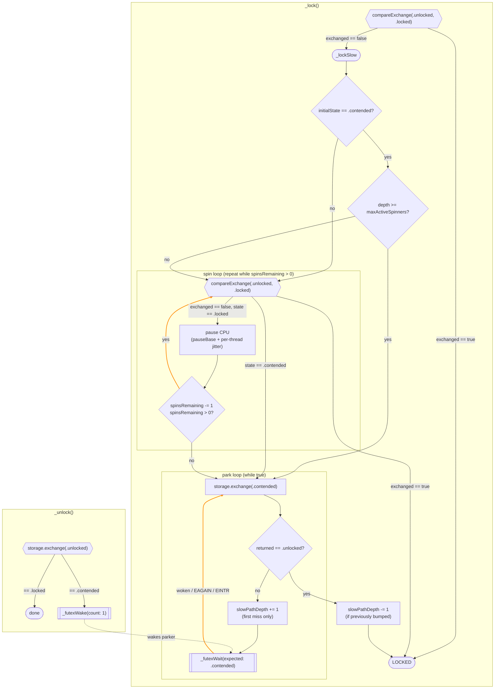

# Synchronization: Linux Mutex

Implementation notes for `Synchronization.Mutex` on Linux
(`stdlib/public/Synchronization/Mutex/LinuxImpl.swift`).

The lock is a plain-futex mutex with a 3-state lock word, a bounded user-space
spin phase, and a kernel fallback via `FUTEX_WAIT` / `FUTEX_WAKE`.

## Lock word states

- `.unlocked` - free.
- `.locked` - held, no waiters parked in the kernel.
- `.contended` - held, at least one waiter parked in the kernel. The unlock
  path issues `FUTEX_WAKE` only when it observes this state, avoiding a syscall
  on the uncontended path.

## Tunables

- `spinTries` (20): spin-phase iteration budget per `_lockSlow` entry.
- `pauseBase` (64): CPU `pause` count per spin iteration, before jitter. Must
  be a power of two - the jitter is derived as `cycleCounter & (pauseBase - 1)`
  so that N concurrent spinners do not retry in lockstep.
- `maxActiveSpinners` (4): once this many threads are already in the kernel
  phase, new arrivals skip the spin loop and park immediately. Keeps the set
  of actively-spinning threads bounded so the lock holder's critical section
  runs without cache-line interference from spinners.

## Lock / unlock flow

