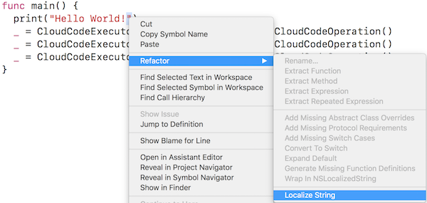
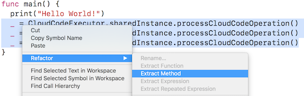
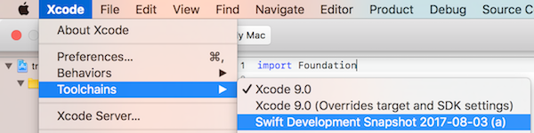

# Swift Local Refactoring

Xcode 9 includes a brand new refactoring engine. It can transform code locally
within a single Swift source file, or globally, such as renaming a method or property
that occurs in multiple files and even different languages. The logic behind local refactorings is
implemented entirely in the compiler and SourceKit, and is now open source in
the [swift repository](https://github.com/swiftlang/swift). Therefore, any Swift enthusiast can
contribute refactoring actions to the language. This post discusses how
a simple refactoring can be implemented and surfaced in Xcode.

## Kinds of Refactorings

A **local refactoring** occurs within the confines of a single file.
Examples of local refactoring include *Extract Method* and *Extract Repeated Expression*.
**Global refactorings**, which change code cross multiple files
(such as *Global Rename*), currently require special coordination by Xcode and currently
cannot be implemented on their own within the Swift codebase. This post focuses on
local refactorings, which can be quite powerful in their own right.

A refactoring action is initiated by a user's cursor selection in the editor.
According to how they are initialized, we categorize refactoring actions as cursor-based
or range-based. **Cursor-based refactoring** has a refactoring target sufficiently
specified by a cursor position in a Swift source file, such as rename refactoring.
In contrast, **range-based refactoring** needs a start and end position to specify
its target, such as Extract Method refactoring. To facilitate the implementation
of these two categories, the Swift repository provides pre-analyzed results called
[ResolvedCursorInfo] and [RangeInfo] to answer several common questions about a cursor
position or a range in a Swift source file.

For instance, [ResolvedCursorInfo] can tell us whether a location in the source file
points to the start of an expression and, if so, provide the corresponding compiler object of that
expression. Alternatively, if the cursor points to a name, [ResolvedCursorInfo] gives
us the declaration corresponding to that name. Similarly, [RangeInfo] encapsulates
information about a given source range, such as whether the range has multiple entry or exit points.

To implement a new refactoring for Swift, we don't
need to start from the raw representation of a cursor or a range position;
instead, we can start with [ResolvedCursorInfo] and [RangeInfo] upon which a refactoring-specific
analysis can be derived.

## Cursor-based Refactoring

Cursor-based refactoring is initiated by a cursor location in a Swift source file.
Refactoring actions implement methods that the refactoring engine uses to display the available actions
on the IDE and to perform the transformations.

Specifically, for displaying the available actions:

1. The user selects a location from the Xcode editor.
2. Xcode makes a request to [sourcekitd] to see what available refactoring actions exist for that location.
3. Each implemented refactoring action is queried with a `ResolvedCursorInfo` object to see if the action is applicable for that location.
4. The list of applicable actions is returned as response from [sourcekitd] and displayed to the user by Xcode.

When the user selects one of the available actions:

1. Xcode makes a request to [sourcekitd] to perform the selected action on the source location.
2. The specific refactoring action is queried with a `ResolvedCursorInfo` object, derived from the same location, to verify that the action is applicable.
3. The refactoring action is asked to perform the transformation with textual source edits.
4. The source edits are returned as response from [sourcekitd] and are applied by the Xcode editor.

To implement *String Localization* refactoring, we need to first declare this
refactoring in the [RefactoringKinds.def] file with an entry like:

~~~cpp
  CURSOR_REFACTORING(LocalizeString, "Localize String", localize.string)
~~~

`CURSOR_REFACTORING` specifies that this refactoring is initialized at a cursor
location and thus will use [ResolvedCursorInfo] in the implementation. The first field,
`LocalizeString`, specifies the internal name of this refactoring in the Swift
codebase. In this example, the class corresponding to this refactoring is named
`RefactoringActionLocalizeString`. The string literal `"Localize String"` is the
display name for this refactoring to be presented to users in the UI. Finally,
"localize.string” is a stable key that identifies the refactoring action, which
the Swift toolchain uses in communication with the source editor.
This entry also allows
the C++ compiler to generate the class stub for the String Localization refactoring
and its callers. Therefore, we can focus on the implementation of the
required functions.

After specifying this entry, we need to implement two functions to
teach Xcode:

1. When it is appropriate to show the refactoring action.
2. What code change should be applied when a user invokes this refactoring action.

Both declarations are automatically generated from the
aforementioned entry. To fulfill (1), we need to implement the [isApplicable] function
of `RefactoringActionLocalizeString` in [Refactoring.cpp], as below:

~~~cpp
1  bool RefactoringActionLocalizeString::
2  isApplicable(ResolvedCursorInfo CursorInfo) {
3    if (CursorInfo.Kind == CursorInfoKind::ExprStart) {
4      if (auto *Literal = dyn_cast<StringLiteralExpr>(CursorInfo.TrailingExpr) {
5        return !Literal->hasInterpolation(); // Not real API.
6      }
7    }
8  }
~~~

Taking a [ResolvedCursorInfo] object as input, it's almost trivial to check
when to populate the available refactoring menu with
“localize string”. In this case, checking that the cursor points to the start of
an expression (Line 3), and the expression is a string literal (Line 4) without
interpolation (Line 5) is sufficient.

Next, we need to implement how the code under the cursor should be
changed if the refactoring action is applied. To do this, we
have to implement the [performChange] method of `RefactoringActionLocalizeString`.
In the implementation of `performChange`, we can access the same `ResolvedCursorInfo` object that [isApplicable] received.

~~~cpp
1  bool RefactoringActionLocalizeString::
2  performChange() {
3    EditConsumer.insert(SM, Cursor.TrailingExpr->getStartLoc(), "NSLocalizedString(");
4    EditConsumer.insertAfter(SM, Cursor.TrailingExpr->getEndLoc(), ", comment: \"\")");
5    return false; // Return true if code change aborted.
6  }
~~~

Still using String Localization as an example, the [performChange] function
is fairly straightforward to implement. In the function body, we
can use [EditConsumer] to issue textual edits around the expression pointed by
the cursor with the appropriate Foundation API calls, as Lines 3 and 4 illustrate.

## Range-based Refactoring

As the above figure shows, range-based refactoring is initiated by selecting a
continuous range of code in a Swift source file. Taking the implementation of the *Extract Expression*
refactoring as an example, we first need to declare the following item in
[RefactoringKinds.def].

~~~cpp
  RANGE_REFACTORING(ExtractExpr, "Extract Expression", extract.expr)
~~~

This entry declares that the Extract Expression refactoring is initiated by a range selection,
named internally as `ExtractExpr`, using `"Extract Expression"` as display name, and with
a stable key of "extract.expr" for service communication purposes.

To teach Xcode when this refactoring should be available, we
also need to implement [isApplicable] for this refactoring in [Refactoring.cpp],
with the slight difference that the input is a [RangeInfo] instead of a [ResolvedCursorInfo] .

~~~cpp
1  bool RefactoringActionExtractExpr::
2  isApplicable(ResolvedRangeInfo Info) {
3    if (Info.Kind != RangeKind::SingleExpression)
4      return false;
5    auto Ty = Info.getType();
6    if (Ty.isNull() || Ty.hasError())
7      return false;
8    ...
9    return true;
10 }
~~~

Though a little more complex than its counterpart in the aforementioned String
Localization refactoring, this implementation is self-explaining too. Lines 3
to 4 check the kind of the given range, which has to be a single expression
to proceed with the extraction. Lines 5 to 7 ensure the extracted expression has
a well-formed type. Further conditions that need to be checked are omitted in
the example for now. Interested readers can refer to [Refactoring.cpp] for
more details. For the code change part, we can use the same [RangeInfo] instance
to emit textual edits:

~~~cpp
1  bool RefactoringActionExtractExprBase::performChange() {
2    llvm::SmallString<64> DeclBuffer;
3    llvm::raw_svector_ostream OS(DeclBuffer);
4    OS << tok::kw_let << " ";
5    OS << PreferredName;
6    OS << TyBuffer.str() <<  " = " << RangeInfo.ContentRange.str() << "\n";
7    Expr *E = RangeInfo.ContainedNodes[0].get<Expr*>();
8    EditConsumer.insert(SM, InsertLoc, DeclBuffer.str());
9    EditConsumer.insert(SM,
10                       Lexer::getCharSourceRangeFromSourceRange(SM, E->getSourceRange()),
11                       PreferredName)
12   return false; // Return true if code change aborted.
13 }
~~~

Lines 2 to 6 construct the declaration of a local variable with the initialized
value of the expression under extraction, e.g. `let extractedExpr = foo()`. Line
8 inserts the declaration at the proper source location in the local context, and
Line 9 replaces the original occurrence of the expression with a reference to
the newly declared variable. As demonstrated by the code example, within the
function body of [performChange], we can access not only the original
[RangeInfo] for the user's selection, but also other important utilities such
as the edit consumer and source manager, making the implementation more convenient.

## Diagnostics
A refactoring action may need to be aborted during automated code change for various reasons.
When this happens, a refactoring implementation can communicate via diagnostics the cause of such failures to the user.
Refactoring diagnostics employ the same mechanism as the compiler itself.
Taking rename refactoring as an example, we would like to issue
an error message if the given new name is an invalid Swift identifier. To do so,
we first need to declare the following entry for the diagnostics in
[DiagnosticsRefactoring.def].

~~~cpp
  ERROR(invalid_name, none, "'%0' is not a valid name", (StringRef))
~~~

After declaring it, we can use the diagnostic in either [isApplicable] or
[performChange]. For *Local Rename* refactoring, emitting the diagnostic in
[Refactoring.cpp] would look something like:

~~~cpp
1  bool RefactoringActionLocalRename::performChange() {
   ...
2    if (!DeclNameViewer(PreferredName).isValid()) {
3      DiagEngine.diagnose(SourceLoc(), diag::invalid_name, PreferredName);
4      return true; // Return true if code change aborted.
5    }
   ...
6  }
~~~

## Testing

Corresponding to the two steps in implementing a new
refactoring action, we need to test that:

1. The contextually available refactorings are
populated properly.
2. The automated code change updates the user's codebase correctly.

These two parts are both tested using the [swift-refactor] command line utility which
is built alongside the compiler.

#### Contextual Refactoring Test
~~~cpp
1  func foo() {
2    print("Hello World!")
3  }
4  // RUN: %refactor -source-filename %s -pos=2:14 | %FileCheck %s -check-prefix=CHECK-LOCALIZE-STRING
5  // CHECK-LOCALIZE-STRING: Localize String
~~~

Let's again take String Localization as an example. The above code
snippet is a test for contextual refactoring actions.
Similar tests can be found in [test/refactoring/RefactoringKind/](https://github.com/swiftlang/swift/tree/main/test/refactoring/RefactoringKind).

Let's take a look at the `RUN` line in more detail, starting with the use of the `%refactor` utility:

~~~cpp
%refactor -source-filename %s -pos=2:14 | %FileCheck %s -check-prefix=CHECK-LOCALIZE-STRING
~~~

This line will dump the display names for all applicable refactorings when a user points the cursor to the string literal "Hello World!".
`%refactor` is an alias that gets substituted by the test runner to give the full path to `swift-refactor` when the tests get run.
`-pos` gives the cursor position where contextual refactoring actions should be pulled from. Since
`String Localization` refactoring is cursor-based, specifying `-pos` alone will be
sufficient. To test range-based refactorings, we need to specify
`-end-pos` to indicate the end location of the refactoring target as well. All positions are
in the format of `line:column`.

To make sure the output of the tool is the expected one, we use the `%FileCheck` utility:

~~~cpp
%FileCheck %s -check-prefix=CHECK-LOCALIZE-STRING
~~~

This will check the output text from `%refactor`
against all following lines with prefix `CHECK-LOCALIZE-STRING`. In this case, it will
check whether the available refactorings include `Localize String`. In addition to
testing that we show the right actions at the right cursor positions, we also need to
test available refactorings are not wrongly populated in situations like string literals
with interpolation.

#### Code Transformation Test

We should also test that when applying the refactoring, the automated code
change matches our expectations. As a preparation, we need to teach [swift-refactor]
a refactoring kind flag to specify the action we are testing with. To achieve this,
the following entry is added in [swift-refactor.cpp](https://github.com/swiftlang/swift/blob/main/tools/swift-refactor/swift-refactor.cpp):

~~~cpp
  clEnumValN(RefactoringKind::LocalizeString, "localize-string", "Perform String Localization refactoring"),
~~~

With such an entry, [swift-refactor] can test the code transformation part of
String Localization specifically. A typical code transformation test consists of two parts:

1. The code snippet before refactoring.
2. The expected output after transformation.

The test performs the designated refactoring in (1) and compares the result
with (2). It passes if the two are identical, otherwise the test fails.

~~~swift
1  func foo() {
2    print("Hello World!")
3  }
4  // RUN: rm -rf %t.result && mkdir -p %t.result
5  // RUN: %refactor -localize-string -source-filename %s -pos=2:14 > %t.result/localized.swift
6  // RUN: diff -u %S/Outputs/localized.swift.expected %t.result/localized.swift
~~~

~~~swift
1  func foo() {
2    print(NSLocalizedString("Hello World!", comment: ""))
3  }
~~~

The above two code snippets comprise a meaningful code transformation test.
Line 4 prepares a temporary source directory
for the code resulting from the refactoring; using the newly added `-localize-string`,
 Line 5 performs the refactoring code change at the start position of `"Hello World!"` and
dumps the result to the temporary directory; finally, Line 6 compares the result
with the expected output illustrated in the second code example.

## Integrating with Xcode
After implementing all of above pieces in the Swift codebase, we
are ready to test/use the newly added refactoring in Xcode by integrating with
a locally-built open source toolchain.

1. Run [build-toolchain](https://github.com/swiftlang/swift/blob/main/utils/build-toolchain)
to build the open source toolchain locally.

2. Untar and copy the toolchain to `/Library/Developer/Toolchains/`.

3. Specify the local toolchain for Xcode's use via `Xcode->Toolchains`, like the
following figure illustrates.

## Potential Local Refactoring Ideas
This post just touches on some of the things that are now possible to implement in the new refactoring engine.
If you are excited about extending the refactoring engine to implement additional transformations,
Swift's issue database contains [several ideas of refactoring transformations](https://github.com/swiftlang/swift/issues?q=is%3Aissue+is%3Aopen+label%3ARefactoring) awaiting implementations.

For further help with implementing refactoring transformations, please feel free to ask questions on the [Swift forums](https://forums.swift.org/c/development/compiler/9).

[sourcekitd]: https://github.com/swiftlang/swift/tree/main/tools/SourceKit
[ResolvedCursorInfo]: https://github.com/swiftlang/swift/blob/60a91bb7360dde5ce9531889e0ed10a2edbc961a/include/swift/IDE/Utils.h#L158
[RangeInfo]: https://github.com/swiftlang/swift/blob/60a91bb7360dde5ce9531889e0ed10a2edbc961a/include/swift/IDE/Utils.h#L344
[performChange]: https://github.com/swiftlang/swift/blob/60a91bb7360dde5ce9531889e0ed10a2edbc961a/lib/IDE/Refactoring.cpp#L599
[RefactoringKinds.def]: https://github.com/swiftlang/swift/blob/60a91bb7360dde5ce9531889e0ed10a2edbc961a/include/swift/IDE/RefactoringKinds.def
[isApplicable]: https://github.com/swiftlang/swift/blob/60a91bb7360dde5ce9531889e0ed10a2edbc961a/lib/IDE/Refactoring.cpp#L646
[DiagnosticsRefactoring.def]: https://github.com/swiftlang/swift/blob/60a91bb7360dde5ce9531889e0ed10a2edbc961a/include/swift/AST/DiagnosticsRefactoring.def
[swift-refactor]: https://github.com/swiftlang/swift/tree/60a91bb7360dde5ce9531889e0ed10a2edbc961a/tools/swift-refactor
[Refactoring.cpp]: https://github.com/swiftlang/swift/blob/60a91bb7360dde5ce9531889e0ed10a2edbc961a/lib/IDE/Refactoring.cpp
[EditConsumer]: https://github.com/swiftlang/swift/blob/60a91bb7360dde5ce9531889e0ed10a2edbc961a/include/swift/IDE/Utils.h#L506
