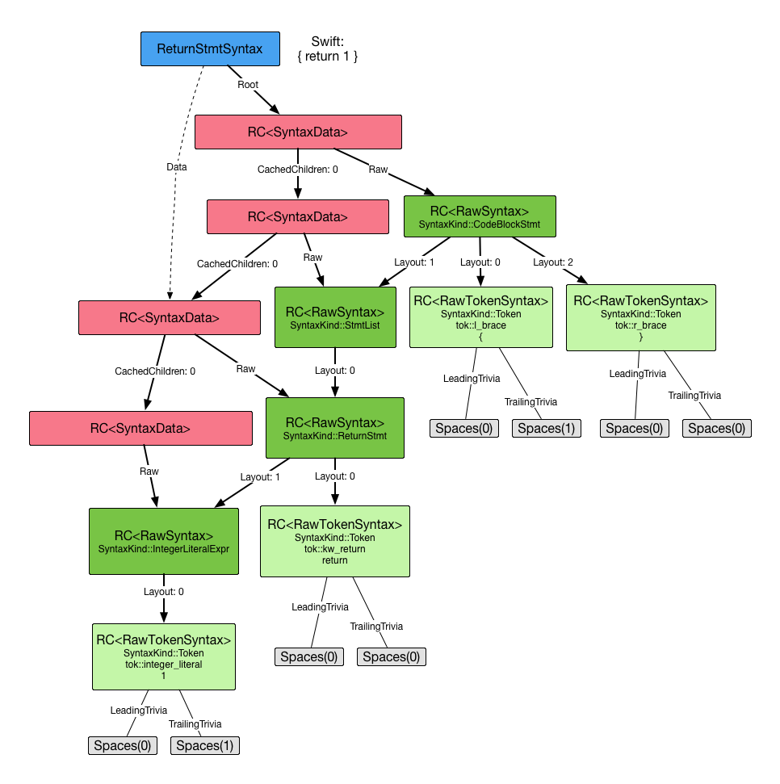

# Swift Syntax and Structured Editing Library

Welcome to lib/Syntax!

This library implements data structures and algorithms for dealing
with Swift [syntax](https://en.wikipedia.org/wiki/Syntax_\(programming_languages\)),
striving to be safe, correct, and intuitive to use. The
library emphasizes immutable, thread-safe data structures, full-fidelity
representation of source, and facilities for *structured editing*.

What is structured editing? It's an editing strategy that is keenly aware of the
*structure* of source code, not necessarily its *representation* (i.e.
characters or bytes). This can be achieved at different granularities: replacing
an identifier, changing a call to global function to a method call, or indenting
and formatting an entire source file based on declarative rules. These kinds of
diverse operations are critical to the Swift Migrator, which is the immediate
client for this library, now developed in the open. Along with that, the library
will also provide infrastructure for a first-class `swift-format` tool.

Eventually, the goal of this library is to represent Swift syntax in all of the
compiler. Currently, lib/AST structures don't make a very clear distinction
between syntactic and semantic information. Long term, we hope to achieve the
following based on work here:

- Adoption throughout the compiler
- Clear separation of syntactic and semantic information
- Greater stability with immutable data structures
- Lower high-water memory use due to reference counting without the need for
  leak-forever memory contexts
- Incremental re-parsing
- Incremental, lazier re-type-checking, helped by separating syntactic
  information

This library is a work in progress and should be expected to be in a molten
state for some time. Don't integrate this into other areas of the compiler or
use it for anything serious just now.

You can read more about the status of the library's implementation at the
[Syntax Status Page](Status.md). More information about opportunities to get
involved to come.

## Design and Implementation Guidelines

In no particular order, here is a summary of the design and implementation
points for this library:

1. Represent Swift source with "full fidelity" - parsing a source file and
   printing the syntax tree should result in the same file.
1. Provide good structured editing APIs at all granularities.
1. Make public API as intuitive as possible. If you can't quickly answer, "What
   do I do next?", that's a bug. Compiler development shouldn't be black magic,
   so let's make an effort so that beginners and experts alike feel welcome
   here.
1. Don't crash.
1. Don't open yourself up to crashes for the sake of performance.
1. Don't hand raw pointers to clients. Give them realized values that they
   either own or borrow, and indicate optionality with types.
1. If it represents authored Swift source, then the data representing it is
   immutable. You don't change what an author wrote without their permission and
   initiation.
1. This library is not concerned with semantic analysis. Don't store types,
   symbolic references, lookup logic, and the like here. This is purely for
   syntactic constructs.
1. All public APIs must be covered by tests. Whenever applicable, consider:
   - C++ unit tests, at a minimum, all public C++ APIs
   - Round-trip lex/parse test cases
   - Exercised by the formatter/migrator
   - For each grammar production, as many combinations as possible, especially
     with respect to optional terms and expected by missing terms
1. All public APIs must have documentation comments.
1. Represent Swift grammar and use naming conventions in accordance with The
   Swift Programming Language book as much as possible, so people know what to
   look for.
1. Accommodate "bad syntax" - humans are imperfect and source code is constantly
   in a state of flux in an editor. Unforunately, we still live in a
   character-centric world - the library shouldn't fall over on bad syntax just
   because someone is in the middle of typing `struct`.

## APIs

### Make APIs

*Make APIs* are for creating new syntax nodes in a single call. Although you
need to provide all of the pieces of syntax to these APIs, you are free to use
"missing" placeholders as substructure. Make APIs return freestanding syntax
nodes and do not establish parental relationships.

#### The SyntaxFactory

The `SyntaxFactory` embodies the Make APIs and is the one-stop shop for creating
new syntax nodes and tokens in a single call. There are two main Make APIs
exposed for each Syntax node: making the node with all of the pieces, or making
a blank node with all of the pieces marked as *missing*. For example,
`SyntaxFactory` has `makeStructDeclSyntax` and `makeBlankStructDeclSyntax` that
both return a `StructDeclSyntax`.

Instead of constructors on each syntax node's class, static creation methods are
all supplied here in the `SyntaxFactory` for better code completion - you don't
need to know the exact name of the class. Just type `SyntaxFactory::make` and
let code completion show you what you can make.

**Example**

```c++
// A 'typealias' keyword with one space after
auto TypeAliasKeyword = SyntaxFactory::makeTypeAliasKeyword({}, Trivia::spaces(1));

// The identifier "Element" with one space after
auto ElementID = SyntaxFactory::makeIdentifier("Element", {}, Trivia::spaces(1));

// An equal '=' token with one space after
auto Equal = SyntaxFactory::makeEqualToken({}, Trivia::spaces(1));

// A type identifier for "Int"
auto IntType = SyntaxFactory::makeTypeIdentifier("Int", {}, {})

// Finally, the actual type alias declaration syntax.
auto TypeAlias = SyntaxFactory::makeTypeAliasDecl(TypeAliasKeyword,
                                                  ElementID,
                                                  EmptyGenericParams,
                                                  Equal,
                                                  IntType);
TypeAlias.print(llvm::outs());
```

```swift
typealias Element = Int
```

### With APIs

*With APIs* are essentially *setters* on `Syntax` nodes you already have in hand
but, because they are immutable, return new `Syntax` nodes with only the
specified substructure replaced. Raw backing storage is shared as much as
possible.

**Example**

Say you have a `MyStruct` of type `StructDeclSyntax` representing:

```swift
struct MyStruct {}
```

Now, let's create a new struct with a different identifier, "YourStruct". The
original struct is unharmed but identical tokens are shared.

```c++
auto NewIdentifier = SyntaxFactory::makeIdentifier("YourStruct",
    MyStruct.getIdentifier().getLeadingTrivia(),
    MyStruct.getIdentifier().getTrailingTrivia());

MyStruct.withIdentifier(NewIdentifier).print(llvm::outs());
```

```swift
struct YourStruct {}
```

### Builder APIs

*Builder APIs* are provided for building up syntax incrementally as it appears.
At any point in the building process, you can call `build()` and get a
reasonably formed Syntax node (i.e. with no raw `nullptr`s) using what you've
provided to the builder so far. Anything that you haven't supplied is marked as
*missing*. This is essentially what the parser does so, looking forward to
future adoption, the builders are designed with the parser in mind, with the
hope that we can better specify recovery behavior and incremental (re-)parsing.

**Example**

```c++
StructDeclSyntaxBuilder Builder;

// We previously parsed a struct keyword, let's tell the builder to use it.
Builder.useStructKeyword(StructKeyword);

// Hm, we didn't see an identifier, but saw a left brace. Let's keep going.
Builder.useLeftBraceToken(ParsedLeftBrace)

// No members of the struct; we saw a right brace.
Builder.useRightBraceToken(ParsedRightBrace);
```

Let's see what we have so far.

```c++
auto StructWithoutIdentifier = Builder.build();
StructWithoutIdentifier.print(llvm::outs());
```

```swift
struct {}
```

Whoops! You forgot an identifier. Let's add one here for fun.

```c++
auto MyStructID = SyntaxFactory::createIdentifier("MyStruct", {}, Trivia::spaces(1));
Builder.useIdentifier(MyStructID);

auto StructWithIdentifier = Builder.build();
StructWithIdentifier.print(llvm::outs());
```

```swift
struct MyStruct {}
```

Much better!

Note that syntax builders own and mutate the data they will eventually use to
build a syntax node. They themselves should not be shared between threads.
However, anything the builder builds and returns to you is safe and immutable.

### Syntax Rewriters

`TODO`.

## Internals

### RawSyntax

`RawSyntax` are the *raw* immutable backing store for all *syntax*. Essentially,
they store a kind, whether they were missing in the source, and the *layout*,
which is a list of children and represents the recursive substructure. Although
these are tree-like in nature, *they maintain no parental relationships* because
they can be shared among many nodes. Eventually, `RawSyntax` bottoms out in
tokens, represented by the `TokenSyntax` class.

#### RawSyntax summary

- `RawSyntax` are the immutable backing store for all syntax.
- `RawSyntax` are immutable.
- `RawSyntax` establishes the tree structure of syntax.
- `RawSyntax` store no parental relationships and can therefore be shared
   among syntax nodes if they have identical content.

### TokenSyntax

These are special cases of `RawSyntax` and represent all terminals in the
grammar. Aside from the token kind and the text, they have two very important
pieces of information for full-fidelity source: leading and trailing source
*trivia* surrounding the token.

#### TokenSyntax summary

- `TokenSyntax` are `RawSyntax` and represent the terminals in the Swift
  grammar.
- Like `RawSyntax`, `TokenSyntax` are immutable.
- `TokenSyntax` do not have pointer equality, as they can be shared among syntax
  nodes.
- `TokenSyntax` have *leading-* and *trailing trivia*, the purely syntactic
  formatting information like whitespace and comments.

### Trivia

You've already seen some uses of `Trivia` in the examples above. These are
pieces of syntax that aren't really relevant to the semantics of the program,
such as whitespace and comments. These are modeled as collections and, with the
exception of comments, are sort of "run-length" encoded. For example, a sequence
of four spaces is represented by `{ Kind: TriviaKind::Space, Count: 4 }`, not
the literal text `"    "`.

Some examples of the "atoms" of `Trivia`:

- Spaces
- Tabs
- Newlines
- Single-line developer (`//`) comments
- Block developer (`/* ... */`) comments
- Single-line documentation (`///`) comments
- Block documentation (`/** ... */`) comments
- Backticks

There are two Rules of Trivia that you should obey when parsing or constructing
new `Syntax` nodes:

1. A token owns all of its trailing trivia up to, but not including,
   the next newline character.

2. Looking backward in the text, a token owns all of the leading trivia
   up to and including the first contiguous sequence of newlines characters.

Let's take a look at how this shows up in practice with a small snippet of Swift
code.

**Example**

```swift
func foo() {
  var x = 2
}
```

Breaking this down token by token:

- `func`
  - Leading trivia: none.
  - Trailing trivia: Takes up the space after (Rule 1).

    ```c++
    // Equivalent to:
    Trivia::spaces(1)
    ```

- `foo`
  - Leading trivia: none. The previous `func` ate the space before.
  - Trailing trivia: none.

- `(`
  - Leading trivia: none.
  - Trailing trivia: none.

- `)`
  - Leading trivia: none.
  - Trailing trivia: Takes up the space after (Rule 1).

- `{`
  - Leading trivia: none. The previous `)` ate the space before.
  - Trailing trivia: none. Because of Rule 1, it doesn't take the following
    newline.

- `var`
  - Leading trivia: One newline followed by two spaces because of Rule 2.

    ```c++
    // Equivalent to:
    Trivia::newlines(1) + Trivia::spaces(2)
    ```
  - Trailing trivia: Takes the space after (Rule 1).

- `x`
  - Leading trivia: none. The previous `var` ate the space before.
  - Trailing trivia: Takes up the space after (Rule 1).

- `=`
  - Leading trivia: none. The previous `x` ate the space before.
  - Trailing trivia: Takes up the space after (Rule 1).

- `2`
  - Leading trivia: none. The previous `=` ate the space before.
  - Trailing trivia: none: Because of Rule 1, it doesn't take the following
    newline.

- `}`
  - Leading trivia: One newline, due to Rule 2.
  - Trailing trivia: none.

- `EOF`
  - Leading trivia: none.
  - Trailing trivia: none.

A couple of remarks about the `EOF` token:

- Starting with the first newline after the last non-EOF token, `EOF` takes
  all remaining trivia in the source file as its leading trivia.
- Because of this, `EOF` never has trailing trivia.

#### Summary of Trivia

- `Trivia` represent *source trivia*, the whitespace and comments in a Swift
  source file.
- `Trivia` are immutable.
- `Trivia` don't have pointer identity - they are primitive values.

### SyntaxData

`SyntaxData` nodes wrap `RawSyntax` nodes with a few important pieces of
additional information: a pointer to a parent, the position in which the node
occurs in its parent, and cached children.

For example, if we have a `StructDeclSyntaxData`, wrapping a `RawSyntax` for a
struct declaration, we might ask for the generic parameter clause. At first,
this is only represented in the raw syntax. On first ask, we thaw those out by
creating a new `GenericParameterClauseSyntaxData`, cache it as our child, set
its parent to `this`, and send it back to the caller. These cached children
are strong references, keeping the syntax tree alive in memory.

You can think of `SyntaxData` as "concrete" or "realized" syntax nodes. They
represent a specific piece of source code, have an absolute location, line and
column number, etc. `RawSyntax` are more like the integer 1 - a single
theoretical entity that exists, but manifesting everywhere it occurs identically
in Swift source code.

Beyond this, `SyntaxData` nodes have *no signficant public API*.

- `SyntaxData` are immutable.
   However, they may mutate themselves in order to implement lazy instantiation
   of children and caching. That caching operation transparent and thread-safe.
- `SyntaxData` have identity, i.e. they can be compared with "pointer equality".
- `SyntaxData` are implementation detail have no public API.

### Syntax

`RawSyntax` and `SyntaxData` are essentially implementation detail in order to
maintain all of those nice properties like immutability and information sharing.
Now, we get to the main players: the `Syntax` nodes. These have the interesting
public interface: the *With APIs*, getters, etc. Anyone working with the
`Syntax` library will be touching these nodes.

Internally, they are actually packaged as a strong reference to the root of the
tree in which that node resides, and a weak reference to the `SyntaxData`
representing that node. Why a weak reference to the data? We do this to prevent
retain cycles and minimize retain/release traffic: **all strong references point
down in the tree, starting at the root**.

Although it's important for the entire library to be easy to use and maintain in
general, it's especially important that the APIs in `Syntax` nodes remain
intuitive and do what you expect with no weird side effects, necessary contexts
to maintain, etc. If you have a handle on a `Syntax` node, you're safe to query
anything about it without other processes pulling out the rug from under you.

### Example Object Diagram: `{ return 1 }`

Here's an example of what you might have as a result of the following C++
code:

```c++
auto LeftBrace = SyntaxFactory::makeLeftBraceToken({}, Trivia::spaces(1));

auto IntegerTok = SyntaxFactory::makeIntegerLiteralToken("1", {}, Trivia::spaces(1));
auto Integer = SyntaxFactory::makeIntegerLiteralExpr(IntegerTok);

auto ReturnKW = SyntaxFactory::makeReturnKeyword({}, Trivia::spaces(1));

// This ReturnStmtSyntax is floating, with no root.
auto Return = SyntaxFactory::makeReturnStmt(ReturnKW, Integer);

auto RightBrace = SyntaxFactory::makeLeftBraceToken({}, {});

auto Statements = SyntaxFactory::makeBlankStmtList()
  .addExpr(Return);

auto Block = SyntaxFactory::makeBlankCodeBlockStmt()
  // Takes a reference of the token directly and increments the
  // reference count.
  .withLeftBraceToken(LeftBrace)

  // Only takes a strong reference to the RawSyntax of the
  // ReturnStmtSyntax above.
  .withStatements(Statements)

  // Takes a reference of the token directly and increments the
  // reference count.
  .withRightBraceToken(RightBrace);

// Returns a new ReturnStmtSyntax with the root set to the Block
// above, and the parent set to the StmtListSyntax.
auto MyReturn = Block.getStatement(0).castTo<ReturnStmt>;
```

Here's what the corresponding object diagram would look like starting with
`MyReturn`.



Legend:
- Green: `RawSyntax` types (`TokenSyntax` is a `RawSyntax`)
- Red: `SyntaxData` types
- Blue: `Syntax` types
- Gray: `Trivia`
- Solid Arrows: Strong references
- Dashed Arrows: Weak references

A couple of interesting points and reminders:
- All strong references point downward in the tree.
- One `SyntaxData` for each `RawSyntax`.  
  Remember, a `SyntaxData` is essentially a `RawSyntax` with a parent pointer
  and cached `SyntaxData` children.
- Parent pointers are omitted here but there are weak references pointing
  upward among `SyntaxData` (red) nodes.
- Clients only work with `Syntax` (blue) nodes and `Trivia` (gray), and should
  never see `SyntaxData` (red) or `RawSyntax` (green) nodes.

## Adding new Syntax Nodes

Here's a handy checklist when implementing a production in the grammar.
- Check that the corresponding `lib/AST` node has `SourceLocs` for all terms. If
  it doesn't, [file a Swift bug][NewSwiftBug] and fix that first.
  - **Add the `Syntax` bug label!**
- Check if it's not already being worked on, and then
  [file a Swift bug][NewSwiftBug], noting which grammar productions
  are affected.
  - **Add the `Syntax` bug label!**
- Add a *kind* to include/swift/Syntax/SyntaxKinds.def
- Create the `${KIND}SyntaxData` class.  
  - Cached children members as `RC<${CHILDKIND}SyntaxData>`
- Create the `${KIND}Syntax` class.  
  Be sure to implement the following:
  - Define the `Cursor` enum for the syntax node. This specifies all of the
    terms of the production, including optional terms. For example, a same-type
    generic requirement is:  
    `same-type-requirement -> type-identifier '==' type`

    That's three terms in the production, and you can see this reflected in the
    `StructDeclSyntaxData` class:

    ```c++
    enum Cursor : CursorIndex {
      LeftTypeIdentifier,
      EqualityToken,
      RightType,
    };
    ```
  - With APIs for all layout elements (e.g. `withLeftTypeIdentifier(...)`)
    - Add C++ unit tests.
      - Check that the resulting `Syntax` node has identical content except for
        what you changed. `print` the new node and check the text.
      - Check that the new node has a different parent.
  - Getters for all layout elements (e.g. `getLeftTypeIdentifier()`)
    - Caching mechanics in corresponding `${KIND}SyntaxData` class.
    - Add a C++ unit test.
      - After `get`ing the child, verify:
        - The child's parent and root are correct
        - The child's content is correct
        - The child `print`s the expected text.
- Implement static Make APIs in `SyntaxFactory`
  - `make${KIND}Syntax(... all elements ...)`
    - Add a C++ unit test.
      - Supply various inputs, some missing, some not.
      - Supply incorrect token kinds for elements that are `RC<TokenSyntax>`.
        Check that the asserts are as expected.
  - `makeBlank${KIND}Syntax()`
    - Add a C++ unit test.
- If applicable, create a `${KIND}SyntaxBuilder`.
  - `use____(...)` methods for each layout element - takes a `${KIND}Syntax` for
    that child type.
  - `${KIND}Syntax build() const`
    - Add a C++ unit test.
      - `build()` at all stages of building, followed by `print()`.
- Add a round-trip test for the grammar production
  - Create a .swift file in test/Syntax with all possible configurations of the
    piece of syntax, with two `RUN` lines:
    - check for a zero-diff print with `-round-trip-lex`, and
    - check for a zero-diff print with `-round-trip-parse`
- Update `lib/Syntax/Status.md` if applicable.

[NewSwiftBug]: https://bugs.swift.org/secure/CreateIssue!default.jspa)
